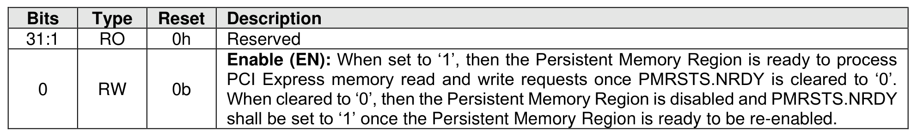

##### 3.1.4.23 Offset E04h: PMRCTL – Persistent Memory Region Control

> **Section ID**: 3.1.4.23 | **Page**: 97-97

This optional property controls the operation of the Persistent Memory Region. If the controller does not
support the Persistent Memory Region feature, then this property shall be cleared to 0h.
This property shall not be reset by a Controller Level Reset initiated by a Controller Reset.

---
### 📊 Tables (1)

#### Table 1: Untitled Table

| Type | Reset | Description |
| :--- | :--- | :--- |
| RO | 0h | Reserved |

