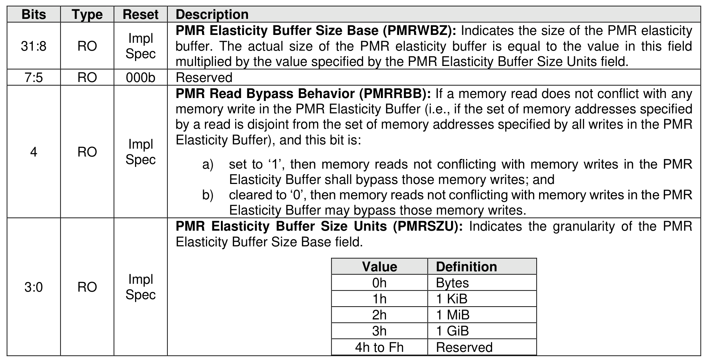

##### 3.1.4.25 Offset E0Ch: PMREBS – Persistent Memory Region Elasticity Buffer Size

> **Section ID**: 3.1.4.25 | **Page**: 98-99

This optional property identifies to the host the size of the PMR elasticity buffer. A value of 0h in this property
indicates to the host that no information regarding the presence or size of a PMR elasticity buffer is
available.
This property shall not be reset by a Controller Level Reset initiated by a Controller Reset.

---
### 📊 Tables (1)

#### Table 1: Untitled Table

| RO | Impl Spec | buffer. The actual size of the PMR elasticity buffer is equal to the value in this field multiplied by the value specified by the PMR Elasticity Buffer Size Units field. |
|---|---|---|
| RO | 000b | Reserved |
| RO | Impl Spec | **PMR Read Bypass Behavior (PMRRBB):** If a memory read does not conflict with any memory write in the PMR Elasticity Buffer (i.e., if the set of memory addresses specified by a read is disjoint from the set of memory addresses specified by all writes in the PMR Elasticity Buffer), and this bit is: a) set to '1', then memory reads not conflicting with memory writes in the PMR Elasticity Buffer shall bypass those memory writes; and b) cleared to '0', then memory reads not conflicting with memory writes in the PMR Elasticity Buffer may bypass those memory writes. |
| RO | Impl Spec | **PMR Elasticity Buffer Size Units (PMRSZU):** Indicates the granularity of the PMR Elasticity Buffer Size Base field. <table><tr><th>Value</th><th>Definition</th></tr><tr><td>0h</td><td>Bytes</td></tr><tr><td>1h</td><td>1 KiB</td></tr><tr><td>2h</td><td>1 MiB</td></tr><tr><td>3h</td><td>1 GiB</td></tr><tr><td>4h to Fh</td><td>Reserved</td></tr></table> |

