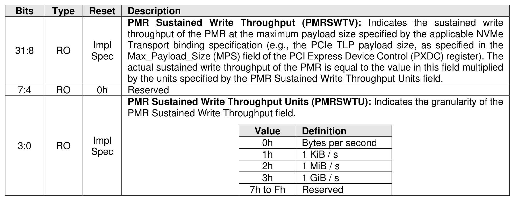

##### 3.1.4.26 Offset E10h: PMRSWTP – Persistent Memory Region Sustained Write Throughput

> **Section ID**: 3.1.4.26 | **Page**: 99-99

This optional property identifies to the host the maximum PMR sustained write throughput. A value of 0h in
this property indicates to the host that no information regarding the PMR sustained write throughput is
available.
This property shall not be reset by a Controller Level Reset initiated by a Controller Reset.

---
### 📊 Tables (1)

#### Table 1: Untitled Table

| Value | Definition |
|---|---|
| 0h | Bytes per second |
| 1h | 1 KiB / s |
| 2h | 1 MiB / s |
| 3h | 1 GiB / s |
| 7h to Fh | Reserved |

