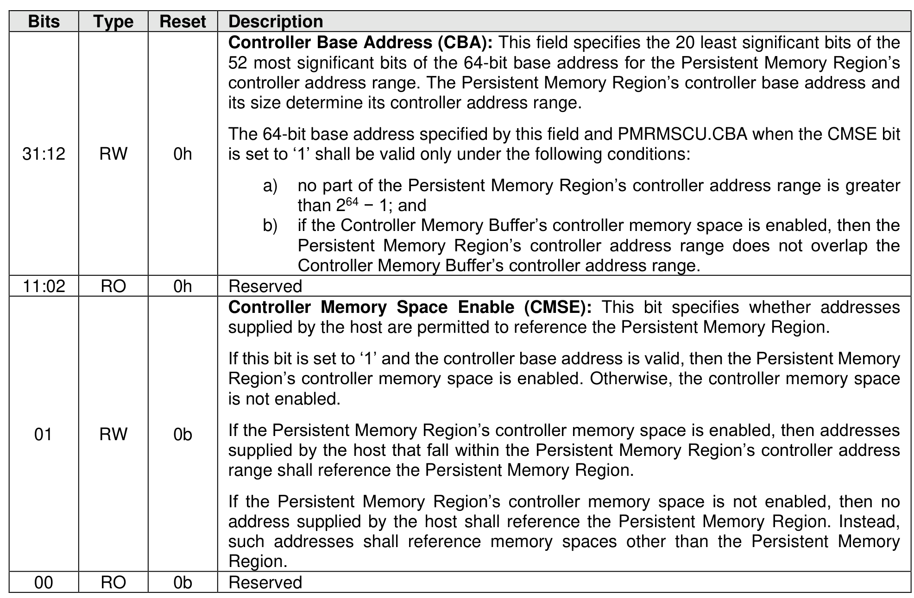

##### 3.1.4.27 Offset E14h: PMRMSCL – Persistent Memory Region Memory Space Control Lower

> **Section ID**: 3.1.4.27 | **Page**: 99-100

This optional property and the PMRMSCU property specify how the controller references the Persistent
Memory Region with host-supplied addresses. If the controller supports the Persistent Memory Region’s
controller memory space (PMRCAP.CMSS), this property is mandatory. Otherwise, this property is
reserved.
For a memory-based controller, the host shall access this property with aligned 32-bit accesses.
This property shall not be reset by a Controller Level Reset initiated by a Controller Reset.

---
### 📊 Tables (1)

#### Table 1: Untitled Table

| | | |
| :--- | :--- | :--- |
| RW | 0h | 52 most significant bits of the 64-bit base address for the Persistent Memory Region's controller address range. The Persistent Memory Region's controller base address and its size determine its controller address range.  The 64-bit base address specified by this field and PMRMSCU.CBA when the CMSE bit is set to '1' shall be valid only under the following conditions:  a) no part of the Persistent Memory Region's controller address range is greater than 264 − 1; and  b) if the Controller Memory Buffer's controller memory space is enabled, then the Persistent Memory Region's controller address range does not overlap the Controller Memory Buffer's controller address range. |
| RO | 0h | Reserved |
| | | **Controller Memory Space Enable (CMSE):** This bit specifies whether addresses supplied by the host are permitted to reference the Persistent Memory Region.  If this bit is set to '1' and the controller base address is valid, then the Persistent Memory Region's controller memory space is enabled. Otherwise, the controller memory space is not enabled.  If the Persistent Memory Region's controller memory space is enabled, then addresses supplied by the host that fall within the Persistent Memory Region's controller address range shall reference the Persistent Memory Region.  If the Persistent Memory Region's controller memory space is not enabled, then no address supplied by the host shall reference the Persistent Memory Region. Instead, such addresses shall reference memory spaces other than the Persistent Memory Region. |
| RW | 0b | |
| RO | 0b | Reserved |
| | | **Offset E18h: PMRMSCU – Persistent Memory Region Memory Space Control Upper**  ional property and the PMRMSCCL property specify how the controller references the Persistent Region with host-supplied addresses. If the controller supports the Persistent Memory Region's er memory space (PMRCAP.CMSS), this property is mandatory. Otherwise, this property is  memory-based controller, the host shall access this property with aligned 32-bit accesses.  roperty shall not be reset by a Controller Level Reset initiated by a Controller Reset. |

