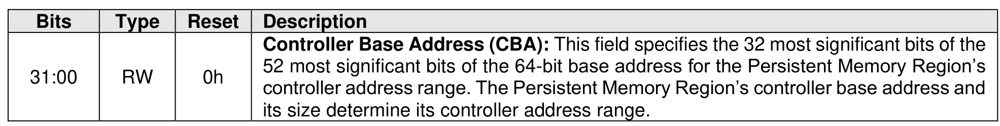

##### 3.1.4.28 Offset E18h: PMRMSCU – Persistent Memory Region Memory Space Control Upper

> **Section ID**: 3.1.4.28 | **Page**: 100-100

This optional property and the PMRMSCL property specify how the controller references the Persistent
Memory Region with host-supplied addresses. If the controller supports the Persistent Memory Region’s
controller memory space (PMRCAP.CMSS), this property is mandatory. Otherwise, this property is
reserved.
For a memory-based controller, the host shall access this property with aligned 32-bit accesses.
This property shall not be reset by a Controller Level Reset initiated by a Controller Reset.

---
### 📊 Tables (1)

#### Table 1: Untitled Table

76

