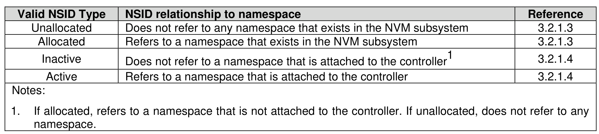

##### 3.2.1.5 NSID and Namespace Relationships

> **Section ID**: 3.2.1.5 | **Page**: 101-102

Unless otherwise noted, specifying an inactive NSID in a command that uses the Namespace Identifier
(NSID) field shall cause the controller to abort the command with a status code of Invalid Field in Command.
Specifying an invalid NSID in a command that uses the NSID field shall cause the controller to abort the
command with a status code of Invalid Namespace or Format.
Figure 65 summarizes the valid NSID types and Figure 66 visually shows the NSID types and how they
relate.

---
### 📊 Tables (1)

#### Table 1: Untitled Table

| 77 |

