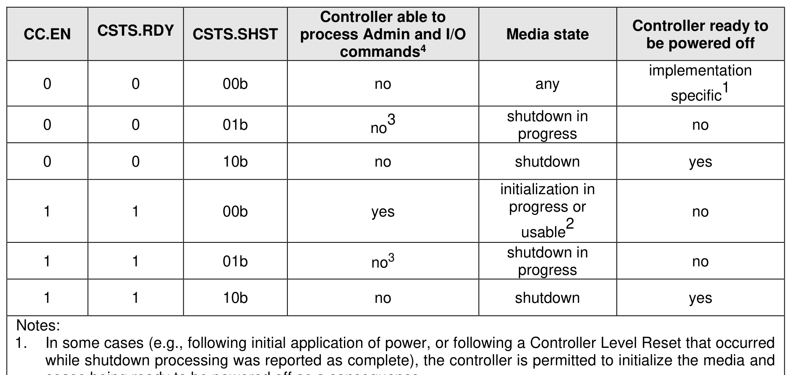

### 3.6 Shutdown Processing

> **Section ID**: 3.6 | **Page**: 136-137

This section describes the recommended procedure for shutdown processing prior to a power-off condition.
There are two shutdown processing mechanisms, controller shutdown (refer to sections 3.6.1 and 3.6.2)
and NVM Subsystem Shutdown (refer to section 3.6.3). The CSTS.ST bit indicates the shutdown
mechanism that is in progress, if any (refer to Figure 42). A host requests a controller shutdown by modifying
the CC.SHN field (refer to Figure 41). A host requests an NVM Subsystem Shutdown by modifying the
NSSD property (refer to section 3.1.4.20) or by issuing an NVMe-MI Shutdown command to a Management
Endpoint (refer to the NVM Express Management Interface Specification).
At most one shutdown processing mechanism is able to be in progress for a controller at any time. If an
NVM Subsystem Shutdown is requested while a controller shutdown is in progress, then the NVM
Subsystem Shutdown overrides the controller shutdown. The progress and completion of shutdown
processing is indicated by the CSTS.SHST field (refer to Figure 42).
NVM Subsystem Shutdown should not be supported by any NVM subsystem that does not support more
than one controller, without counting virtual controllers (e.g., NVM Subsystem Shutdown should not be
supported by an NVM subsystem that supports one primary controller and multiple secondary controllers)
(refer to section 8.2.6).
Figure 85 describes the interactions of the shutdown processing state indicated by the CSTS.SHST field
with the state of the controller indicated by the CC.EN bit (refer to Figure 41) and by the CSTS.RDY bit
(refer to Figure 42). The four possible media states in Figure 85 are: shutdown, shutdown in progress,
usable, and initialization in progress.
2.
If the CC.CRIME bit is cleared to ‘0’, then the media is usable. If the CC.CRIME bit is set to ‘1’, then either
media initialization is in progress or the media is usable (refer to Figure 41).
3.
While shutdown processing is in progress, the controller may abort any command with a status code of
Commands Aborted due to Power Loss Notification.
4.
I/O commands are only able to be processed by a controller that supports I/O commands. Fabrics commands
are always able to be processed by a controller that supports Fabrics commands.
Figure 85 does not include transition conditions for a controller that is becoming ready or is undergoing
reset. During these transitions, the CC.EN bit and the CSTS.RDY bit have different values (refer to Figure
41 and Figure 42). The media may or may not be usable during these transitions.
Figure 85 does not include the NVMe-MI effects of processing an Admin command that requires access to
the media (refer to Figure 84) and specifies the Ignore Shutdown bit set to ‘1’ is processed by the controller
via the out-of-band mechanism (refer to the NVM Express Management Interface Specification). Processing
of such a command causes the media to become usable, after which the media may or may not be returned
to its previous condition.
If the Controller Power Scope (i.e., CAP.CPS) field is cleared to 00b (i.e., Not Reported) or set to 01b (i.e.,
Controller scope), it is recommended that the host wait until the controller is ready to be powered off before
removing power. The controller is ready to be powered off when that controller reports shutdown processing
is complete (i.e., CSTS.SHST field is set to 10b).
If the CAP.CPS field is set to 10b (i.e., Domain scope), it is recommended that the host wait until the domain
is ready to be powered off before removing power. The domain is ready to be powered off when all the
controllers in that domain report shutdown processing is complete (i.e., CSTS.SHST field is set to 10b on
all controllers in the domain).
If the CAP.CPS field is set to 11b (i.e., NVM subsystem scope), it is recommended that the host wait until
the NVM subsystem is ready to be powered off before removing power. The NVM subsystem is ready to
be powered off when all controllers in the NVM subsystem report shutdown processing is complete (i.e.,
CSTS.SHST field is set to 10b on all controllers in the NVM subsystem).

---
### 📊 Tables (1)

#### Table 1: Untitled Table

| | | | | |
|---|---|---|---|---|
| 0 | 10b | no | shutdown | yes |
| 1 | 00b | yes | initialization in progress or usable2 | no |
| 1 | 01b | no3 | shutdown in progress | no |
| 1 | 10b | no | shutdown | yes |

