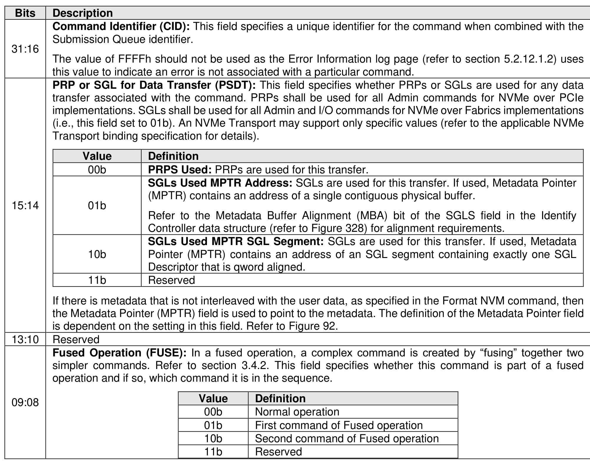
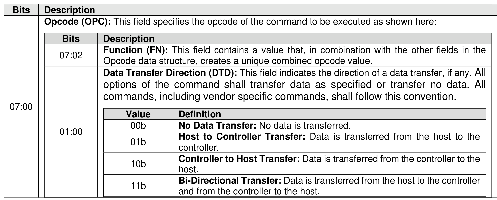
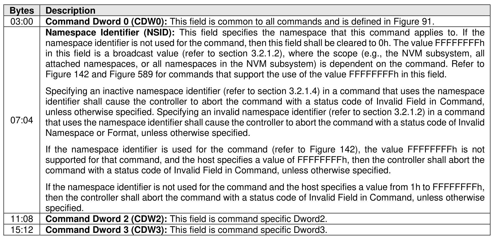
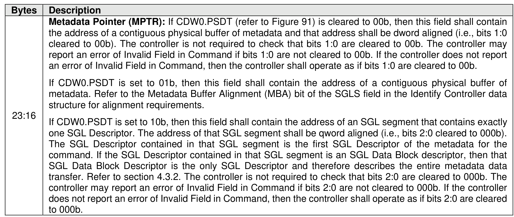
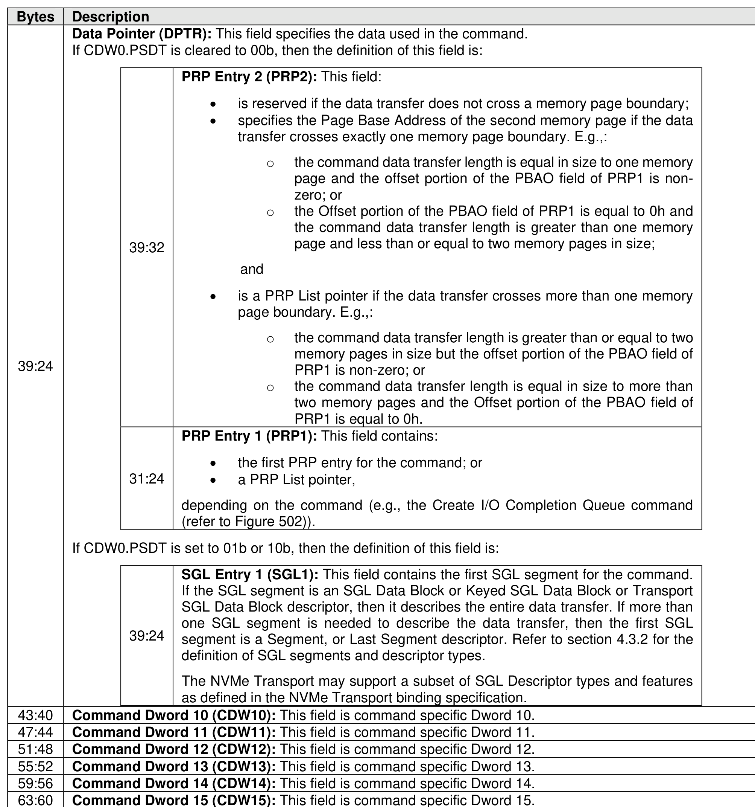
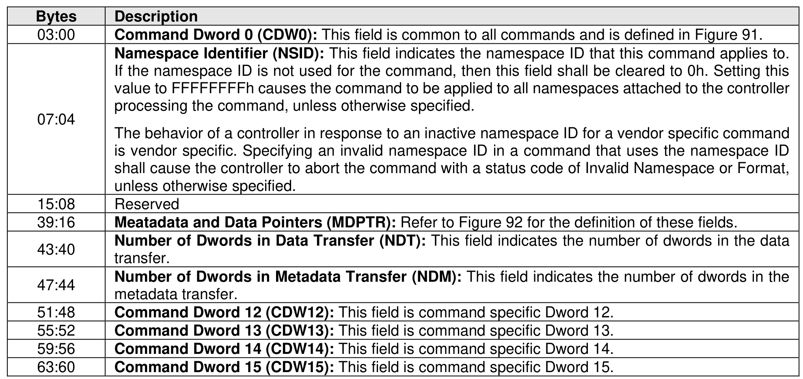

#### 4.1.1 Admin Command and I/O Command Common SQE

> **Section ID**: 4.1.1 | **Page**: 159-163

Each Common Command Format command is 64 bytes in size.
Command Dword 0, Namespace Identifier, Metadata Pointer, PRP Entry 1, PRP Entry 2, SGL Entry 1, and
Metadata SGL Segment Pointer have common definitions for all Admin commands and I/O commands for
all I/O Command Sets. Metadata Pointer, PRP Entry 1, PRP Entry 2, and Metadata SGL Segment Pointer
are not used by all commands. Command Dword 0 is defined in Figure 91.
The Common Command Format is defined in Figure 92. Any additional I/O Command Set defined in the
future may use an alternate command size or format.
SGLs shall not be used for Admin commands in NVMe over PCIe implementations.
In addition to the fields commonly defined for the Common Command Format, Vendor Specific commands
may support the Number of Dwords in Data Transfer and Number of Dwords in Metadata Transfer fields. If
supported, the command format for the Vendor Specific commands is defined in Figure 93. For more
details, refer to section 8.1.28.

---
### 📊 Tables (6)

#### Table 1: Untitled Table

| Value | Definition |
| :--- | :--- |
| 00b | **PRPs Used**: PRPs are used for this transfer. |
| 01b | **SGLs Used MPTR Address**: SGLs are used for this transfer. If used, Metadata Pointer (MPTR) contains an address of a single contiguous physical buffer.   Refer to the Metadata Buffer Alignment (MBA) bit of the SGLS field in the Identify Controller data structure (refer to Figure 328) for alignment requirements. |
| 10b | **SGLs Used MPTR SGL Segment**: SGLs are used for this transfer. If used, Metadata Pointer (MPTR) contains an address of an SGL segment containing exactly one SGL Descriptor that is qword aligned. |
| 11b | Reserved |
| | If there is metadata that is not interleaved with the user data, as specified in the Format NVM command, then the Metadata Pointer (MPTR) field is used to point to the metadata. The definition of the Metadata Pointer field is dependent on the setting in this field. Refer to Figure 92. |
| | Reserved |
| **Fused Operation (FUSE)**: In a fused operation, a complex command is created by "fusing" together two simpler commands. Refer to section 3.4.2. This field specifies whether this command is part of a fused operation and if so, which command it is in the sequence. |
| Value | Definition |
| :--- | :--- |
| 00b | Normal operation |
| 01b | First command of Fused operation |
| 10b | Second command of Fused operation |
| 11b | Reserved |
| | |
| | |
| | |
| | |
| | |
| | |
| | |
| | |
| | |
| | |
| Command Dword 2 (CDW2): This field is command specific Dword2. |  |
|---|---|
| Command Dword 3 (CDW3): This field is command specific Dword3. |  |
| | Description |
|:---|:---|
| 39:32 | **PRP Entry 2 (PRP2):** This field: • is reserved if the data transfer does not cross a memory page boundary; • specifies the Page Base Address of the second memory page if the data transfer crosses exactly one memory page boundary. E.g.,:   o the command data transfer length is equal in size to one memory page and the offset portion of the PBAO field of PRP1 is non-zero; or   o the Offset portion of the PBAO field of PRP1 is equal to 0h and the command data transfer length is greater than one memory page and less than or equal to two memory pages in size; and • is a PRP List pointer if the data transfer crosses more than one memory page boundary. E.g.,:   o the command data transfer length is greater than or equal to two memory pages in size but the offset portion of the PBAO field of PRP1 is non-zero; or   o the command data transfer length is equal in size to more than two memory pages and the Offset portion of the PBAO field of PRP1 is equal to 0h. |
| 31:24 | **PRP Entry 1 (PRP1):** This field contains: • the first PRP entry for the command; or • a PRP List pointer, depending on the command (e.g., the Create I/O Completion Queue command (refer to Figure 502)). |
| 39:24 | **SGL Entry 1 (SGL1):** This field contains the first SGL segment for the command. If the SGL segment is an SGL Data Block or Keyed SGL Data Block or Transport SGL Data Block descriptor, then it describes the entire data transfer. If more than one SGL segment is needed to describe the data transfer, then the first SGL segment is a Segment, or Last Segment descriptor. Refer to section 4.3.2 for the definition of SGL segments and descriptor types. The NVMe Transport may support a subset of SGL Descriptor types and features as defined in the NVMe Transport binding specification. |
| | **Command Dword 10 (CDW10):** This field is command specific Dword 10. |
| | **Command Dword 11 (CDW11):** This field is command specific Dword 11. |
| | **Command Dword 12 (CDW12):** This field is command specific Dword 12. |
| | **Command Dword 13 (CDW13):** This field is command specific Dword 13. |
| | **Command Dword 14 (CDW14):** This field is command specific Dword 14. |
| | **Command Dword 15 (CDW15):** This field is command specific Dword 15. |
| | In addition to the fields commonly defined for the Common Command Format, Vendor Specific commands support the Number of Dwords in Data Transfer and Number of Dwords in Metadata Transfer fields. If supported, the command format for the Vendor Specific commands is defined in Figure 93. For more details, refer to section 8.1.28. |
| | |
| | |
| | |
| | |
| | |
| | |
| | |
| | |
| | |
| | |

#### Table 2: Untitled Table

(Continuation of Untitled Table - see first part)

#### Table 3: Untitled Table

(Continuation of Untitled Table - see first part)

#### Table 4: Untitled Table

(Continuation of Untitled Table - see first part)

#### Table 5: Untitled Table

(Continuation of Untitled Table - see first part)

#### Table 6: Untitled Table

(Continuation of Untitled Table - see first part)

