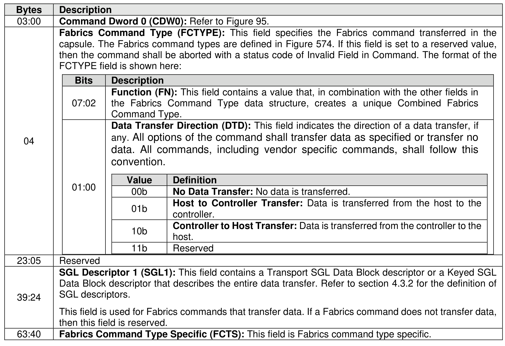
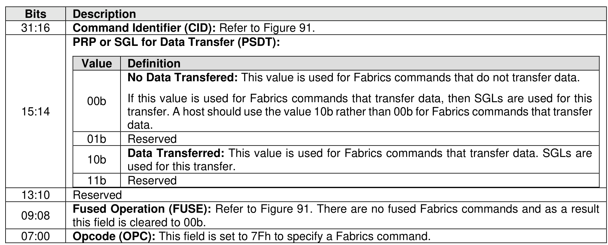

#### 4.1.2 Fabrics Command Common SQE

> **Section ID**: 4.1.2 | **Page**: 163-164

The common submission queue entry for Fabrics commands is shown in Figure 94.

---
### 📊 Tables (2)

#### Table 1: Untitled Table

| | | |
| :--- | :--- | :--- |
| | **Command Type.** | |
| | **Data Transfer Direction (DTD):** This field indicates the direction of a data transfer, if any. All options of the command shall transfer data as specified or transfer no data. All commands, including vendor specific commands, shall follow this convention. | |
| | | |
| | | **Value** | **Definition** |
| | | 00b | **No Data Transfer:** No data is transferred. |
| | | 01b | **Host to Controller Transfer:** Data is transferred from the host to the controller. |
| | | 10b | **Controller to Host Transfer:** Data is transferred from the controller to the host. |
| | | 11b | **Reserved** |
| | | |
| | Reserved | |
| | **SGL Descriptor 1 (SGL1):** This field contains a Transport SGL Data Block descriptor or a Keyed SGL Data Block descriptor that describes the entire data transfer. Refer to section 4.3.2 for the definition of SGL descriptors. | |
| | This field is used for Fabrics commands that transfer data. If a Fabrics command does not transfer data, then this field is reserved. | |
| | **Fabrics Command Type Specific (FCTS):** This field is Fabrics command type specific. | |
| | | |
| | | |
| | | |
| | | |
| | | |
| | | |
| | | |
|

#### Table 2: Untitled Table

(Continuation of Untitled Table - see first part)

