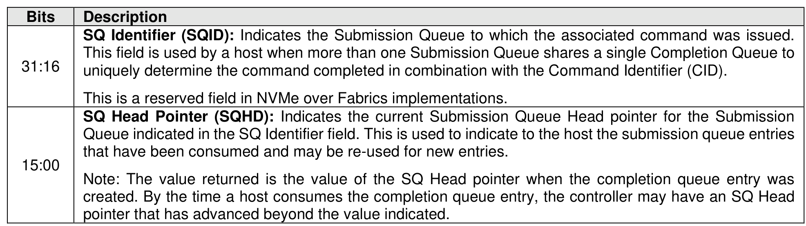
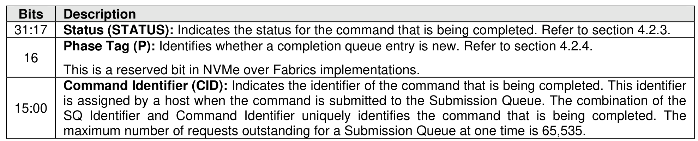

#### 4.2.1 Admin Command and I/O Command Common CQE

> **Section ID**: 4.2.1 | **Page**: 164-165

The Common Completion Queue Entry Layout is at least 16 bytes in size. Figure 96 describes the layout
of the first 16 bytes of the completion queue entry data structure which follows the Common Completion
Queue Entry Layout. The contents of Dword 0 and Dword 1 are command specific. If a command uses
Dword 0 or Dword 1, then the definition of these dwords is contained within the associated command
definition. If a command does not use Dword 0 or Dword 1, then the unused field(s) are reserved. Dword 2
is defined in Figure 97 and Dword 3 is defined in Figure 98.
If a completion queue entry is constructed via multiple writes, the Phase Tag bit shall be updated in the last
write of that completion queue entry.

---
### 📊 Tables (3)

#### Table 1: Untitled Table

| Phase Tag (P): Identifies whether a completion queue entry is new. Refer to section 4.2.4. | |
|---|---|
| This is a reserved bit in NVMe over Fabrics implementations. | |
| Command Identifier (CID): Indicates the identifier of the command that is being completed. This identifier is assigned by a host when the command is submitted to the Submission Queue. The combination of the SQ Identifier and Command Identifier uniquely identifies the command that is being completed. The maximum number of requests outstanding for a Submission Queue at one time is 65,535. | |

#### Table 2: Untitled Table

(Continuation of Untitled Table - see first part)

#### Table 3: Untitled Table

(Continuation of Untitled Table - see first part)

