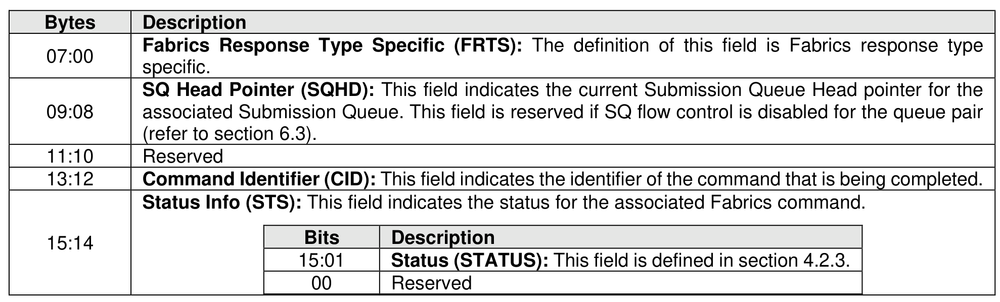

#### 4.2.2 Fabrics Command Common CQE

> **Section ID**: 4.2.2 | **Page**: 165-165

The common completion queue entry for Fabrics commands is shown in Figure 99.

---
### 📊 Tables (1)

#### Table 1: Untitled Table

| | | |
| :--- | :--- | :--- |
| | **Command Identifier (CID):** This field indicates the identifier of the command that is being completed. | |
| | **Status Info (STS):** This field indicates the status for the associated Fabrics command. | |
| | | **Bits** | **Description** |
| | | 15:01 | **Status (STATUS):** This field is defined in section 4.2.3. |
| | | 00 | Reserved |

