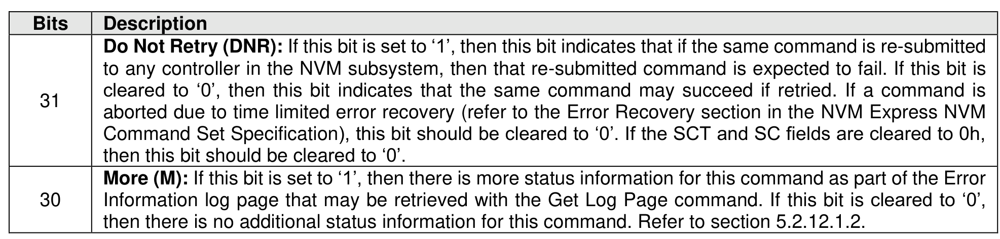
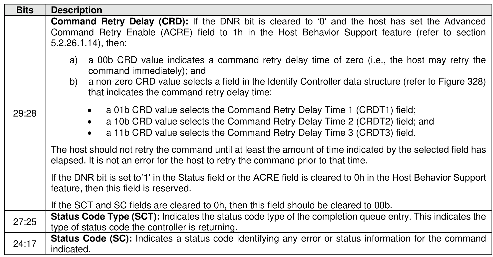
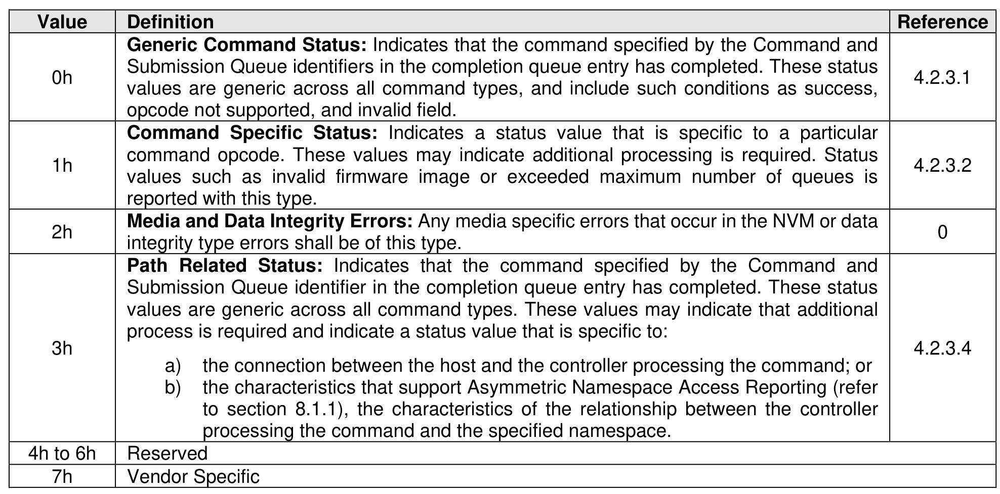

#### 4.2.3 Status Field Definition

> **Section ID**: 4.2.3 | **Page**: 165-167

The Status field defines the status for the command indicated in the completion queue entry, defined in
Figure 100.
A value of 0h for the Status field indicates a successful command completion, with no fatal or non-fatal error
conditions. Unless otherwise noted, if a command fails to complete successfully for multiple reasons, then
the particular status code returned is chosen by the vendor.
The Status Code (SC) field in the completion queue entry indicates more detailed status information about
the completion being reported.
Each Status Code set of values is split into three ranges:
•
00h to 7Fh: Applicable to Admin Command Set, Fabrics commands, or across multiple command
sets;
NVM Express® Base Specification, Revision 2.3
•
80h to BFh: I/O Command Set specific status codes, or Fabrics command specific status codes;
and
•
C0h to FFh: Vendor Specific status codes.
Unless otherwise specified, if multiple status codes apply, then the controller selects the status code that is
returned.

---
### 📊 Tables (3)

#### Table 1: Untitled Table

| | Definition | Reference |
| :--- | :--- | :--- |
| | **Generic Command Status:** Indicates that the command specified by the Command and Submission Queue identifiers in the completion queue entry has completed. These status values are generic across all command types. These values may indicate that additional process is required and indicate a status value that is specific to: | 4.2.3.1 |
| | | 0 |
| | **Media and Data integrity Errors:** Any media specific errors that occur in the NVM or data integrity type errors shall be of this type. | |
| | **Path Related Status:** Indicates that the command specified by the Command and Submission Queue identifier in the completion queue entry has completed. These status values are generic across all command types. These values may indicate that additional process is required and indicate a status value that is specific to: | 4.2.3.4 |
| | a) the connection between the host and the controller processing the command; or b) the characteristics that support Asymmetric Namespace Access Reporting (refer to section 8.1.1), the characteristics of the relationship between the controller processing the command and the specified namespace. | |
| | Reserved | |
| | Vendor Specific | |

#### Table 2: Untitled Table

(Continuation of Untitled Table - see first part)

#### Table 3: Untitled Table

(Continuation of Untitled Table - see first part)

