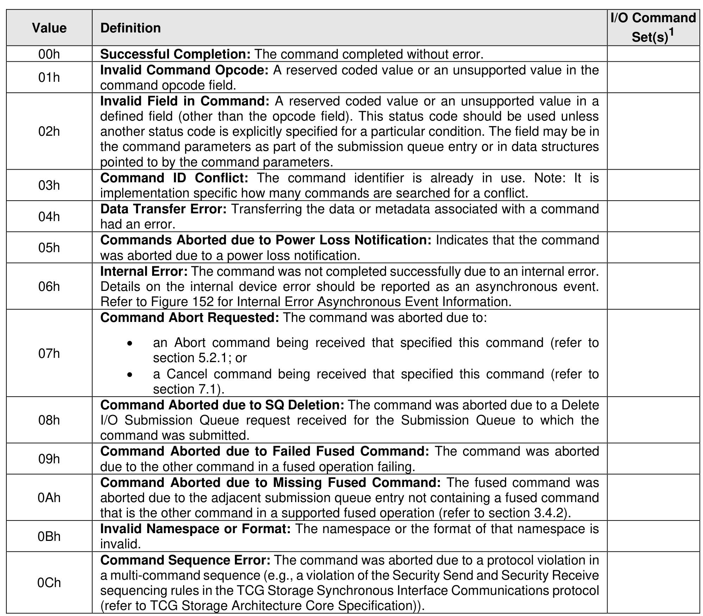
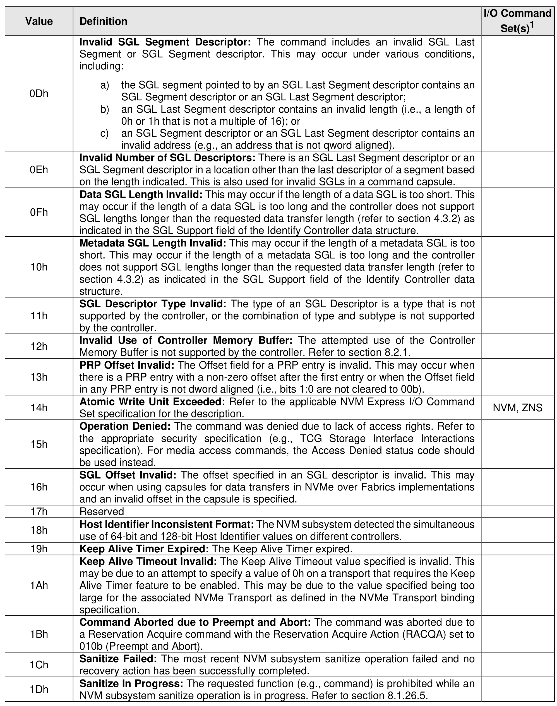
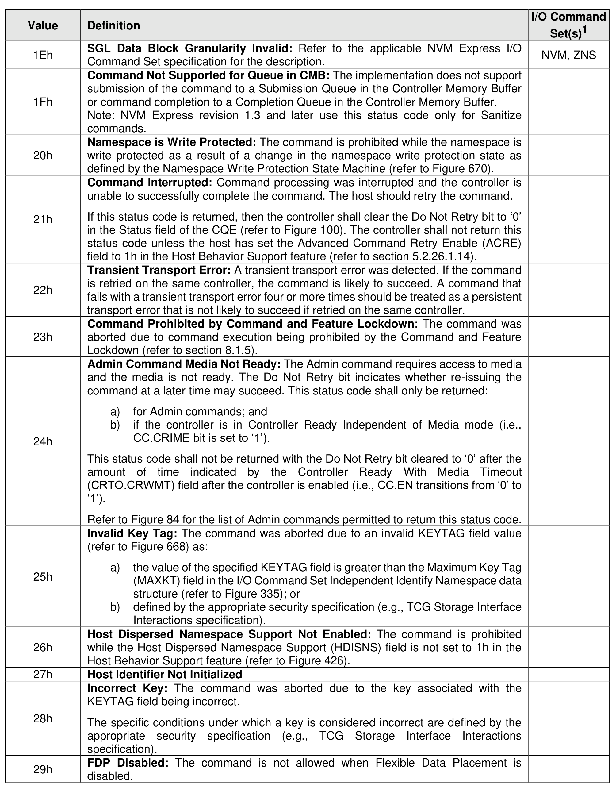
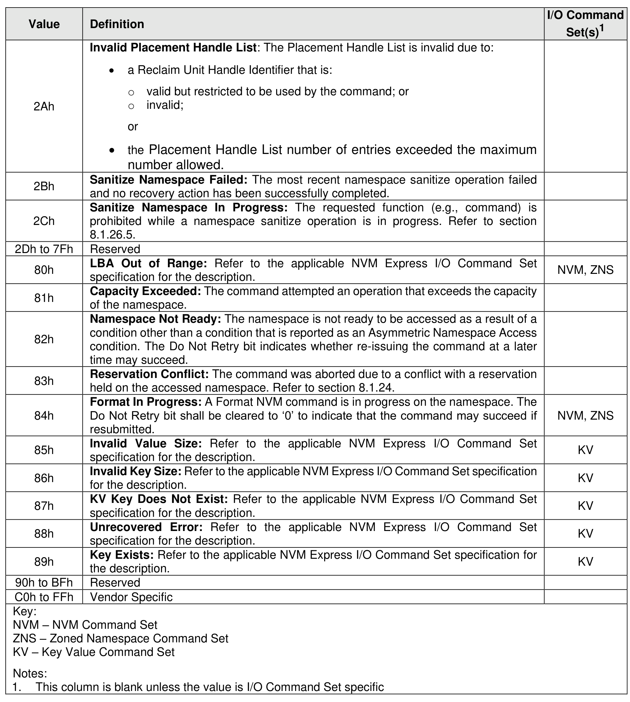

##### 4.2.3.1 Generic Command Status Definition

> **Section ID**: 4.2.3.1 | **Page**: 167-170

Completion queue entries with a Status Code Type (SCT) of Generic Command Status indicate a status
value associated with the command that is generic across many different types of commands.

---
### 📊 Tables (4)

#### Table 1: Untitled Table

| command opcode field. |  |
| :--- | :--- |
| **Invalid Field in Command**: A reserved coded value or an unsupported value in a defined field (other than the opcode field). This status code should be used unless another status code is explicitly specified for a particular condition. The field may be in the command parameters as part of the submission queue entry or in data structures pointed to by the command parameters. |  |
| **Command ID Conflict**: The command identifier is already in use. Note: It is implementation specific how many commands are searched for a conflict. |  |
| **Data Transfer Error**: Transferring the data or metadata associated with a command had an error. |  |
| **Commands Aborted due to Power Loss Notification**: Indicates that the command was aborted due to a power loss notification. |  |
| **Internal Error**: The command was not completed successfully due to an internal error. Details on the internal device error should be reported as an asynchronous event. Refer to Figure 152 for Internal Error Asynchronous Event Information. |  |
| **Command Abort Requested**: The command was aborted due to:   • an Abort command being received that specified this command (refer to section 5.2.1; or   • a Cancel command being received that specified this command (refer to section 7.1). |  |
| **Command Aborted due to SQ Deletion**: The command was aborted due to a Delete I/O Submission Queue request received for the Submission Queue to which the command was submitted. |  |
| **Command Aborted due to Failed Fused Command**: The command was aborted due to the other command in a fused operation failing. |  |
| **Command Aborted due to Missing Fused Command**: The fused command was aborted due to the adjacent submission queue entry not containing a fused command that is the other command in a supported fused operation (refer to section 3.4.2). |  |
| **Invalid Namespace or Format**: The namespace or the format of that namespace is invalid. |  |
| **Command Sequence Error**: The command was aborted due to a protocol violation in a multi-command sequence (e.g., a violation of the Security Send and Security Receive sequencing rules in the TCG Storage Synchronous Interface Communications protocol (refer to TCG Storage Architecture Core Specification)). |  |
| | Set(s) |
| :--- | :--- |
| Invalid SGL Segment Descriptor: The command includes an invalid SGL Last Segment or SGL Segment descriptor. This may occur under various conditions, including:   a) the SGL segment pointed to by an SGL Last Segment descriptor contains an SGL Segment descriptor or an SGL Last Segment descriptor;   b) an SGL Last Segment descriptor contains an invalid length (i.e., a length of 0h or 1h that is not a multiple of 16); or   c) an SGL Segment descriptor or an SGL Last Segment descriptor contains an invalid address (e.g., an address that is not qword aligned). | |
| Invalid Number of SGL Descriptors: There is an SGL Last Segment descriptor or an SGL Segment descriptor in a location other than the last descriptor of a segment based on the length indicated. This is also used for invalid SGLs in a command capsule. | |
| Data SGL Length Invalid: This may occur if the length of a data SGL is too short. This may occur if the length of a data SGL is too long and the controller does not support SGL lengths longer than the requested data transfer length (refer to section 4.3.2) as indicated in the SGL Support field of the Identify Controller data structure. | |
| Metadata SGL Length Invalid: This may occur if the length of a metadata SGL is too short. This may occur if the length of a metadata SGL is too long and the controller does not support SGL lengths longer than the requested data transfer length (refer to section 4.3.2) as indicated in the SGL Support field of the Identify Controller data structure. | |
| SGL Descriptor Type Invalid: The type of an SGL Descriptor is a type that is not supported by the controller, or the combination of type and subtype is not supported by the controller. | |
| Invalid Use of Controller Memory Buffer: The attempted use of the Controller Memory Buffer is not supported by the controller. Refer to section 8.2.1. | |
| PRP Offset Invalid: The Offset field for a PRP entry is invalid. This may occur when there is a PRP entry with a non-zero offset after the first entry or when the Offset field in any PRP entry is not dword aligned (i.e., bits 1:0 are not cleared to 00b). | |
| Atomic Write Unit Exceeded: Refer to the applicable NVM Express I/O Command Set specification for the description. | NVM, ZNS |
| Operation Denied: The command was denied due to lack of access rights. Refer to the appropriate security specification (e.g., TCG Storage Interface Interactions specification). For media access commands, the Access Denied status code should be used instead. | |
| SGL Offset Invalid: The offset specified in an SGL descriptor is invalid. This may occur when using capsules for data transfers in NVMe over Fabrics implementations and an invalid offset in the capsule is specified. | |
| Reserved | |
| Host Identifier Inconsistent Format: The NVM subsystem detected the simultaneous use of 64-bit and 128-bit Host Identifier values on different controllers. | |
| Keep Alive Timer Expired: The Keep Alive Timer expired. | |
| Keep Alive Timeout Invalid: The Keep Alive Timeout value specified is invalid. This may be due to an attempt to specify a value of 0h on a transport that requires the Keep Alive Timer feature to be enabled. This may be due to the value specified being too large for the associated NVMe Transport as defined in the NVMe Transport binding specification. | |
| Command Aborted due to Preempt and Abort: The command was aborted due to a Reservation Acquire command with the Reservation Acquire Action (RACQA) set to 010b (Preempt and Abort). | |
| Sanitize Failed: The most recent NVM subsystem sanitize operation failed and no recovery action has been successfully completed. | |
| Sanitize In Progress: The requested function (e.g., command) is prohibited while an NVM subsystem sanitize operation is in progress. Refer to section 8.1.26.5. | |
| Definition | Set(s)¹ |
| :--- | :--- |
| SGL Data Block Granularity Invalid: Refer to the applicable NVM Express I/O Command Set specification for the description. | NVM, ZNS |
| Command Not Supported for Queue in CMB: The implementation does not support submission of the command to a Submission Queue in the Controller Memory Buffer or command completion to a Completion Queue in the Controller Memory Buffer. Note: NVM Express revision 1.3 and later use this status code only for Sanitize commands. | |
| Namespace is Write Protected: The command is prohibited while the namespace is write protected as a result of a change in the namespace write protection state as defined by the Namespace Write Protection State Machine (refer to Figure 670). | |
| Command Interrupted: Command processing was interrupted and the controller is unable to successfully complete the command. The host should retry the command.   If this status code is returned, then the controller shall clear the Do Not Retry bit to '0' in the Status field of the CQE (refer to Figure 100). The controller shall not return this status code unless the host has set the Advanced Command Retry Enable (ACRE) field to '1h' in the Host Behavior Support feature (refer to section 5.2.26.1.14). | |
| Transient Transport Error: A transient transport error was detected. If the command is retried on the same controller, the command is likely to succeed. A command that fails with a transient transport error four or more times should be treated as a persistent transport error that is not likely to succeed if retried on the same controller. | |
| Command Prohibited by Command and Feature Lockdown: The command was aborted due to command execution being prohibited by the Command and Feature Lockdown (refer to section 8.1.5). | |
| Admin Command Media Not Ready: The Admin command requires access to media and the media is not ready. The Do Not Retry bit indicates whether re-issuing the command at a later time may succeed. This status code shall only be returned:   a) for Admin commands; and   b) if the controller is in Controller Ready Independent of Media mode (i.e., CC.CRIME bit is set to '1').   This status code shall not be returned with the Do Not Retry bit cleared to '0' after the amount of time indicated by the Controller Ready With Media Timeout (CRTO.CRWMT) field after the controller is enabled (i.e., CC.EN transitions from '0' to '1').   Refer to Figure 84 for the list of Admin commands permitted to return this status code. | |
| Invalid Key Tag: The command was aborted due to an invalid KEYTAG field value (refer to Figure 668) as:   a) the value of the specified KEYTAG field is greater than the Maximum Key Tag (MAXKT) field in the I/O Command Set Independent Identify Namespace data structure (refer to Figure 335); or   b) defined by the appropriate security specification (e.g., TCG Storage Interface Interactions specification). | |
| Host Dispersed Namespace Support Not Enabled: The command is prohibited while the Host Dispersed Namespace Support (HDISNS) field is not set to 1h in the Host Behavior Support feature (refer to Figure 426). | |
| Host Identifier Not Initialized | |
| Incorrect Key: The command was aborted due to the key associated with the KEYTAG field being incorrect.   The specific conditions under which a key is considered incorrect are defined by the appropriate security specification (e.g., TCG Storage Interface Interactions specification). | |
| FDP Disabled: The command is not allowed when Flexible Data Placement is disabled. | |
| | Set(s) |
| :--- | :--- |
| Invalid Placement Handle List: The Placement Handle List is invalid due to:   • a Reclaim Unit Handle Identifier that is:   &nbsp;&nbsp;&nbsp;&nbsp;o valid but restricted to be used by the command; or   &nbsp;&nbsp;&nbsp;&nbsp;o invalid;   &nbsp;&nbsp;&nbsp;&nbsp;or   • the Placement Handle List number of entries exceeded the maximum number allowed. | |
| Sanitize Namespace Failed: The most recent namespace sanitize operation failed and no recovery action has been successfully completed. | |
| Sanitize Namespace In Progress: The requested function (e.g., command) is prohibited while a namespace sanitize operation is in progress. Refer to section 8.1.26.5. | |
| 7Fh | Reserved |
| LBA Out of Range: Refer to the applicable NVM Express I/O Command Set specification for the description. | NVM, ZNS |
| Capacity Exceeded: The command attempted an operation that exceeds the capacity of the namespace. | |
| Namespace Not Ready: The namespace is not ready to be accessed as a result of a condition other than a condition that is reported as an Asymmetric Namespace Access condition. The Do Not Retry bit indicates whether re-issuing the command at a later time may succeed. | |
| Reservation Conflict: The command was aborted due to a conflict with a reservation held on the accessed namespace. Refer to section 8.1.24. | |
| Format In Progress: A Format NVM command is in progress on the namespace. The Do Not Retry bit shall be cleared to '0' to indicate that the command may succeed if resubmitted. | NVM, ZNS |
| Invalid Value Size: Refer to the applicable NVM Express I/O Command Set specification for the description. | KV |
| Invalid Key Size: Refer to the applicable NVM Express I/O Command Set specification for the description. | KV |
| KV Key Does Not Exist: Refer to the applicable NVM Express I/O Command Set specification for the description. | KV |
| Unrecovered Error: Refer to the applicable NVM Express I/O Command Set specification for the description. | KV |
| Key Exists: Refer to the applicable NVM Express I/O Command Set specification for the description. | KV |
| 3Fh | Reserved |
| FFh | Vendor Specific |
| NVM Command Set   Zoned Namespace Command Set   Key Value Command Set | |
| The Set(s) column is blank unless the value is I/O Command Set specific | |
| **Command Specific Status Definition**   Command queue entries with a Status Code Type (SCT) of Command Specific Errors indicate an error specific to a particular command opcode. Status codes of 00h to 7Fh are for Admin command errors (refer to Figure 103). Status codes of 80h to BFh are specific to the selected I/O command sets (refer to 04). | |

#### Table 2: Untitled Table

(Continuation of Untitled Table - see first part)

#### Table 3: Untitled Table

(Continuation of Untitled Table - see first part)

#### Table 4: Untitled Table

(Continuation of Untitled Table - see first part)

