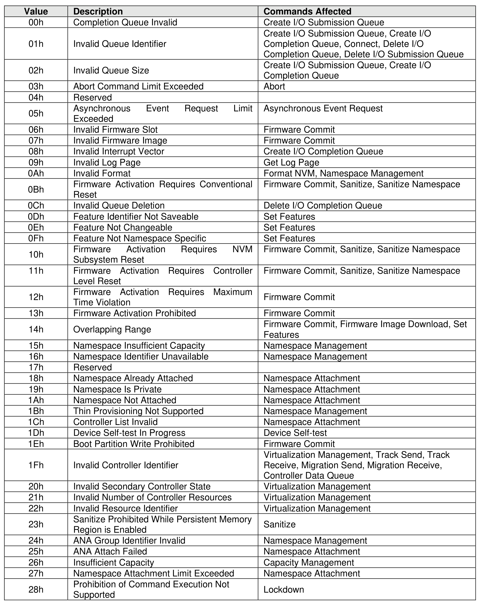
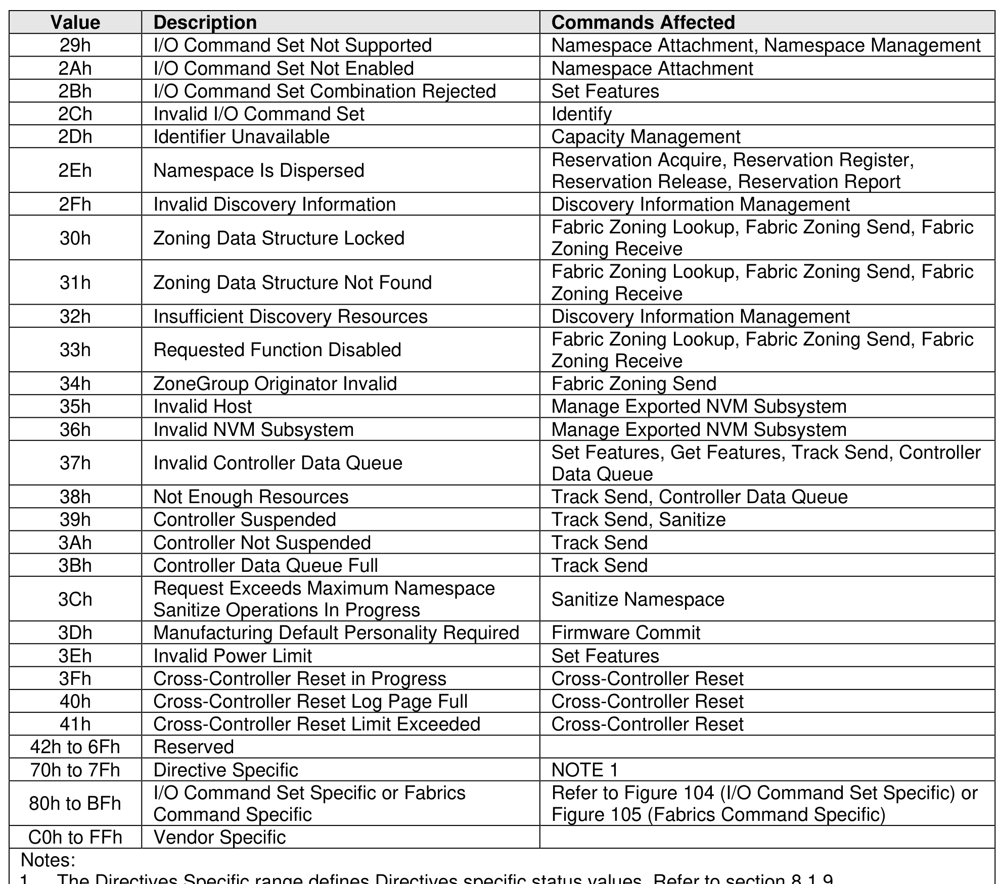
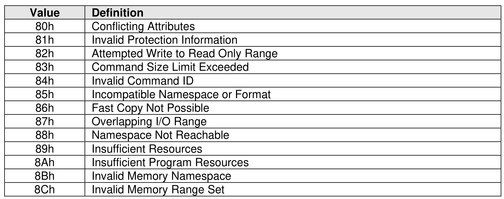
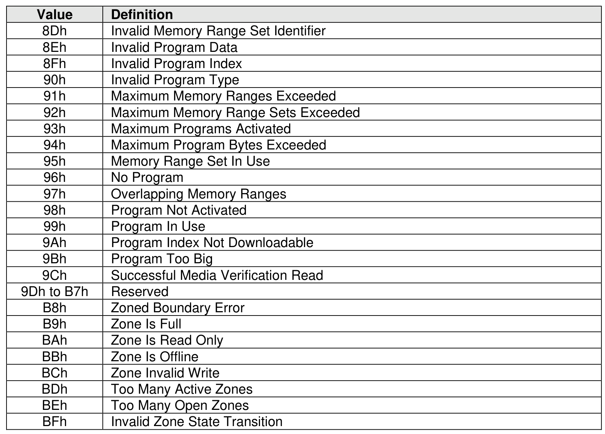
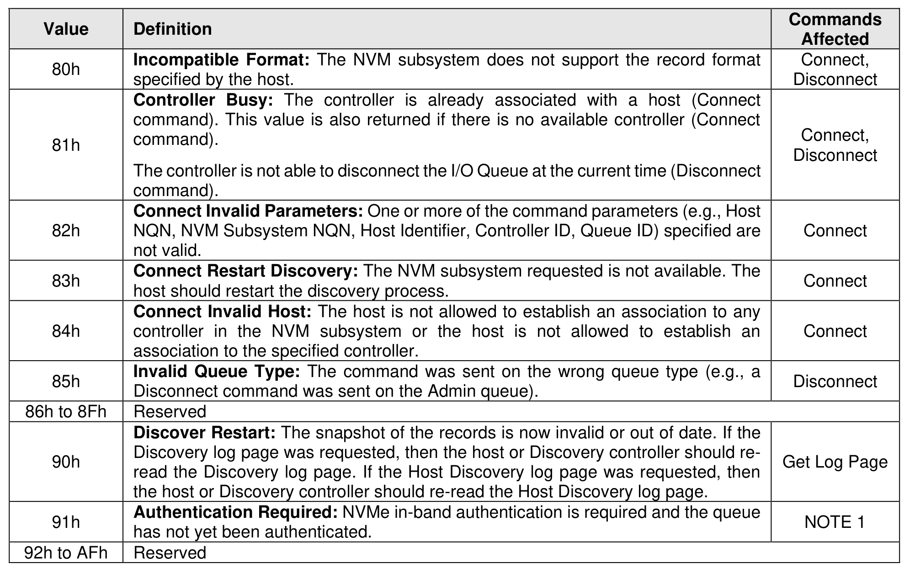
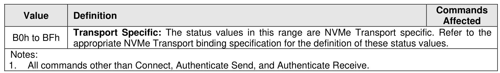

##### 4.2.3.2 Command Specific Status Definition

> **Section ID**: 4.2.3.2 | **Page**: 170-174

Completion queue entries with a Status Code Type (SCT) of Command Specific Errors indicate an error
that is specific to a particular command opcode. Status codes of 00h to 7Fh are for Admin command errors
(refer to Figure 103). Status codes of 80h to BFh are specific to the selected I/O command sets (refer to
Figure 104).
Fabrics command errors use status codes of 80h to BFh (refer to Figure 105) and Admin command error
status codes (refer to Figure 103).
Some Fabrics command errors use Admin command error status codes (refer to Figure 103).

---
### 📊 Tables (6)

#### Table 1: Untitled Table

| | | |
|:---|:---|:---|
| | Invalid Queue Identifier | Create I/O Submission Queue, Create I/O Completion Queue, Connect, Delete I/O Completion Queue, Delete I/O Submission Queue |
| | Invalid Queue Size | Create I/O Submission Queue, Create I/O Completion Queue |
| | Abort Command Limit Exceeded | Abort |
| | Reserved | |
| | Asynchronous Event Request Limit Exceeded | Asynchronous Event Request |
| | Invalid Firmware Slot | Firmware Commit |
| | Invalid Firmware Image | Firmware Commit |
| | Invalid Interrupt Vector | Create I/O Completion Queue |
| | Invalid Log Page | Get Log Page |
| | Invalid Format | Format NVM, Namespace Management |
| | Firmware Activation Requires Conventional Reset | Firmware Commit, Sanitize, Sanitize Namespace |
| | Invalid Queue Deletion | Delete I/O Completion Queue |
| | Feature Identifier Not Saveable | Set Features |
| | Feature Not Changeable | Set Features |
| | Feature Not Namespace Specific | Set Features |
| | Firmware Activation Requires NVM Subsystem Reset | Firmware Commit, Sanitize, Sanitize Namespace |
| | Firmware Activation Requires Controller Level Reset | Firmware Commit, Sanitize, Sanitize Namespace |
| | Firmware Activation Requires Maximum Time Violation | Firmware Commit |
| | Firmware Activation Prohibited | Firmware Commit |
| | Overlapping Range | Firmware Commit, Firmware Image Download, Set Features |
| | Namespace Insufficient Capacity | Namespace Management |
| | Namespace Identifier Unavailable | Namespace Management |
| | Reserved | |
| | Namespace Already Attached | Namespace Attachment |
| | Namespace Is Private | Namespace Attachment |
| | Namespace Not Attached | Namespace Attachment |
| | Thin Provisioning Not Supported | Namespace Management |
| | Controller List Invalid | Namespace Attachment |
| | Device Self-test In Progress | Device Self-test |
| | Boot Partition Write Prohibited | Firmware Commit |
| | Invalid Controller Identifier | Virtualization Management, Track Send, Track Receive, Migration Send, Migration Receive, Controller Data Queue |
| | Invalid Secondary Controller State | Virtualization Management |
| | Invalid Number of Controller Resources | Virtualization Management |
| | Invalid Resource Identifier | Virtualization Management |
| | Sanitize Prohibited While Persistent Memory Region is Enabled | Sanitize |
| | ANA Group Identifier Invalid | Namespace Management |
| | ANA Attach Failed | Namespace Attachment |
| | Insufficient Capacity | Capacity Management |
| | Namespace Attachment Limit Exceeded | Namespace Attachment |
| | Prohibition of Command Execution Not Supported | Lockdown |
| | | |
| :--- | :--- | :--- |
| | I/O Command Set Not Supported | Namespace Attachment, Namespace Management |
| | I/O Command Set Combination Rejected | Set Features |
| | Invalid I/O Command Set | Identify |
| | Identifier Unavailable | Capacity Management |
| | Namespace Is Dispersed | Reservation Acquire, Reservation Register, Reservation Release, Reservation Report |
| | Invalid Discovery Information | Discovery Information Management |
| | Zoning Data Structure Locked | Fabric Zoning Lookup, Fabric Zoning Send, Fabric Zoning Receive |
| | Zoning Data Structure Not Found | Fabric Zoning Lookup, Fabric Zoning Send, Fabric Zoning Receive |
| | Insufficient Discovery Resources | Discovery Information Management |
| | Requested Function Disabled | Fabric Zoning Lookup, Fabric Zoning Send, Fabric Zoning Receive |
| | ZoneGroup Originator Invalid | Fabric Zoning Send |
| | Invalid Host | Manage Exported NVM Subsystem |
| | Invalid NVM Subsystem | Manage Exported NVM Subsystem |
| | Invalid Controller Data Queue | Set Features, Get Features, Track Send, Controller Data Queue |
| | Not Enough Resources | Track Send, Controller Data Queue |
| | Controller Suspended | Track Send, Sanitize |
| | Controller Not Suspended | Track Send |
| | Controller Data Queue Full | Track Send |
| | Request Exceeds Maximum Namespace Sanitize Operations In Progress | Sanitize Namespace |
| | Manufacturing Default Personality Required | Firmware Commit |
| | Invalid Power Limit | Set Features |
| | Cross-Controller Reset in Progress | Cross-Controller Reset |
| | Cross-Controller Reset Log Page Full | Cross-Controller Reset |
| | Cross-Controller Reset Limit Exceeded | Cross-Controller Reset |
| | 6Fh | Reserved |
| | 7Fh | Directive Specific |
| | | NOTE 1 |
| | BFFh | I/O Command Set Specific or Fabrics Command Specific |
| | | Refer to Figure 104 (I/O Command Set Specific) or Figure 105 (Fabrics Command Specific) |
| | FFFh | Vendor Specific |
| | | |
| | | |
| | | |
| | | |
| | | |
| | | |
| | | |
| |
| | | |
| :--- | :--- | :--- |
| Invalid Program Data | | |
| Invalid Program Index | | |
| Invalid Program Type | | |
| Maximum Memory Ranges Exceeded | | |
| Maximum Memory Range Sets Exceeded | | |
| Maximum Programs Activated | | |
| Maximum Program Bytes Exceeded | | |
| Memory Range Set In Use | | |
| No Program | | |
| Overlapping Memory Ranges | | |
| Program Not Activated | | |
| Program In Use | | |
| Program Index Not Downloadable | | |
| Program Too Big | | |
| Successful Media Verification Read | | |
| Reserved | | |
| Zoned Boundary Error | | |
| Zone Is Full | | |
| Zone Is Read Only | | |
| Zone Is Offline | | |
| Zone Invalid Write | | |
| Too Many Active Zones | | |
| Too Many Open Zones | | |
| Invalid Zone State Transition | | |
| | | |
| | | |
| | | |
| | | |
| | | |
| | | |
| | | |

#### Table 2: Untitled Table

(Continuation of Untitled Table - see first part)

#### Table 3: Untitled Table

(Continuation of Untitled Table - see first part)

#### Table 4: Untitled Table

(Continuation of Untitled Table - see first part)

#### Table 5: Untitled Table

(Continuation of Untitled Table - see first part)

#### Table 6: Untitled Table

(Continuation of Untitled Table - see first part)

