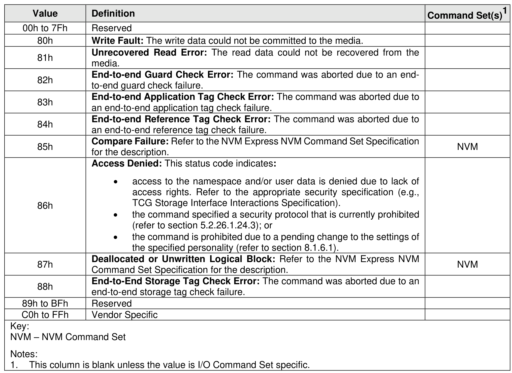

##### 4.2.3.3 Media and Data Integrity Errors Definition

> **Section ID**: 4.2.3.3 | **Page**: 174-174

Completion queue entries with a Status Code Type (SCT) of Media and Data Integrity Errors indicate an
error associated with the command that is due to an error associated with the NVM media or a data integrity
type error.

---
### 📊 Tables (1)

#### Table 1: Untitled Table

| 2h | End-to-end Guard Check Error: The command was aborted due to an end-to-end guard check failure. |  |
| :--- | :--- | :--- |
| 3h | End-to-end Application Tag Check Error: The command was aborted due to an end-to-end application tag check failure. |  |
| 4h | End-to-end Reference Tag Check Error: The command was aborted due to an end-to-end reference tag check failure. |  |
| 5h | Compare Failure: Refer to the NVM Express NVM Command Set Specification for the description. | NVM |
| 6h | **Access Denied:** This status code indicates: • access to the namespace and/or user data is denied due to lack of access rights. Refer to the appropriate security specification (e.g., TCG Storage Interface Interactions Specification). • the command specified a security protocol that is currently prohibited (refer to section 5.2.26.1.24.3); or • the command is prohibited due to a pending change to the settings of the specified personality (refer to section 8.1.6.1). |  |
| 7h | Deallocated or Unwritten Logical Block: Refer to the NVM Express NVM Command Set Specification for the description. | NVM |
| 8h | End-to-End Storage Tag Check Error: The command was aborted due to an end-to-end storage tag check failure. |  |
| o BFh | Reserved |  |
| o FFh | Vendor Specific |  |
| | | |
| | | |
| | | |
| | | |
| | | |
| | | |
| | | |
| |

