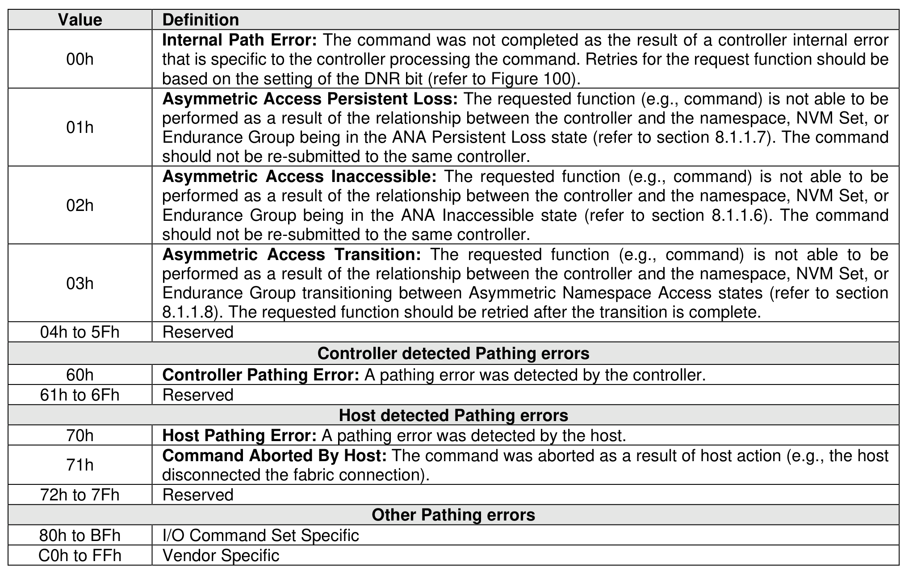

##### 4.2.3.4 Path Related Status Definition

> **Section ID**: 4.2.3.4 | **Page**: 174-175

Completion queue entries with a Status Code Type (SCT) of Path Related Status (refer to Figure 107)
indicate a status value associated with the command that is generic across many different types of
commands and applies to a specific connection between the host and controller processing the command
or between the controller and the namespace. The command for which this status is returned may be retried
on a different controller in the same NVM subsystem if more than one controller is available to the host.
In a multipath environment, unless otherwise specified, errors of this type should be retried using a different
path, if one is available.

---
### 📊 Tables (1)

#### Table 1: Untitled Table

| | |
| :--- | :--- |
| 0h | that is specific to the controller processing the command. Retries for the request function should be based on the setting of the DNR bit (refer to Figure 100). |
| 1h | **Asymmetric Access Persistent Loss:** The requested function (e.g., command) is not able to be performed as a result of the relationship between the controller and the namespace, NVM Set, or Endurance Group being in the ANA Persistent Loss state (refer to section 8.1.1.7). The command should not be re-submitted to the same controller. |
| 2h | **Asymmetric Access Inaccessible:** The requested function (e.g., command) is not able to be performed as a result of the relationship between the controller and the namespace, NVM Set, or Endurance Group being in the ANA Inaccessible state (refer to section 8.1.1.6). The command should not be re-submitted to the same controller. |
| 3h | **Asymmetric Access Transition:** The requested function (e.g., command) is not able to be performed as a result of the relationship between the controller and the namespace, NVM Set, or Endurance Group transitioning between Asymmetric Namespace Access states (refer to section 8.1.1.8). The requested function should be retried after the transition is complete. |
| o 5Fh | Reserved |
| | **Controller detected Pathing errors** |
| 0h | **Controller Pathing Error:** A pathing error was detected by the controller. |
| o 6Fh | Reserved |
| | **Host detected Pathing errors** |
| 0h | **Host Pathing Error:** A pathing error was detected by the host. |
| 1h | **Command Aborted By Host:** The command was aborted as a result of host action (e.g., the host disconnected the fabric connection). |
| o 7Fh | Reserved |
| | **Other Pathing errors** |
| o BFh | I/O Command Set Specific |
| o FFh | Vendor Specific |
| | **Phase Tag** |
| | Phase Tag bit indicates whether a completion queue entry is new. The Phase Tag bit for each on queue entry in: |
| | the Admin Completion Queue shall be initialized to ‘0’ by the host prior to setting CC.EN (refer to Figure 41) to ‘1’; and |
| | an I/O Completion Queue shall be initialized to ‘0’ by the host prior to submitting the Create I/O Completion Queue command for that queue. |
| | the controller posts a new completion queue entry to the Completion Queue, the controller shall |

