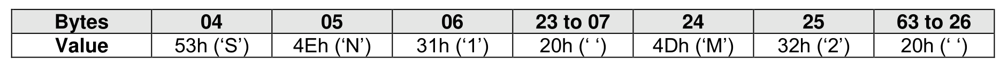

#### 4.5.2 Serial Number (SN) and Model Number (MN)

> **Section ID**: 4.5.2 | **Page**: 188-188

The Serial Number (SN, bytes 23:04) and Model Number (MN, bytes 63:24) are defined in the Identify
Controller data structure. The values are ASCII strings assigned by the vendor. Each identifier is in big
endian format.
Example (Value shown as ASCII characters):
•
SN = “SN1”; and
•
MN = “M2”.

---
### 📊 Tables (1)

#### Table 1: Untitled Table

164

