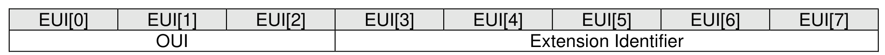
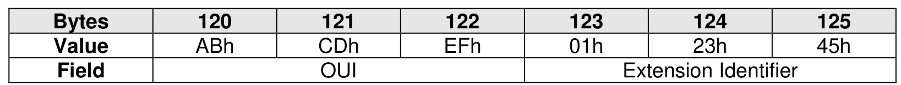
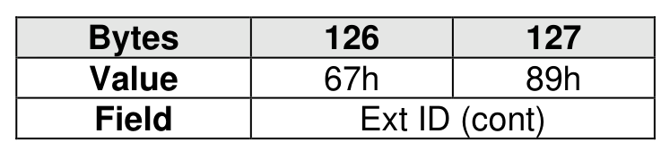
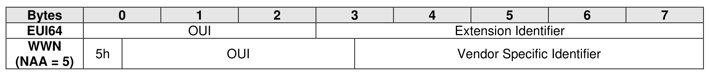

#### 4.5.4 IEEE Extended Unique Identifier (EUI64)

> **Section ID**: 4.5.4 | **Page**: 189-189

The IEEE Extended Unique Identifier (EUI64, bytes 127:120) is defined in the Identify Namespace data
structure. Tutorials are available at https://standards.ieee.org/develop/regauth/tut/index.html. IEEE defines
three formats that may be used in this field: MA-L, MA-M, and MA-S. The examples in this section use the
MA-L format.
The MA-L format is defined as a string of eight octets:
EUI64 is defined in big endian format. The OUI field differs from the OUI Identifier which is in little endian
format as described in section 4.5.3.
Example:
•
OUI Identifier = ABCDEFh; and
•
Extension Identifier = 0123456789h.
The MA-L format is similar to the World Wide Name (WWN) format defined as IEEE Registered designator
(NAA = 5) as shown below.

---
### 📊 Tables (4)

#### Table 1: Untitled Table

| Field | Ext ID (cont) |
|---|---|
| Extension Identifier | |
| Vendor Specific Identifier | |

#### Table 2: Untitled Table

(Continuation of Untitled Table - see first part)

#### Table 3: Untitled Table

(Continuation of Untitled Table - see first part)

#### Table 4: Untitled Table

(Continuation of Untitled Table - see first part)

