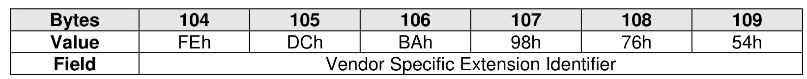
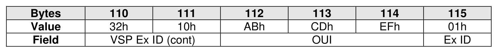
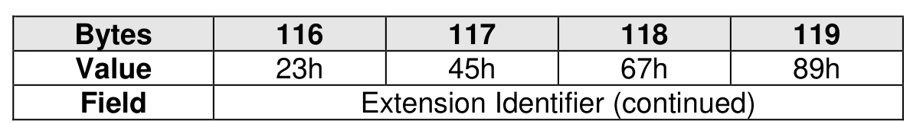
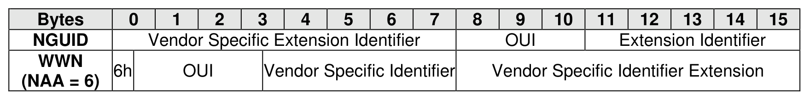

#### 4.5.5 Namespace Globally Unique Identifier (NGUID)

> **Section ID**: 4.5.5 | **Page**: 189-190

The Namespace Globally Unique Identifier (NGUID, bytes 119:104) is defined in the Identify Namespace
data structure. The NGUID is composed of an IEEE OUI, an extension identifier, and a vendor specific
extension identifier. The extension identifier and vendor specific extension identifier are both assigned by
the vendor and may be considered as a single field. NGUID is defined in big endian format. The OUI field
differs from the OUI Identifier which is in little endian format as described in section 4.5.3.
Example:
•
OUI Identifier = ABCDEFh;
•
Extension Identifier = 0123456789h; and
•
Vendor Specific Extension Identifier = FEDCBA9876543210h.
The NGUID format is similar to the World Wide Name (WWN) format as IEEE Registered Extended
designator (NAA = 6) as shown below.

---
### 📊 Tables (4)

#### Table 1: Untitled Table

| 110 | 111 | 112 | 113 | 114 | 115 |
|---|---|---|---|---|---|
| 22h | 10h | ADBh | CDBh | ECh | 01h |
| **Bytes** | **116** | **117** | **118** | **119** | |
| **Value** | **23h** | **45h** | **67h** | **89h** | |
| 5 | 6 | 7 | 8 | 9 | 10 |
| | | | | | |
| | | | | | |
| | | | | | |
| | | | | | |
| |

#### Table 2: Untitled Table

(Continuation of Untitled Table - see first part)

#### Table 3: Untitled Table

(Continuation of Untitled Table - see first part)

#### Table 4: Untitled Table

(Continuation of Untitled Table - see first part)

