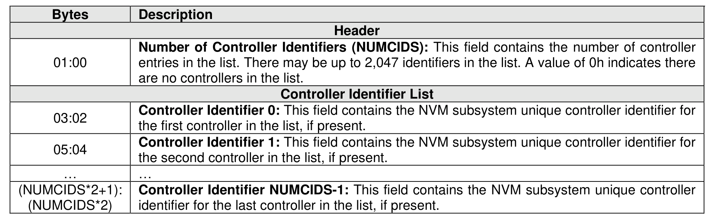

#### 4.6.1 Controller List

> **Section ID**: 4.6.1 | **Page**: 190-191

A Controller List, defined in Figure 138, is an ordered list of ascending controller identifiers. The controller
identifier of a controller is the value indicated in the CNTLID field of the Identify Controller data structure in
Figure 328. Unused entries are zero filled.

---
### 📊 Tables (1)

#### Table 1: Untitled Table

| | Number of Controller Identifiers (NUMCIDS): This field contains the number of controller entries in the list. There may be up to 2,047 identifiers in the list. A value of 0h indicates there are no controllers in the list. |
|---|---|
| | **Controller Identifier List** |
| | **Controller Identifier 0**: This field contains the NVM subsystem unique controller identifier for the first controller in the list, if present. |
| | **Controller Identifier 1**: This field contains the NVM subsystem unique controller identifier for the second controller in the list, if present. |
| | ... |
| | **Controller Identifier NUMCIDS-1**: This field contains the NVM subsystem unique controller identifier for the last controller in the list, if present. |

