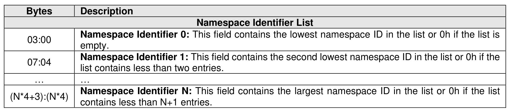

#### 4.6.2 Namespace List

> **Section ID**: 4.6.2 | **Page**: 191-191

A Namespace List, defined in Figure 139, is an ordered list of namespace IDs. Unused entries are zero
filled.

---
### 📊 Tables (1)

#### Table 1: Untitled Table

| (N*4) | Namespace Identifier N: This field contains the largest namespace ID in the list or 0h if the list contains less than N+1 entries. |

