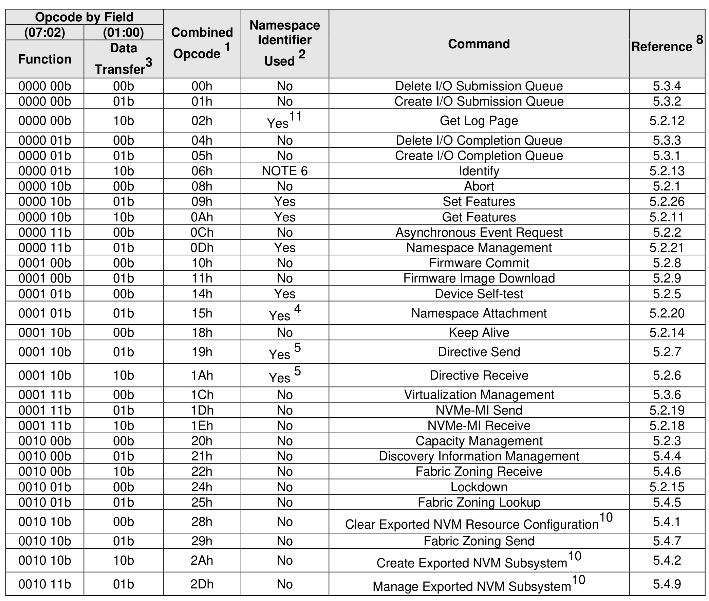
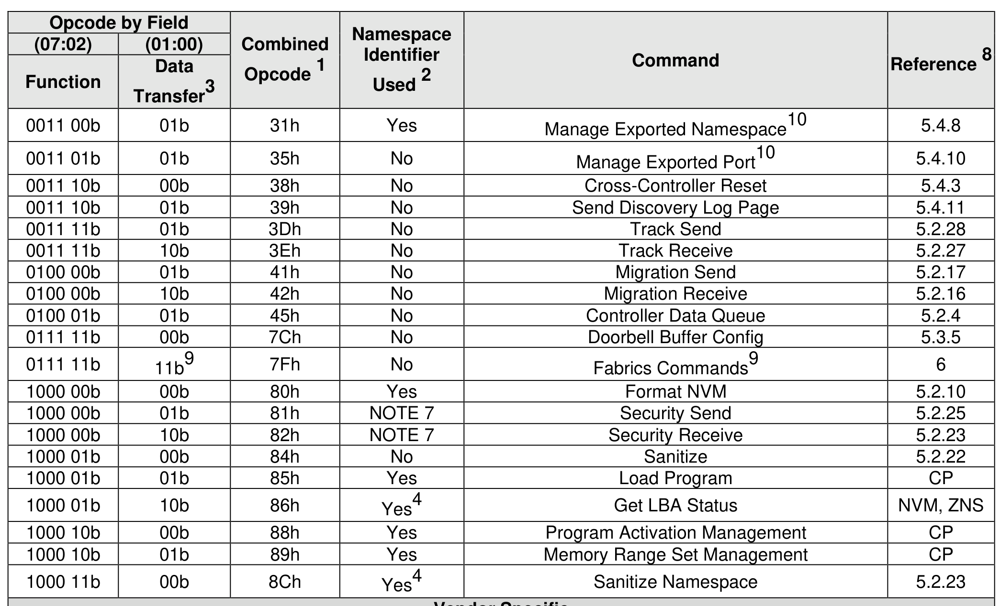
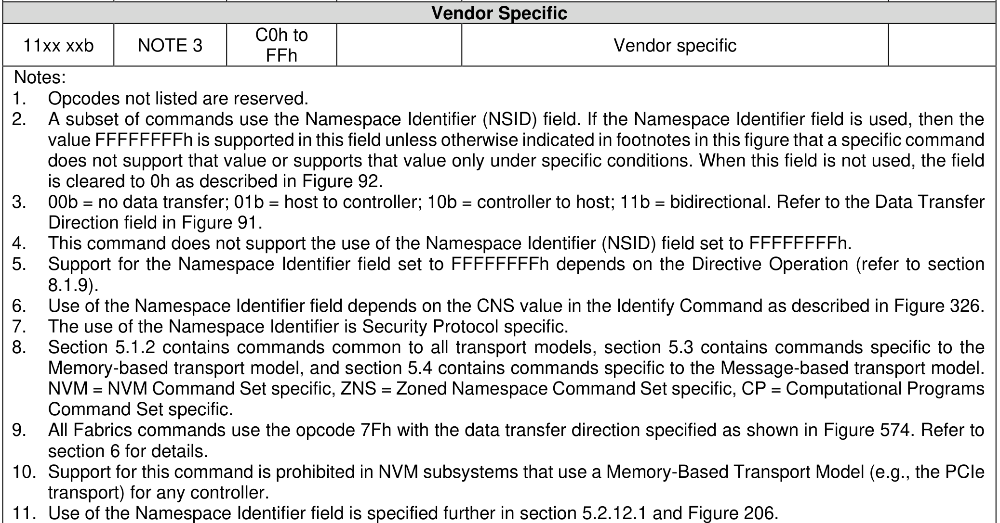

## 5 Admin Command Set

> **Section ID**: 5 | **Page**: 195-196

The Admin Command Set defines the commands that may be submitted to the Admin Submission Queue.
Section 5.1.2 describes Admin commands that are common to all transport models. Section 5.3 describes
Admin commands that are specific to the Memory-based transport model. Section 5.4 describes Admin
commands that are specific to the Message-based transport model.
The submission queue entry (SQE) structure and the fields that are common to all Admin commands are
defined in section 4.1. The completion queue entry (CQE) structure and the fields that are common to all
Admin commands are defined in section 4.2. The command specific fields in the SQE and CQE structures
(i.e., SQE Command Dwords 10 to 15, CQE Dword 0, and CQE Dword 1) for the Admin Command Set are
defined in this section.
Admin commands should not be impacted by the state of I/O queues (e.g., a full I/O Completion Queue
should not delay or stall the Delete I/O Submission Queue command).
Figure 142 defines all Admin commands. Refer to Figure 28 for mandatory, optional, and prohibited
commands for the various controller types.

---
### 📊 Tables (3)

#### Table 1: Untitled Table

| | | | | | |
| :--- | :--- | :--- | :--- | :--- | :--- |
| 00b | 10b | 02h | Yes | 11 | Get Log Page |
| 01b | 00b | 04h | No | | Delete I/O Completion Queue |
| 01b | 01b | 05h | No | | Create I/O Completion Queue |
| 01b | 10b | 06h | NOTE 6 | | Identify |
| 10b | 00b | 08h | No | | Abort |
| 10b | 01b | 09h | Yes | | Set Features |
| 10b | 10b | 0Ah | Yes | | Get Features |
| 11b | 00b | 0Ch | No | | Asynchronous Event Request |
| 11b | 01b | 0Dh | Yes | | Namespace Management |
| 00b | 00b | 10h | No | | Firmware Commit |
| 00b | 01b | 11h | No | | Firmware Image Download |
| 01b | 00b | 14h | Yes | | Device Self-test |
| 01b | 01b | 15h | Yes | 4 | Namespace Attachment |
| 10b | 00b | 18h | No | | Keep Alive |
| 10b | 01b | 19h | Yes | 5 | Directive Send |
| 10b | 10b | 1Ah | Yes | 5 | Directive Receive |
| 11b | 00b | 1Ch | No | | Virtualization Management |
| 11b | 01b | 1Dh | No | | NVMe-MI Send |
| 11b | 10b | 1Eh | No | | NVMe-MI Receive |
| 00b | 00b | 20h | No | | Capacity Management |
| 00b | 01b | 21h | No | | Discovery Information Management |
| 00b | 10b | 22h | No | | Fabric Zoning Receive |
| 01b | 00b | 24h | No | | Lockdown |
| 01b | 01b | 25h | No | | Fabric Zoning Lookup |
| 10b | 00b | 28h | No | | Clear Exported NVM Resource Configuration |
| 10b | 01b | 29h | No | | Fabric Zoning Send |
| 10b | 10b | 2Ah | No | | Create Exported NVM Subsystem |
| 11b | 01b | 2Dh | No | | Manage Exported NVM Subsystem |
| | | | | | |
| | | | | | |
| | | | | | |
| | | | | | |
| |

#### Table 2: Untitled Table

(Continuation of Untitled Table - see first part)

#### Table 3: Untitled Table

(Continuation of Untitled Table - see first part)

