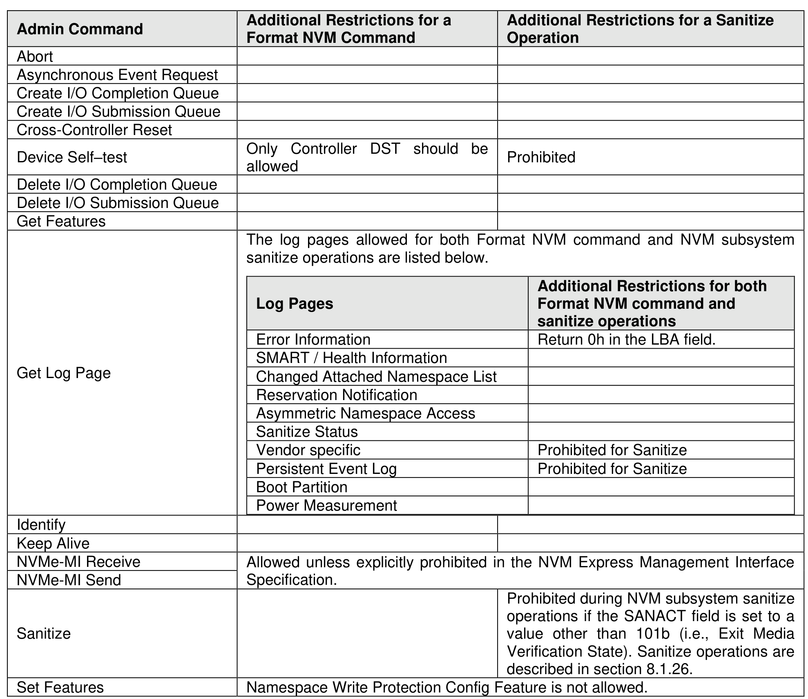
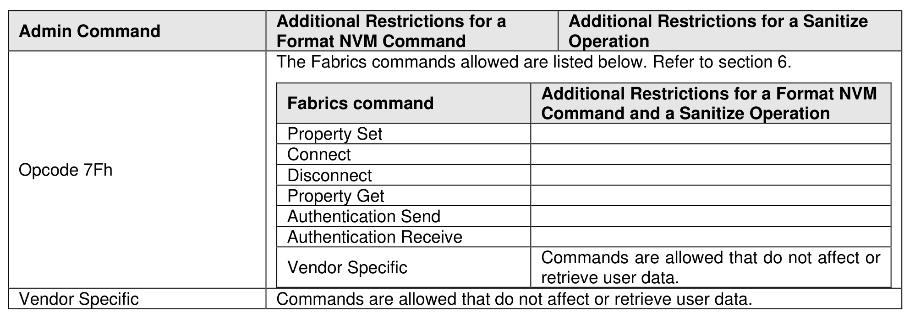

#### 5.1.1 NVM Subsystem Sanitize Operation and Format NVM Admin Command Processing Restrictions

> **Section ID**: 5.1.1 | **Page**: 197-198

Figure 143 lists the Admin commands that are allowed while an NVM subsystem sanitize operation is in
progress and the Admin commands that should be allowed during the processing of a Format NVM
command.
If a Format NVM command is in progress, then an Admin command not listed in Figure 143 that is submitted
for any namespace affected by that Format NVM command may be aborted. If aborted for that reason, then
a status code of Format In Progress should be returned.
If there are Admin commands not listed in Figure 143 being processed for a namespace, then a Format
NVM command which is submitted that affects that namespace may be aborted. If aborted for that reason,
then a status code of Command Sequence Error should be returned.

---
### 📊 Tables (2)

#### Table 1: Untitled Table

| | | |
| :--- | :--- | :--- |
| Controller Reset | Only Controller DST should be allowed | Prohibited |
| Self-test | | |
| /O Completion Queue | | |
| /O Submission Queue | | |
| | | |
| | The log pages allowed for both Format NVM command and NVM subsystem sanitize operations are listed below. | |
| Page | **Log Pages** | **Additional Restrictions for both Format NVM command and sanitize operations** |
| | Error Information | Return 0h in the LBA field. |
| | SMART / Health Information | |
| | Changed Attached Namespace List | |
| | Reservation Notification | |
| | Asymmetric Namespace Access | |
| | Sanitize Status | |
| | Vendor specific | Prohibited for Sanitize |
| | Persistent Event Log | Prohibited for Sanitize |
| | Boot Partition | |
| | Power Measurement | |
| | | |
| | | |
| | | |
| | | |
| | | |
| | | |
| | | |
|

#### Table 2: Untitled Table

(Continuation of Untitled Table - see first part)

