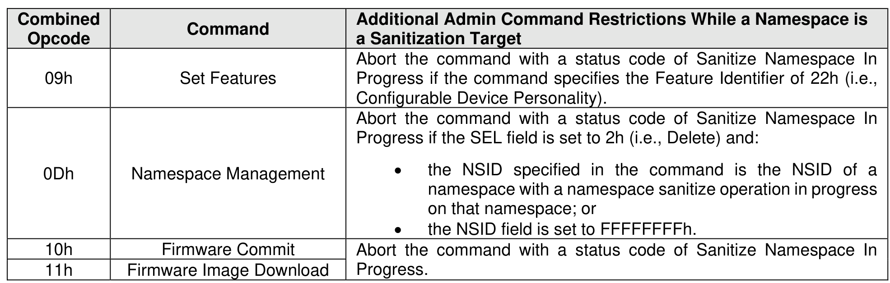
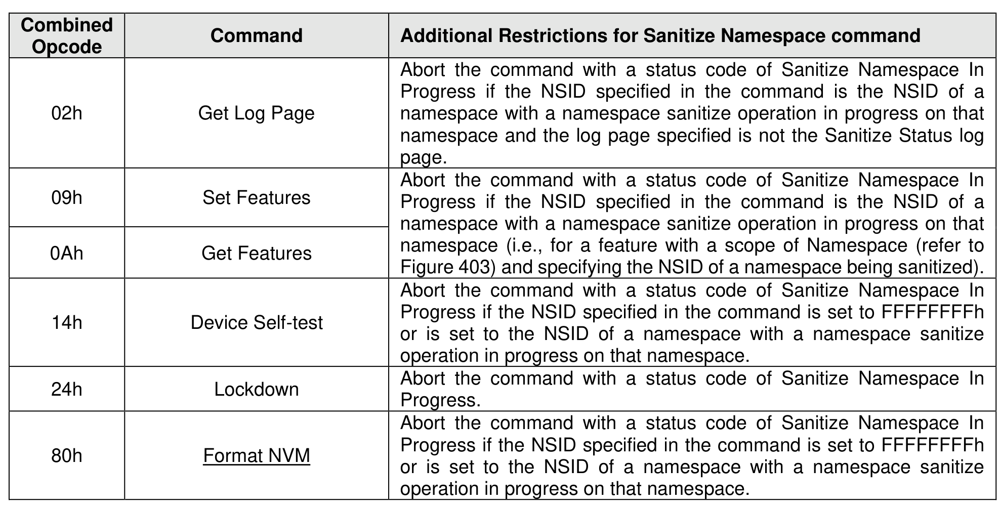
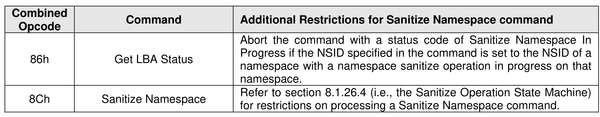

#### 5.1.2 Namespace Sanitize Operation Admin Command Processing Restrictions

> **Section ID**: 5.1.2 | **Page**: 198-200

Figure 144 lists Admin commands that have processing restrictions while a namespace sanitize operation
is in progress.
If an Admin command is being processed that either:
•
affects (e.g., changes or deletes) a namespace that is the sanitization target of an in progress
namespace sanitize operation (e.g., a command that affects all namespaces or a command with
an NSID set to the NSID of a namespace which is being sanitized); or
•
causes the user data to be accessed (e.g., read) for a namespace that is the sanitization target of
an in progress namespace sanitize operation,
then that command shall be aborted with a status code of Sanitize Namespace In Progress.
Some Admin commands only affect attached namespaces while other Admin commands are capable of
affecting namespaces that are not attached. Figure 144 describes Admin command processing restrictions
for all controllers while any namespace is a sanitization target of an in progress namespace sanitize
operation. Figure 145 describes Admin command processing restrictions for controllers with an attached
namespace that is a sanitization target of an in progress namespace sanitize operation. Admin commands
not shown in Figure 144 or Figure 145 (e.g., Vendor Specific commands) are aborted with a status code of
Sanitize Namespace In Progress if the implementation of that Admin command affects a namespace which
is a sanitization target of an in progress namespace sanitize operation.

---
### 📊 Tables (4)

#### Table 1: Untitled Table

| | | |
| :--- | :--- | :--- |
| | Namespace Attachment | Abort the command with a status code of Sanitize Namespace In Progress if the NSID specified in the command is set to FFFFFFFFh or is set to the NSID of a namespace with a namespace sanitize operation in progress on that namespace. |
| | Directive Send | |
| | Directive Receive | |
| | Capacity Management | Abort the command with a status code of Sanitize Namespace In Progress if the operation specified requests an action that includes the deletion of a namespace with a namespace sanitize operation in progress on that namespace. |
| | Clear Exported NVM Resource Configuration | Abort the command with a status code of Sanitize Namespace In Progress if any exported namespace has a sanitize operation in progress on that namespace. |
| | Manage Exported NVM Subsystem | Abort the command with a status code of Sanitize Namespace In Progress if the management operation specified requests the deletion of a namespace with a namespace sanitize operation in progress on that namespace. |
| | Migration Send | Abort the command with a status code of Sanitize Namespace In Progress if the CNTLID field specifies the identifier of a controller that has an attached namespace that is the sanitization target of an in progress namespace sanitize operation. |
| | Migration Receive | Abort the command with a status code of Sanitize Namespace In Progress if the CNTLID field specifies the identifier of a controller that has an attached namespace that is the sanitization target of an in progress namespace sanitize operation. |
| | Sanitize | Refer to section 8.1.26.4 (i.e., the Sanitize Operation State Machine) for restrictions on processing a Sanitize command. |
| | Vendor Specific | Abort the command with a status code of Sanitize Namespace In Progress if the command affects a namespace that is a sanitization target or that accesses (e.g., reads) user data from a namespace that is a sanitization target. |
| | | |
| Figure 145: Namespace Sanitize Operations - Admin Command Restrictions if Sanitizing Attached Namespace | | |
| | Command | Additional Restrictions for Sanitize Namespace command |
| | Get Log Page | Abort the command with a status code of Sanitize Namespace In Progress if the NSID specified in the command is the NSID of a namespace with a namespace sanitize operation in progress on that namespace and the log page specified is not the Sanitize Status log (Figure 403) and specifying the NSID of a namespace being sanitized). |
| | Device Self-test | Abort the command with a status code of Sanitize Namespace In Progress if the NSID specified in the command is set to FFFFFFFFh or is set to the NSID of a namespace with a namespace sanitize operation in progress on that namespace. |
| | Lockdown | Abort the command with a status code of Sanitize Namespace In Progress. |
| | Format NVM | Abort the command with a status code of Sanitize Namespace In Progress if the NSID specified in the command is set to FFFFFFFFh or is set to the NSID of a namespace with a namespace sanitize operation in progress on that namespace. |
| | Get LBA Status | Abort the command with a status code of Sanitize Namespace In Progress if the NSID specified in the command is set to the NSID of a namespace with a namespace sanitize operation in progress on that namespace. |
| | Sanitize Namespace | Refer to section 8.1.26.4 (i.e., the Sanitize Operation State Machine) for restrictions on processing a Sanitize Namespace command. |
| | | |
| | | |
| | | |
| | | |
| | | |
| | | |
| | | |
| |

#### Table 2: Untitled Table

(Continuation of Untitled Table - see first part)

#### Table 3: Untitled Table

(Continuation of Untitled Table - see first part)

#### Table 4: Untitled Table

(Continuation of Untitled Table - see first part)

