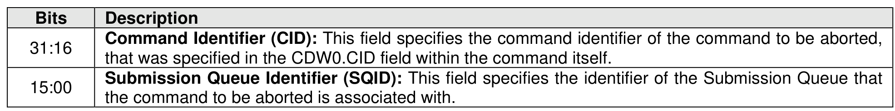

#### 5.2.1 Abort command

> **Section ID**: 5.2.1 | **Page**: 200-201

The Abort command is used to request an abort of a specific command previously submitted to the Admin
Submission Queue or an I/O Submission Queue. An Abort command may or may not abort the command
that was requested to be aborted. For example, the command to abort may have already completed,
currently be in execution, or may be deeply queued.
The controller should process the Abort command as soon as the command is fetched.
To abort a large number of commands (e.g., a larger number of commands than the limit listed in the ACL
field), the host should:
•
use the Cancel command (refer to section 7.1), if supported, to abort all commands submitted to
an I/O Submission Queue or to abort all commands submitted to an I/O Submission Queue for a
specific namespace; or
•
follow the procedures described in section 3.3.1.3 to delete the I/O Submission Queue and recreate
the I/O Submission Queue.
If an abort action is performed on the command to abort, that action may be:
•
an immediate abort (i.e., the abort action occurs prior to posting the completion queue entry for the
Abort command); or
•
a deferred abort (i.e., the abort action occurs after posting the completion queue entry for the Abort
command).
If an immediate abort is performed, then the controller shall either:
•
post the completion queue entry for the command to abort to the appropriate Admin Completion
Queue or I/O Completion Queue with a status code of Command Abort Requested before the
completion queue entry for the Abort command is posted to the Admin Completion Queue; or
•
ensure that there are no subsequent effects of the command to abort, as described in section
5.2.1.1, prior to posting the completion queue entry for the Abort command and post the completion
queue entry for the command to abort to the appropriate Admin Completion Queue or I/O
Completion Queue with a status code of Command Abort Requested. The completion queue entry
for the Abort command and the completion queue entry for the command to abort are allowed to
be posted in any order.
If an immediate abort is not performed, then the controller may or may not perform a deferred abort.
The Abort command uses the Command Dword 10 field. All other command specific fields are reserved.
The Abort Command Limit field in the Identify Controller data structure (refer to Figure 328) indicates the
controller limit on concurrent execution of Abort commands. A host should not allow the number of
outstanding Abort commands to exceed this value. The controller may complete any excess Abort
commands with the status code set to Abort Command Limit Exceeded.

---
### 📊 Tables (1)

#### Table 1: Untitled Table

| | Submission Queue Identifier (SQID): This field specifies the identifier of the Submission Queue that the command to be aborted is associated with. |

