##### 5.2.2.1 Command Completion

> **Section ID**: 5.2.2.1 | **Page**: 203-209

A completion queue entry is posted to the Admin Completion Queue if there is an asynchronous event to
report to the host. Command specific status values associated with Asynchronous Event Request are
defined in Figure 149.
Dword 0 and Dword 1 of the completion queue entry contains information about the asynchronous event.
The definition of Dword 0 of the completion queue entry is in Figure 150. The definition of Dword 1 of the
completion queue entry is in Figure 151.

---
### 📊 Tables (15)

#### Table 1: Untitled Table
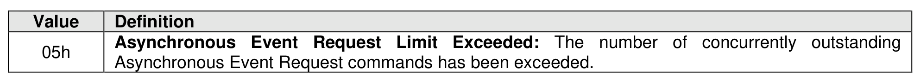

| Value | Definition | Reference |
| :--- | :--- | :--- |
| 000b | Error status | Figure 152 |
| 001b | SMART / Health status | Figure 153 |
| 010b | Notice | Figure 154 |
| 011b | Immediate | Figure 156 |
| 100b | One-Shot | Figure 157 |
| 101b | Reserved | |
| 110b | I/O Command specific status | Figure 155 |
| 111b | Vendor specific | |

Figure 151: Asynchronous Event Request – Completion Queue Entry Dword 1

| Description | |
| :--- | :--- |
| Event Specific Parameter (EVNTSP): This field specifies information for a specific event. If this field is | |

| Value | Definition |
| :--- | :--- |
| 0h | Write to Invalid Doorbell Register: A host wrote the doorbell of a queue that was not created. |
| | Invalid Doorbell Write Value: A host attempted to write an invalid doorbell value. Some possible causes of this error are: |
| | • a host attempts to add a command to a full Submission Queue; and |
| | • a host attempts to remove a completion queue entry from an empty Completion Queue. |
| 2h | Diagnostic Failure: A diagnostic failure was detected. This may include a self-test operation. |
| 3h | Persistent Internal Error: A failure occurred that is persistent and the controller is unable to isolate to a specific set of commands. If this error is indicated, then the CSTS.CFS bit may be set to '1' and the host should perform a reset as described in section 3.7. |
| 4h | Transient Internal Error: A transient error occurred that is specific to a particular set of commands; controller operation may continue without a reset. |
| 5h | Firmware Image Load Error: The firmware image could not be loaded. The controller reverted to the previously active firmware image or a baseline read-only firmware image. |
| 0 FFh | Reserved |

Figure 153: Asynchronous Event Information – SMART / Health Status

| Value | Definition |
| :--- | :--- |
| 0h | NVM subsystem Reliability: NVM subsystem reliability has been compromised. This may be due to significant media errors, an internal error, the media being placed in read only mode, or a volatile memory backup device failing. This status value shall not be used if the read-only condition on the media is due to a change in the write protection state of a namespace (refer to section 8.1.17.1). |
| 1h | Temperature Threshold: A temperature is greater than or equal to an over temperature threshold or less than or equal to an under temperature threshold (refer to section 5.2.26.1.3). |
| 2h | Spare Below Threshold: Available spare capacity has fallen below the threshold. |
| 0 FFh | Reserved |
| | | |
|---|---|---|
| | **Attached Namespace Attribute Changed:** Indicates a change to one or more of the following: | |
| | • Identify Namespace data structures (refer to section 1.5.50) that are associated with an attached namespace; | |
| | • the Active Namespace ID list (i.e., CNS 02h); | |
| | • the I/O Command Set specific Active Namespace ID list (i.e., CNS 07h); or | |
| | • other data structures as specified in applicable NVM Express I/O Command Set specifications. | |
| | This event shall be reported for any of the changes in the preceding list to namespaces that are attached to the controller, unless otherwise specified. This event may be reported by controllers compliant to version 2.1 and earlier versions of this specification for changes to namespaces that were not attached to the controller at the time the changes occurred. | |
| | To clear this event, a host issues a Get Log Page command for the Changed Attached Namespace List log page (refer to section 5.2.12.1.5) with the Retain Asynchronous Event bit cleared to ‘0’. | |
| | A controller shall not send this event if: | |
| | a) Namespace Status (refer to Figure 335) has changed and shutdown processing is either reported as in progress (i.e., CSTS.SHST is set to 01b) or is reported as complete (i.e., CSTS.SHST is set to 10b); | |
| | b) that controller receives a command (e.g., a Namespace Management command or Capacity Management command) on the Admin Submission Queue (e.g., not via a Management Endpoint, refer to the NVM Express Management Interface Specification) that requests a delete operation for a namespace; | |
| | c) the ANAGRPID field (refer to Figure 335) has changed; | |
| | d) the RGRPID field (refer to Figure 335) has changed; or | |
| | e) an I/O Command Set specific change occurs (refer to the applicable NVM Express I/O Command Set specification). | |
| | A controller shall only send this event for changes to the Remaining Format NVM (RFNVM) field in the Format Progress Indicator field transition from a non-zero value to 0h, or from 0h to a non-zero value. | |
| | | |
| | **Firmware Activation Starting:** The controller is starting a firmware activation process. Command processing is paused during the time that the firmware activation process occurs. The host may use CSTS.PP to determine when command processing has resumed. | |
| | To clear this event, the host reads the Firmware Slot Information log page with the Retain Asynchronous Event bit cleared to ‘0’. | |
| | | |
| | **Telemetry Log Changed:** The controller has saved the controller internal state in the Telemetry Controller-Initiated log page and set the Telemetry Controller-Initiated Data Available field to 1h in that log page. | |
| | To clear this event, the host issues a Get Log Page command with Retain Asynchronous Event bit cleared to ‘0’ for the Telemetry Controller-Initiated log. | |
| | |
| :--- | :--- |
| | **Asymmetric Namespace Access Change**: The Asymmetric Namespace Access information (refer to section 5.2.12.1.13) related to an ANA Group that contains namespaces attached to this controller has changed (e.g., an ANA state has changed, an ANAGRPID has changed). The current Asymmetric Namespace Access information for attached namespaces is indicated in the Asymmetric Namespace Access log page (refer to section 5.2.12.1.13). To clear this event, the host issues a Get Log Page command (refer to section 5.2.12) with the Retain Asynchronous Event bit cleared to '0' for the Asymmetric Namespace Access log. A controller shall not send this event if an Attached Namespace Attribute Changed asynchronous event or an Allocated Namespace Attribute Changed asynchronous event is sent for the same event, such as a change due to: a) the attachment of a namespace (refer to section 5.2.20); b) the deletion of a namespace (refer to section 8.1.16.2); or c) the detachment of a namespace (refer to section 5.2.20). |
| | **Predictable Latency Event Aggregate Log Change**: Indicates that event pending entries for one or more NVM Sets (refer to section 5.2.12.1.12) have been added to the Predictable Latency Event Aggregate log. To clear this event, the host reads the Predictable Latency Event Aggregate log page with the Retain Asynchronous Event bit cleared to '0'. |
| | **LBA Status Information Alert**: I/O Command Set specific definition. |
| | **Endurance Group Event Aggregate Log Page Change**: Indicates that event entries for one or more Endurance Groups (refer to section 5.2.12.1.10) have been added to the Endurance Group Event Aggregate log. To clear this event, the host issues a Get Log Page command with the Retain Asynchronous Event bit cleared to '0' for the Endurance Group Event Aggregate log. |
| | **Reachability Group Change**: The Reachability Group information (refer to section 5.2.12.1.25) related to a Reachability Group that contains namespaces attached to this controller has changed (e.g., a member was added to or deleted from a Reachability Group). The current Reachability Group information for attached namespaces is indicated in the Reachability Groups log page. To clear this event, the host issues a Get Log Page command (refer to section 5.2.12) with the Retain Asynchronous Event bit cleared to '0' for the Reachability Groups log. A controller shall not send this event if an Attached Namespace Attribute Changed asynchronous event or an Allocated Namespace Attribute Changed asynchronous event is sent for the same event, such as a change due to: a) the attachment of a namespace (refer to section 5.2.20); b) the deletion of a namespace (refer to section 5.2.21); or c) the detachment of a namespace (refer to section 5.2.20). |
| | **Reachability Association Change**: The Reachability Association information (refer to section 5.2.12.1.26) related to a Reachability Association that contains namespaces attached to this controller has changed (e.g., a member was added to or deleted from a Reachability Association). The current Reachability Association information for attached namespaces is indicated in the Reachability Associations log page. To clear this event, the host issues a Get Log Page command (refer to section 5.2.12) with the Retain Asynchronous Event bit cleared to '0' for the Reachability Associations log. A controller shall not send this event if an Attached Namespace Attribute Changed asynchronous event or an Allocated Namespace Attribute Changed asynchronous event is sent for the same event, such as a change due to: a) the attachment of a namespace (refer to section 5.2.20); b) the deletion of a namespace (refer to section 5.2.21); or c) the detachment of a namespace (refer to section 5.2.20). |
| | |
| | | |
| :--- | :--- | :--- |
| | | |
| | | |
| | | |
| | | |
| | | |
| | | |
| | | |
| |
| Value | Definition |
| :--- | :--- |
| 1h | **Sanitize Operation Completed**: Indicates that a sanitize operation has completed (including any associated additional media modification, refer to the No-Deallocate Modifies Media After Sanitize field in Figure 328) without unexpected deallocation of all media in the sanitization target that is allocated for user data (refer to section 5.2.26.1.15) and status is available in the Sanitize Status log page (refer to section 5.2.12.1.36). To clear this event, the host reads the Sanitize Status log page with the Retain Asynchronous Event bit cleared to '0'. The Event Specific Parameter field in completion queue entry Dword 1 shall be cleared to 0h if the sanitization target was the NVM subsystem. The Event Specific Parameter field shall be set to the NSID of the sanitization target if the sanitization target was a namespace. |
| 2h | **Sanitize Operation Completed With Unexpected Deallocation**: Indicates that a sanitize operation for which No-Deallocate After Sanitize (refer to Figure 388) was requested has completed with the unexpected deallocation of all media in the sanitization target that is allocated for user data (refer to section 5.2.26.1.15) and status is available in the Sanitize Status log page (refer to section 5.2.12.1.36). To clear this event, the host reads the Sanitize Status log page with the Retain Asynchronous Event bit cleared to '0'. |
| 3h | **Sanitize Operation Entered Media Verification State**: Indicates that sanitize processing was successful, the sanitize operation entered the Media Verification state (refer to section 8.1.26), and status is available in the Sanitize Status log page (refer to section 5.2.12.1.36). The Event Specific Parameter field in completion queue entry Dword 1 shall be cleared to 0h if the sanitization target was the NVM subsystem. The Event Specific Parameter field shall be set to the NSID of the sanitization target if the sanitization target was a namespace. |
| 0 FFh | Reserved |
| | **Figure 156: Asynchronous Event Information – Immediate** |
| | | **Figure 156: Asynchronous Event Information – Immediate** |
| | | |
| | | |
| | | |
| | | |
| | | |
| | | |
| | | |
| |
| | | | | | | | | |
|---|---|---|---|---|---|---|---|---|
| | | | | | | | | |
| | | | | | | | | |
| | | | | | | | | |

#### Table 2: Untitled Table
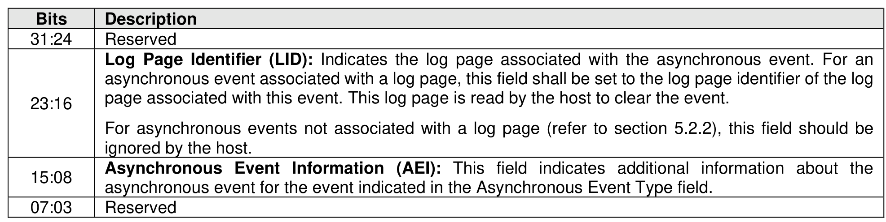

(Continuation of Untitled Table - see first part)

#### Table 3: Untitled Table

(Continuation of Untitled Table - see first part)

#### Table 4: Untitled Table
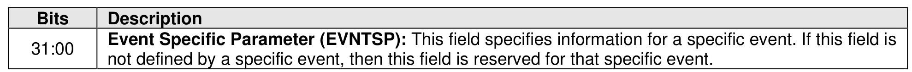

(Continuation of Untitled Table - see first part)

#### Table 5: Untitled Table
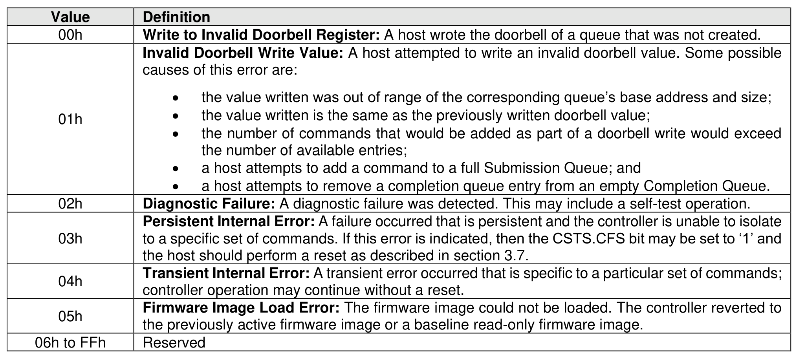

(Continuation of Untitled Table - see first part)

#### Table 6: Untitled Table
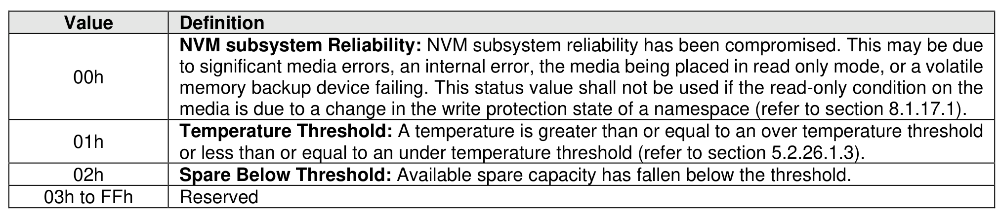

(Continuation of Untitled Table - see first part)

#### Table 7: Untitled Table
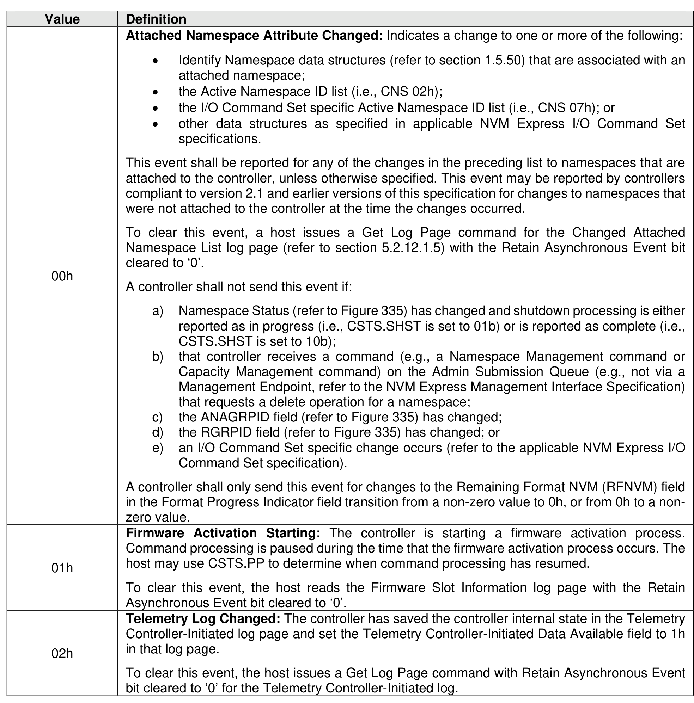

(Continuation of Untitled Table - see first part)

#### Table 8: Untitled Table
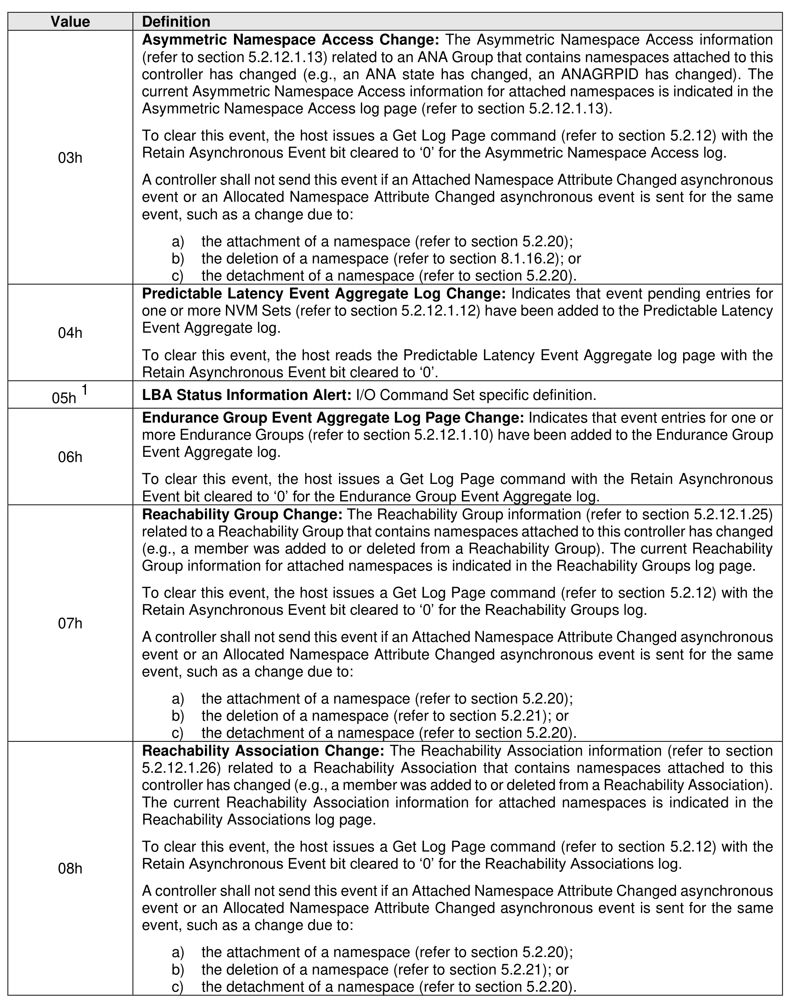

(Continuation of Untitled Table - see first part)

#### Table 9: Untitled Table

(Continuation of Untitled Table - see first part)

#### Table 10: Untitled Table
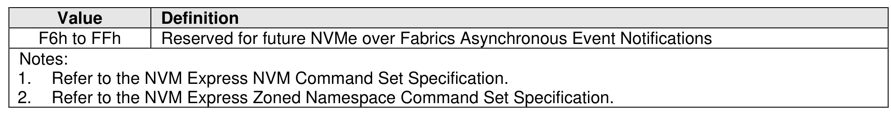

(Continuation of Untitled Table - see first part)

#### Table 11: Untitled Table
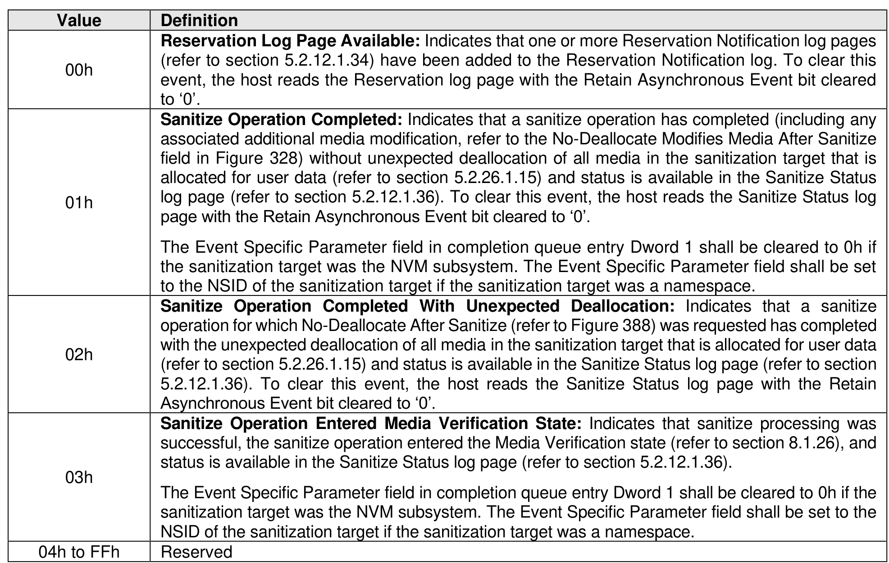

(Continuation of Untitled Table - see first part)

#### Table 12: Untitled Table
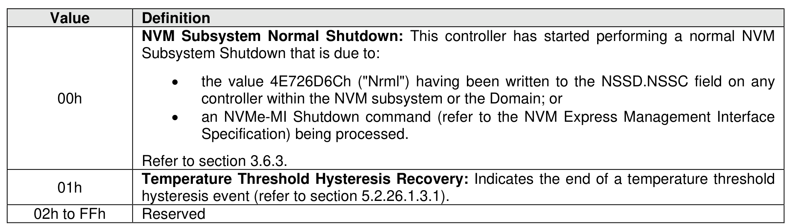

(Continuation of Untitled Table - see first part)

#### Table 13: Untitled Table
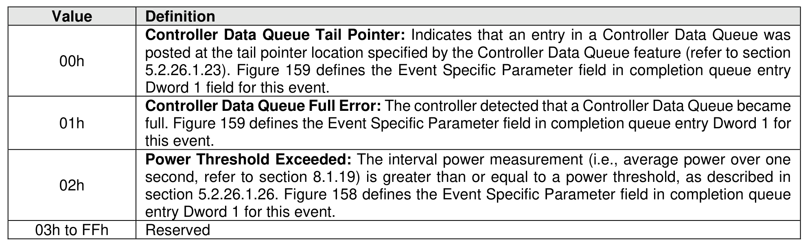

(Continuation of Untitled Table - see first part)

#### Table 14: Untitled Table
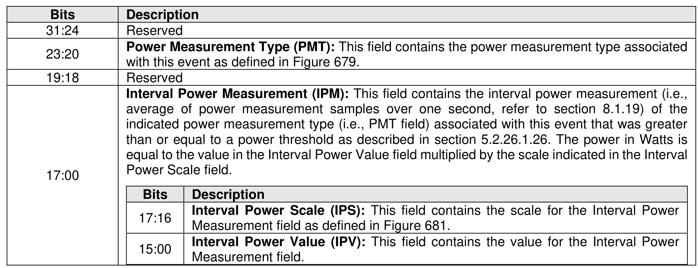

(Continuation of Untitled Table - see first part)

#### Table 15: Untitled Table
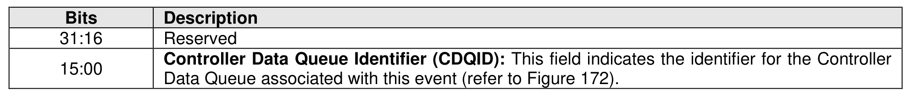

(Continuation of Untitled Table - see first part)

