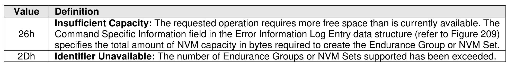
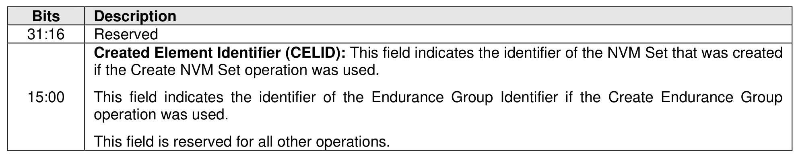

##### 5.2.3.4 Command Completion

> **Section ID**: 5.2.3.4 | **Page**: 212-213

Upon completion of the Capacity Management command, the controller posts a completion queue entry to
the Admin Completion Queue. Capacity Management command specific status values are defined in Figure
163.
Dword 0 of the completion queue entry contains the identifier of the Endurance Group or NVM Set created,
if any. Completion queue entry Dword 0 is defined in Figure 164.

---
### 📊 Tables (2)

#### Table 1: Untitled Table

| | Created Element Identifier (CELID): This field indicates the identifier of the NVM Set that was created if the Create NVM Set operation was used. This field indicates the identifier of the Endurance Group Identifier if the Create Endurance Group operation was used. This field is reserved for all other operations. |
|---|---|
| | Controller Data Queue command Controller Data Queue command is used to manage queues in host memory that a controller posts a type of data (refer to section8.1.7). |

#### Table 2: Untitled Table

(Continuation of Untitled Table - see first part)

