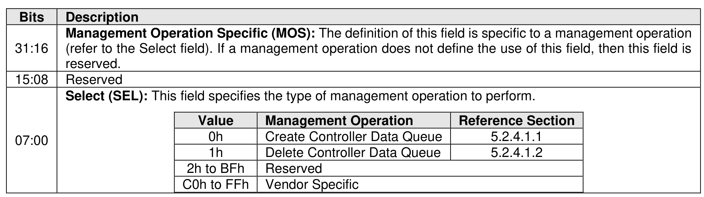

#### 5.2.4 Controller Data Queue command

> **Section ID**: 5.2.4 | **Page**: 213-213

The Controller Data Queue command is used to manage queues in host memory that a controller posts a
specific type of data (refer to section8.1.7).
The Controller Data Queue command uses the Command Dword 10 field. The use of the PRP1 field,
Command Dword 11 field, and Command Dword 12 field is specific to the management operation specified
by the Select field. All other command specific fields are reserved.
The Select field defined in Figure 165 determines which management operation is to be performed by this
command and refer to section 5.2.4.1 for a description of each management operation.

---
### 📊 Tables (1)

#### Table 1: Untitled Table

| | | |
| :--- | :--- | :--- |
| 0h | Create Controller Data Queue | 5.2.4.1.1 |
| 1h | Delete Controller Data Queue | 5.2.4.1.2 |
| 2h to BFh | Reserved | |
| C0h to FFh | Vendor Specific | |

