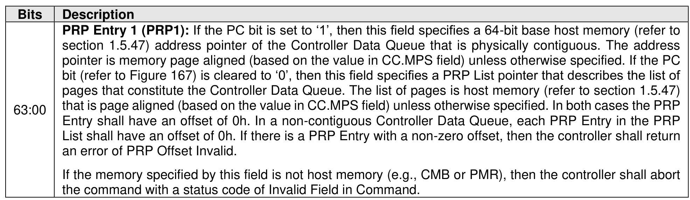
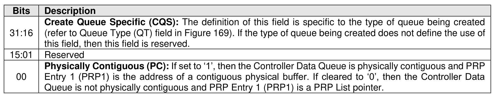
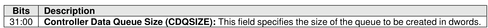
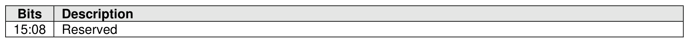
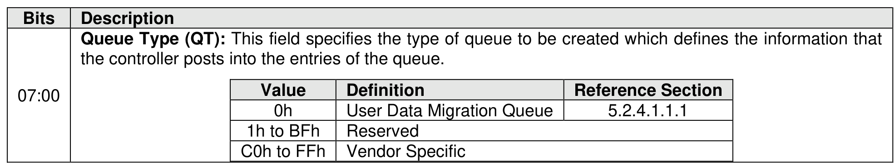

###### 5.2.4.1.1 Create Controller Data Queue (Management Operation 0h)

> **Section ID**: 5.2.4.1.1 | **Page**: 213-215

The Create Controller Data Queue management operation of the Controller Data Queue command is used
to create a queue in host memory to which a controller posts the information specified by the Queue Type
field (refer to Figure 169).
The Create Controller Data Queue management operation uses the PRP Entry 1 field, Command Dword
11 field, and Command Dword 12 field.
If a PRP List is provided to describe the Controller Data Queue, then the PRP List shall be maintained by
the host at the same location in host physical memory and the values in the PRP List shall not be modified
until the Controller Data Queue is deleted (refer to section 5.2.4.1.2) or the controller is reset. If the PRP
List values are modified, then the behavior is undefined.
If the number of memory ranges specified by the PRP Entry 1 field is greater than the value defined by the
Maximum CDQ Memory Ranges (MCMR) field in the Identify Controller data structure (refer to Figure 328),
then the controller shall abort the command with a status code of Invalid Field in Command.
If the number of memory ranges specified by the PRP Entry 1 field plus the number of memory ranges that
exists for all of the Controller Data Queues in the NVM subsystem is greater than the value defined by the
NVM Subsystem Maximum Controller CDQ Memory Ranges (NMCMR) field in the Identify Controller data
structure (refer to Figure 328), then the controller shall abort the command with a status code of Invalid
Field in Command.
If the current number of User Data Migration Queues that exist in the controller is equal to the value in the
Maximum Controller User Data Migration Queues (MCUDMQ) field in the Identify Controller data structure,
then the controller shall abort the command with a status code of Invalid Field in Command.
If the current number of User Data Migration Queues that exist in the NVM subsystem is equal to the value
in the Maximum NVM Subsystem User Data Migration Queues (MNSUDMQ) field in the Identify Controller
data structure, then the controller shall abort the command with a status code of Invalid Field in Command.
If the Controller Data Queue Size field value is not a multiple of the size of the entries for the type of
Controller Data Queue as specified by the Queue Type field (refer to Figure 169), then the controller shall
abort the command with a status code of Invalid Field in Command.
The Management Operation Specific field (refer to Figure 165) for the Create Controller Data Queue
management operation is specified in Figure 169.
If the PRP Entry 1 field has a non-zero PRP offset, then the controller shall abort the command with a status
code of PRP Offset Invalid.

---
### 📊 Tables (5)

#### Table 1: Untitled Table

| Value | Definition | Reference Section |
| :--- | :--- | :--- |
| 0h | User Data Migration Queue | 5.2.4.1.1.1 |
| 1h to BFh | Reserved | |
| C0h to FFh | Vendor Specific | |

#### Table 2: Untitled Table

(Continuation of Untitled Table - see first part)

#### Table 3: Untitled Table

(Continuation of Untitled Table - see first part)

#### Table 4: Untitled Table

(Continuation of Untitled Table - see first part)

#### Table 5: Untitled Table

(Continuation of Untitled Table - see first part)

