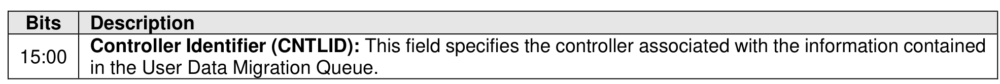

###### 5.2.4.1.1.1 User Data Migration Queue (Queue Type 0h)

> **Section ID**: 5.2.4.1.1.1 | **Page**: 215-215

The User Data Migration Queue of the Controller Data Queue command is used to create a queue for
logging of user data modified during the migration of the controller specified by the Controller Identifier field
as defined by Figure 170.
If a User Data Migration Queue is associated with the same controller specified by the Controller Identifier
field (refer to Figure 170), then the controller shall abort the command with a status code of Invalid Field in
Command.
If the number of User Data Migration Queues that exist in the controller is equal to the value defined in the
Maximum Controller User Data Migration Queues (MCUDMQ) field in the Identify Controller data structure
(refer to Figure 328), then the controller shall abort this command with a status code of Not Enough
Resources.
If the number of User Data Migration Queues that exist in the NVM subsystem is equal to the value defined
in the Maximum NVM Subsystem User Data Migration Queues (MNSUDMQ) field in the Identify Controller
data structure (refer to Figure 328), then the controller shall abort this command with a status code of Not
Enough Resources.
Refer to the applicable NVM Express I/O Command Set specification for the requirements and formats of
the entries for the User Data Migration Queue.

---
### 📊 Tables (1)

#### Table 1: Untitled Table

| Field | Bit(s) | Description |
| :--- | :--- | :--- |
| Reserved | 31:24 | Reserved |
| Queue ID | 23:16 | Queue ID |
| Reserved | 15:0 | Reserved |

