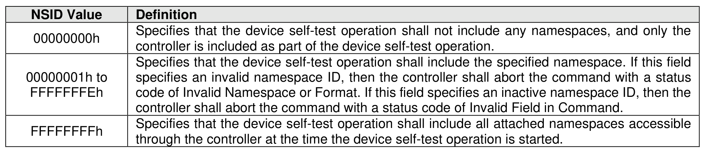
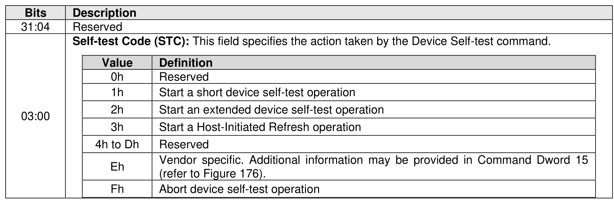
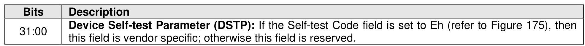
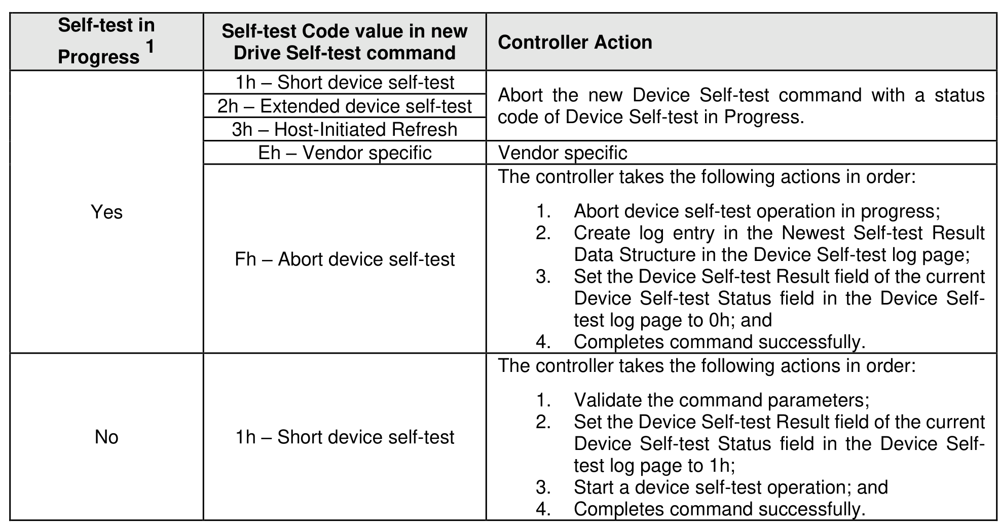
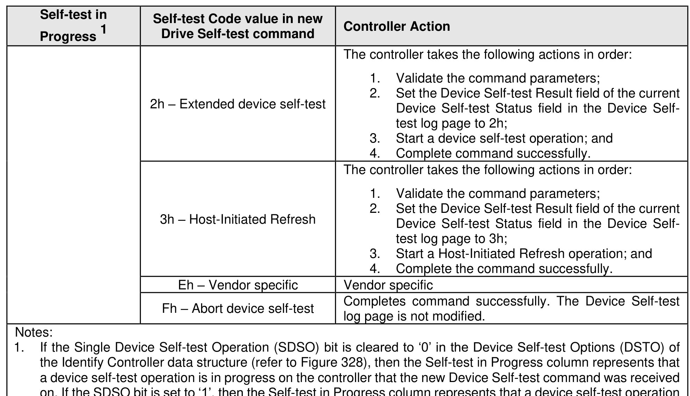

#### 5.2.5 Device Self-test command

> **Section ID**: 5.2.5 | **Page**: 216-218

The Device Self-test command is used to start a device self-test operation or abort a device self-test
operation (refer to section 8.1.8). The Device Self-test command is used specifically to:
a) start a short device self-test operation;
b) start an extended device self-test operation;
c) start a Host-Initiated Refresh operation;
d) start a vendor specific device self-test operation; or
e) abort a device self-test operation already in process.
A Host-Initiated Refresh operation is a device self-test operation.
The device self-test operation is performed by the controller that the Device Self-test command was
submitted to. The Namespace Identifier field controls which namespaces are included in the device self-
test operation as specified in Figure 174. For a Host-Initiated Refresh operation, the Namespace Identifier
field shall be ignored by the controller.
The Device Self-test command uses the Command Dword 10 field and the Command Dword 15 field. All
other command specific fields are reserved.
The processing of a Device Self-test command and interactions with a device self-test operation already in
progress is defined in Figure 177.

---
### 📊 Tables (5)

#### Table 1: Untitled Table

| Value | Definition |
| :--- | :--- |
| 0h | Reserved |
| 1h | Start a short device self-test operation |
| 2h | Start an extended device self-test operation |
| 3h | Start a Host-Initiated Refresh operation |
| 4h to Dh | Reserved |
| Eh | Vendor specific. Additional information may be provided in Command Dword 15 (refer to Figure 176). |
| Fh | Abort device self-test operation |

Figure 176: Device Self-test – Command Dword 15

| Description | |
| :--- | :--- |
| Device Self-test Parameter (DSTP): If the Self-test Code field is set to Eh (refer to Figure 175), then this field is vendor specific; otherwise this field is reserved. | |

Figure 177: Device Self-test – Command Processing

| Self-test in progress | Self-test Code value in new Drive Self-test command | Controller Action |
| :--- | :--- | :--- |
| | Fh – Abort device self-test | 2. Create log entry in the Newest Self-test Result Data Structure in the Device Self-test log page; 3. Set the Device Self-test Result field of the current Device Self-test Status field in the Device Self-test log page to 0h; and 4. Completes command successfully. |
| No | 1h – Short device self-test | The controller takes the following actions in order: 1. Validate the command parameters; 2. Set the Device Self-test Result field of the current Device Self-test Status field in the Device Self-test log page to 1h; 3. Start a device self-test operation; and 4. Completes command successfully. |
| | 2h – Extended device self-test | The controller takes the following actions in order: 1. Validate the command parameters; 2. Set the Device Self-test Result field of the current Device Self-test Status field in the Device Self-test log page to 2h; 3. Start a device self-test operation; and 4. Complete command successfully. |
| | 3h – Host-Initiated Refresh | The controller takes the following actions in order: 1. Validate the command parameters; 2. Set the Device Self-test Result field of the current Device Self-test Status field in the Device Self-test log page to 3h; 3. Start a Host-Initiated Refresh operation; and 4. Complete the command successfully. |
| | Eh – Vendor specific | Vendor specific |
| | Fh – Abort device self-test | Completes command successfully. The Device Self-test log page is not modified. |

The Single Device Self-test Operation (SDSO) bit is cleared to '0' in the Device Self-test Options (DSTO) of Identify Controller data structure (refer to Figure 328), then the Self-test in Progress column represents that device self-test operation is in progress on the controller that the new Device Self-test command was received. If the SDSO bit is set to '1', then the Self-test in Progress column represents that a device self-test operation is in progress on the NVM subsystem.

Command Completion

A completion queue entry is posted to the Admin Completion Queue after the appropriate actions are taken as defined in Figure 177. Device Self-test command specific status values are defined in Figure 178.

Figure 178: Device Self-test – Command Specific Status Values

#### Table 2: Untitled Table

(Continuation of Untitled Table - see first part)

#### Table 3: Untitled Table

(Continuation of Untitled Table - see first part)

#### Table 4: Untitled Table

(Continuation of Untitled Table - see first part)

#### Table 5: Untitled Table

(Continuation of Untitled Table - see first part)

