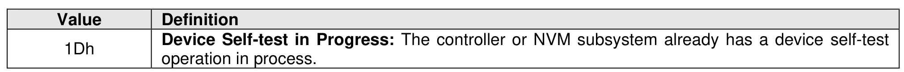

##### 5.2.5.1 Command Completion

> **Section ID**: 5.2.5.1 | **Page**: 218-218

A completion queue entry is posted to the Admin Completion Queue after the appropriate actions are taken
as specified in Figure 177. Device Self-test command specific status values are defined in Figure 178.

---
### 📊 Tables (1)

#### Table 1: Untitled Table

| Field | Description |
| :--- | :--- |
| Number of Dwords (NUMD) | The NUMD field corresponds to a length that is less than the size of the data structure to be transferred, then only that specified portion of the data structure is transferred. If the NUMD field corresponds to a length that is greater than the size of the associated data structure, then the entire contents of the data structure are transferred and no additional data is transferred. |
| | |

