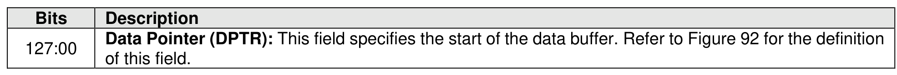
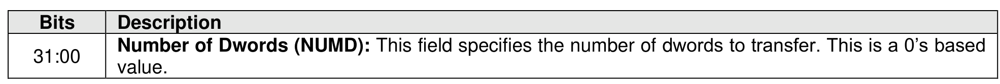
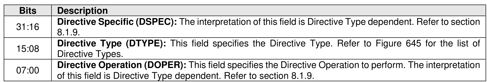

#### 5.2.6 Directive Receive command

> **Section ID**: 5.2.6 | **Page**: 218-219

The Directive Receive command returns a data buffer that is dependent on the Directive Type. Refer to
section 8.1.9.
The Directive Receive command uses the Data Pointer, Command Dword 10, and Command Dword 11
fields. Command Dword 12 and Dword 13 may be used based on the Directive Type field and the Directive
Operation field. All other command specific fields are reserved.
If the Number of Dwords (NUMD) field corresponds to a length that is less than the size of the data structure
to be returned, then only that specified portion of the data structure is transferred. If the NUMD field
corresponds to a length that is greater than the size of the associated data structure, then the entire contents
of the data structure are transferred and no additional data is transferred.

---
### 📊 Tables (3)

#### Table 1: Untitled Table

| Directive Type (DTYP): This field specifies the Directive Type. Refer to Figure 818 for the list of Directive Types. | |
|---|---|
| Directive Operation (DOPER): This field specifies the Directive Operation to perform. The interpretation of this field is Directive Type dependent. Refer to section 8.1.9. | |

#### Table 2: Untitled Table

(Continuation of Untitled Table - see first part)

#### Table 3: Untitled Table

(Continuation of Untitled Table - see first part)

