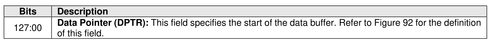
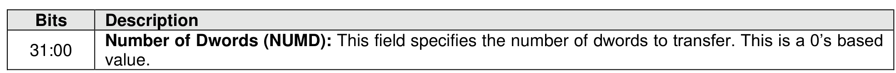
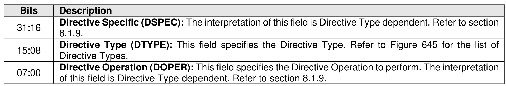

#### 5.2.7 Directive Send command

> **Section ID**: 5.2.7 | **Page**: 219-219

The Directive Send command transfers a data buffer that is dependent on the Directive Type to the
controller. Refer to section 8.1.9.
The Directive Send command uses the Data Pointer, Command Dword 10, and Command Dword 11 fields.
Command Dword 12 and Command Dword 13 may be used based on the Directive Type field and the
Directive Operation field. All other command specific fields are reserved.

---
### 📊 Tables (3)

#### Table 1: Untitled Table

| Description |  |
| :--- | :--- |
| Directive Specific (DSPEC): The interpretation of this field is Directive Type dependent. Refer to section 8.1.9. |  |

#### Table 2: Untitled Table

(Continuation of Untitled Table - see first part)

#### Table 3: Untitled Table

(Continuation of Untitled Table - see first part)

