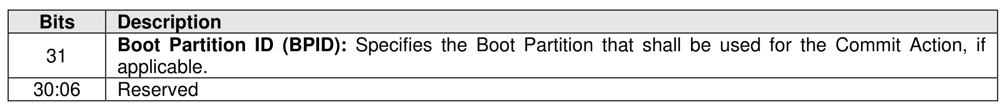
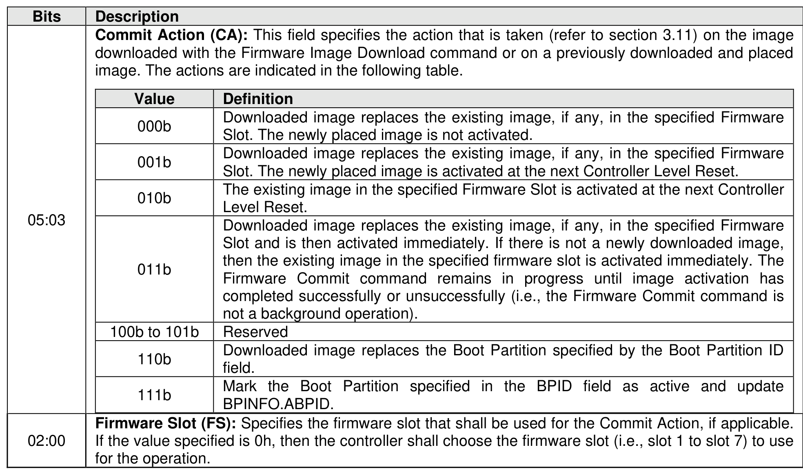

#### 5.2.8 Firmware Commit command

> **Section ID**: 5.2.8 | **Page**: 220-221

Note: This command was known in NVM Express Base Specification revisions prior to revision 1.2 as
“Firmware Activate.”
The Firmware Commit command is used to modify the firmware image or Boot Partitions.
When modifying a firmware image, the Firmware Commit command verifies that a valid firmware image
has been downloaded and commits that revision to a specific firmware slot. The host may select the
firmware image to activate on the next Controller Level Reset as part of this command. The host may
determine the currently executing firmware revision by examining the Firmware Revision field in the Identify
Controller data structure in Figure 328. The host may determine the firmware revision to be executed on
the next Controller Level Reset by examining the Firmware Slot Information log page. All controllers in a
domain share firmware slots and the same firmware image is applied to all controllers in that domain (i.e.,
all the controllers in the NVM subsystem if multiple domains are not supported or all the controllers in that
domain if multiple domains are supported).
Activation of a firmware image may result in a change in controller behavior that is not expected by the host
(e.g., an incompatible change in the UUID List (refer to section 8.1.30.2)). In this case, if the Commit Action
field is set to 011b, then the controller shall abort the command with a status code of Firmware Activation
Requires Conventional Reset.
If a change to the settings of any personality is pending (refer to section 8.1.6.1), then the controller shall
abort the command with a status code of Access Denied.
When modifying Boot Partitions, the host may select the Boot Partition to mark as active or to replace. A
Boot Partition is only able to be written when write unlocked (refer to section 8.1.3).
The Firmware Commit command uses the Command Dword 10 field. All other command specific fields are
reserved.

---
### 📊 Tables (2)

#### Table 1: Untitled Table

| Value | Definition |
|:---|:---|
| 000b | Downloaded image replaces the existing image, if any, in the specified Firmware Slot. The newly placed image is not activated. |
| 001b | Downloaded image replaces the existing image, if any, in the specified Firmware Slot. The newly placed image is activated at the next Controller Level Reset. |
| 010b | The existing image in the specified Firmware Slot is activated at the next Controller Level Reset. |
| 011b | Downloaded image replaces the existing image, if any, in the specified Firmware Slot and is then activated immediately. If there is not a newly downloaded image, then the existing image in the specified firmware slot is activated immediately. The Firmware Commit command remains in progress until image activation has completed successfully or unsuccessfully (i.e., the Firmware Commit command is not a background operation). |
| 100b to 101b | Reserved |
| 110b | Downloaded image replaces the Boot Partition specified by the Boot Partition ID field. |
| 111b | Mark the Boot Partition specified in the BPID field as active and update BPINFO.ABPID. |
| | **Firmware Slot (FS):** Specifies the firmware slot that shall be used for the Commit Action, if applicable. If the value specified is 0h, then the controller shall choose the firmware slot (i.e., slot 1 to slot 7) to use for the operation. |

#### Table 2: Untitled Table

(Continuation of Untitled Table - see first part)

