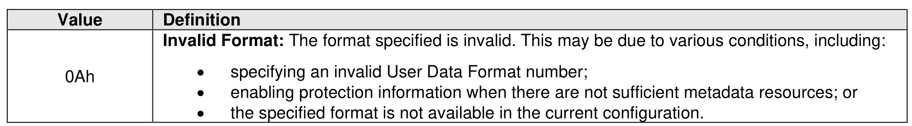

##### 5.2.10.1 Command Completion

> **Section ID**: 5.2.10.1 | **Page**: 227-227

A completion queue entry is posted to the Admin Completion Queue when the NVM media format is
complete. Format NVM command specific status values (i.e., SCT field set to 1h) are shown in Figure 194.

---
### 📊 Tables (1)

#### Table 1: Untitled Table

*(No markdown content)*

