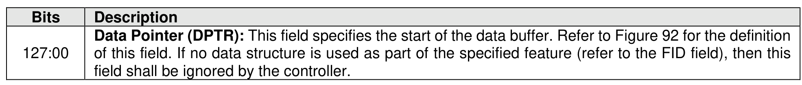
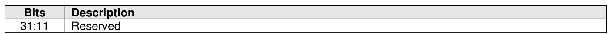
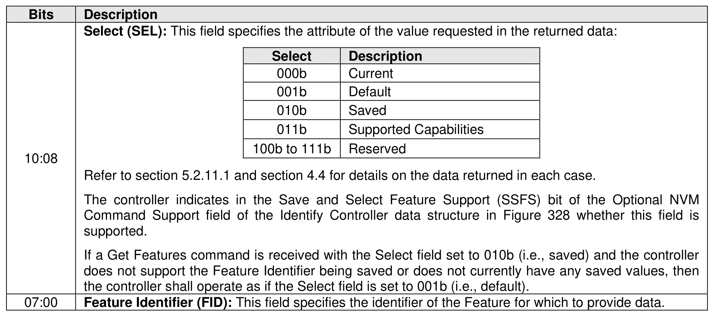
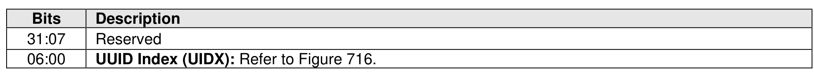
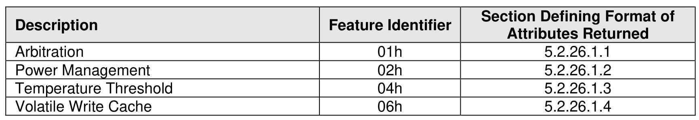
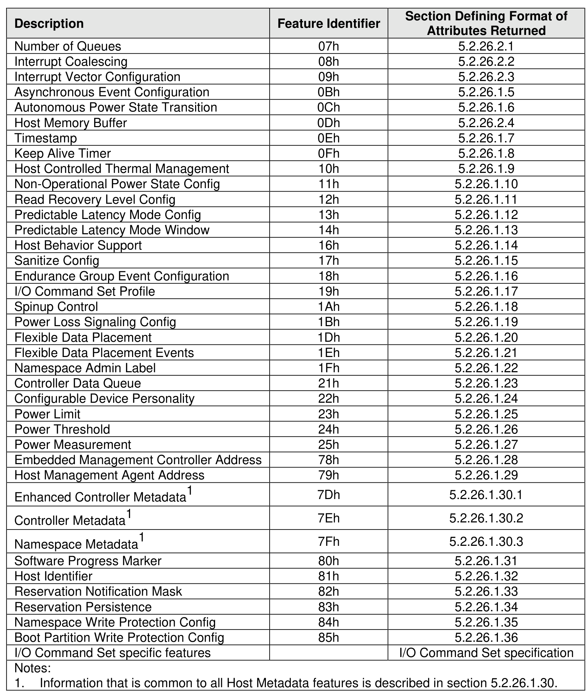

#### 5.2.11 Get Features command

> **Section ID**: 5.2.11 | **Page**: 227-229

The Get Features command retrieves the attributes of the Feature specified.
The Get Features command uses the Data Pointer, Command Dword 10 and Command Dword 14 fields.
The use of the Command Dword 11 field is Feature specific. If not used by a Feature, then Command
Dword 11 is reserved unless otherwise stated. All other command specific fields are reserved.
The mandatory, optional, and prohibited Feature Identifiers for each type of controller are defined in section
3.1.3.6.
If the controller supports selection of a UUID by the Get Features command (refer to Figure 403 and section
8.1.30) and the controller supports selection of a UUID for:
•
the specified vendor specific Feature Identifier (refer to Figure 403); or
•
vendor-specific attributes within a Feature (e.g., vendor-specific personalities in the Configurable
Device Personality feature as defined in section 5.2.26.1.24) defined by this specification or any
applicable NVM Express I/O Command Set specification,
then Command Dword 14 is used to specify a UUID Index value (refer to Figure 197).
If the controller does not support selection of a UUID by the Get Features command or the controller does
not support selection of a UUID for:
•
the specified vendor specific Feature Identifier; or
•
vendor-specific attributes within a Feature defined by this specification or any applicable NVM
Express I/O Command Set specification,
then Command Dword 14 does not specify a UUID Index value.
Figure 198 describes the Feature Identifiers whose attributes may be retrieved using the Get Features
command. The definition of the attributes returned and the associated format is specified in the section
indicated.

---
### 📊 Tables (6)

#### Table 1: Untitled Table

| Select | Description |
|:---|:---|
| 000b | Current |
| 001b | Default |
| 010b | Saved |
| 011b | Supported Capabilities |
| 100b to 111b | Reserved |

Refer to section 5.2.11.1 and section 4.4 for details on the data returned in each case.

The controller indicates in the Save and Select Feature Support (SSFS) bit of the Optional NVM Command Support field of the Identify Controller data structure in Figure 328 whether this field is supported.

If a Get Features command is received with the Select field set to 010b (i.e., saved) and the controller does not support the Feature Identifier being saved or does not currently have any saved values, then the controller shall operate as if the Select field is set to 001b (i.e., default).

| Feature Identifier (FID): This field specifies the identifier of the Feature for which to provide data. | | |
|:---|:---|:---|
| | | |
| | | |
| | | |
| | | |
| | | |
| | | |
| | | |
| |

#### Table 2: Untitled Table

(Continuation of Untitled Table - see first part)

#### Table 3: Untitled Table

(Continuation of Untitled Table - see first part)

#### Table 4: Untitled Table

(Continuation of Untitled Table - see first part)

#### Table 5: Untitled Table

(Continuation of Untitled Table - see first part)

#### Table 6: Untitled Table

(Continuation of Untitled Table - see first part)

