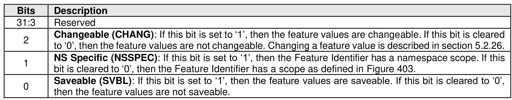

##### 5.2.11.2 Command Completion

> **Section ID**: 5.2.11.2 | **Page**: 230-230

Upon completion of the Get Features command, the controller posts a completion queue entry to the Admin
Completion Queue. If the Select field is not set to 011b, then Dword 0 of the completion queue entry may
contain feature-dependent information (refer to section 5.2.26).
If the Select field is set to 011b, then Figure 199 describes the contents of Dword 0 of the completion queue
entry.
If the controller supports any changeable value of any attribute of a feature, then the controller reports that
feature as changeable (i.e., the controller sets the Changeable bit to '1' in completion queue entry Dword 0
for a Get Features command that specifies that feature and has the Select field set to 011b), even if the
feature has been set to a value or values that are not changeable.
For some features (e.g., Namespace Write Protection Config (refer to section 5.2.26.1.35), Boot Partition
Write Protection Config (refer to section 5.2.26.1.36)), the changeability of feature values is value-
dependent (e.g., the Permanent Write Protect (i.e., 011b) value of the Write Protection State in the
Namespace Write Protection Config feature is not changeable).

---
### 📊 Tables (1)

#### Table 1: Untitled Table

| | |
| :--- | :--- |
| | Saveable (SVBL): If this bit is set to '1', then the feature values are saveable. If this bit is cleared to '0', then the feature values are not saveable. |

