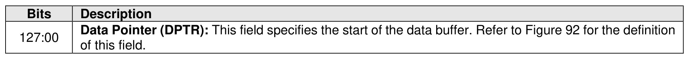
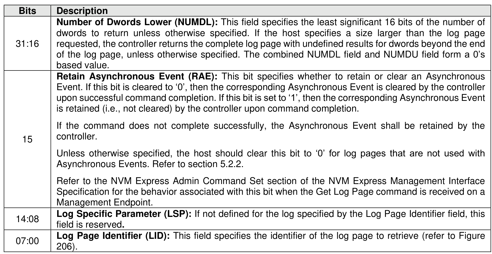
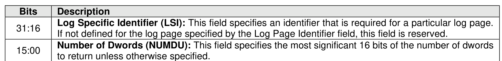
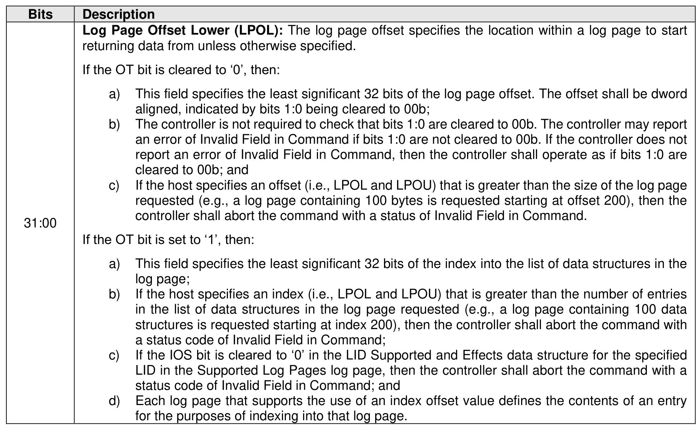
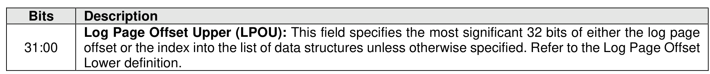
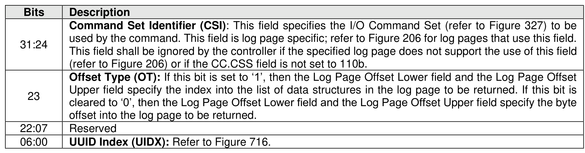
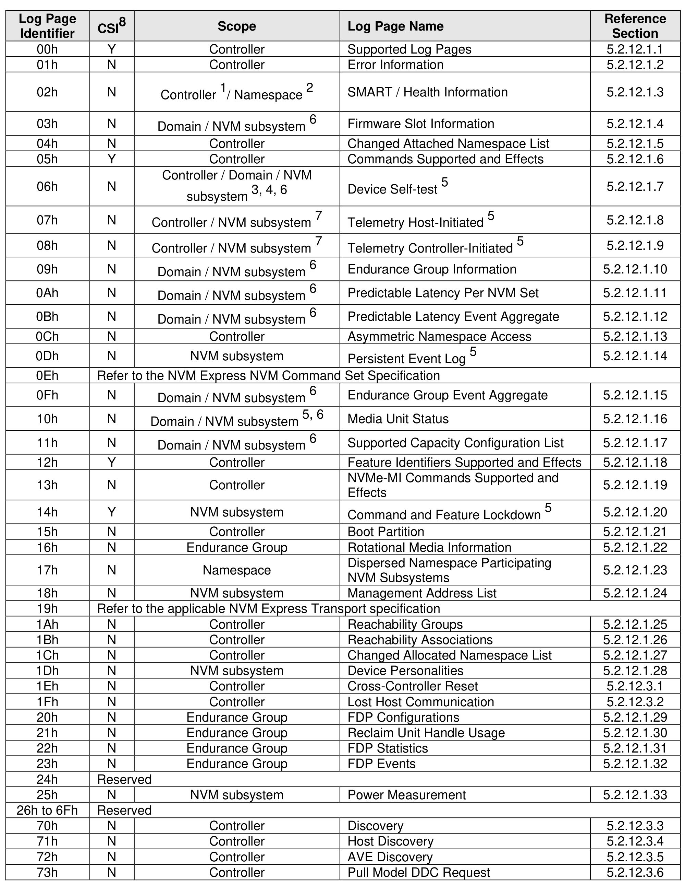
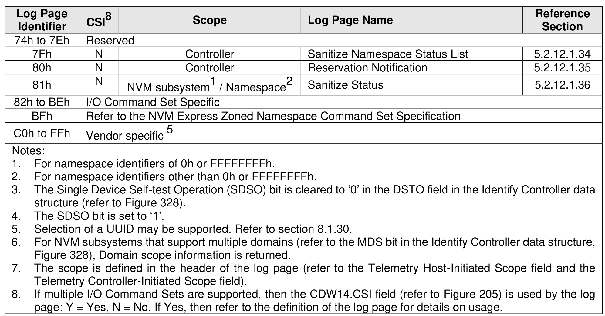

#### 5.2.12 Get Log Page command

> **Section ID**: 5.2.12 | **Page**: 230-234

The Get Log Page command returns a data buffer containing the log page requested. The Get Log Page
command may be impacted by the ANA state (refer to section 8.1.1.10).
The Get Log Page command uses the Data Pointer, Command Dword 10, Command Dword 11, Command
Dword 12, Command Dword 13, and Command Dword 14 fields. All other command specific fields are
reserved.
There are mandatory and optional Log Page Identifiers defined in section 3.1.3.5. If a Get Log Page
command is processed that specifies a Log Page Identifier that is not supported, then the controller shall
abort the command with a status code of Invalid Log Page with the exception defined in Figure 321.
The controller indicates support for the Log Page Offset and extended Number of Dwords (32 bits rather
than 12 bits) in the Log Page Attributes field of the Identify Controller data structure. If extended data is not
supported, then bits 27:16 of the Number of Dwords Lower field specify the Number of Dwords to transfer.
If the Log Page Offset is supported, then:
•
a byte offset shall be supported (i.e., Offset Type field cleared to ‘0’) for all log pages; and
•
for each log page that has the IOS bit set to ‘1’ in the LID Supported and Effects data structure
(refer to Figure 208) for the specified LID in the Supported Log Pages log page an index offset shall
be supported (i.e., Offset Type field set to ‘1’).
If the IOS bit is cleared to ‘0’ in the LID Supported and Effects data structure for the specified LID in the
Supported Log Pages log page and a Get Log Page command specifies Offset Type field set to ‘1’, then
that command shall be aborted with a status code of Invalid Field in Command.
If the controller supports selection of a UUID by the Get Log Page command (refer to Figure 206 and section
8.1.30), then Command Dword 14 is used to specify a UUID Index value (refer to Figure 205).
Figure 206 defines the log pages that are able to be retrieved with the Get Log Page command and the
scope of the information that is returned in those log pages. Section 5.2.12.1 describes log pages that are
common to all transport models. Section 5.2.12.2 describes log pages that are specific to the Memory-
based transport model. Section 5.2.12.3 describes log pages that are specific to the Message-based
transport model.

---
### 📊 Tables (8)

#### Table 1: Untitled Table

| Description | |
| :--- | :--- |
| Log Specific Identifier (LSI): This field specifies an identifier that is required for a particular log page. If not defined for the log page specified by the Log Page Identifier field, this field is reserved. | |
| Number of Dwords (NUMDU): This field specifies the most significant 16 bits of the number of dwords to return unless otherwise specified. | |
| returning data from unless otherwise specified. | |
| If the OT bit is cleared to '0', then: | |
| a) This field specifies the least significant 32 bits of the log page offset. The offset shall be dword aligned, indicated by bits 1:0 being cleared to 00b; | |
| b) The controller is not required to check that bits 1:0 are cleared to 00b. The controller may report an error of Invalid Field in Command if bits 1:0 are not cleared to 00b. If the controller does not report an error of Invalid Field in Command, then the controller shall operate as if bits 1:0 are cleared to 00b; and | |
| c) If the host specifies an offset (i.e., LPOL and LPOU) that is greater than the size of the log page requested (e.g., a log page containing 100 bytes is requested starting at offset 200), then the controller shall abort the command with a status of Invalid Field in Command. | |
| If the OT bit is set to '1', then: | |
| a) This field specifies the least significant 32 bits of the index into the list of data structures in the log page; | |
| b) If the host specifies an index (i.e., LPOL and LPOU) that is greater than the number of entries in the list of data structures in the log page requested (e.g., a log page containing 100 data structures is requested starting at index 200), then the controller shall abort the command with a status code of Invalid Field in Command; | |
| c) If the IOS bit is cleared to '0' in the LID Supported and Effects data structure for the specified LID in the Supported Log Pages log page, then the controller shall abort the command with a status code of Invalid Field in Command; and | |
| d) Each log page that supports the use of an index offset value defines the contents of an entry for the purposes of indexing into that log page. | |
| Figure 204: Get Log Page – Command Dword 13 | |
| Description | |
| Log Page Offset Upper (LPOU): This field specifies the most significant 32 bits of either the log page offset or the index into the list of data structures unless otherwise specified. Refer to the Log Page Offset Lower definition. | |
| | |
| | |
| | |
| | |
| | |
| | |
| | |
| | |
| | |
| |
| | | | | |
| :--- | :--- | :--- | :--- | :--- |
| | | | | Section |
| | | | | |
| | | Controller | Supported Log Pages | 5.2.12.1.1 |
| | | Controller | Error Information | 5.2.12.1.2 |
| | N | Controller1 / Namespace2 | SMART / Health Information | 5.2.12.1.3 |
| | N | Domain / NVM subsystem6 | Firmware Slot Information | 5.2.12.1.4 |
| | N | Controller | Changed Attached Namespace List | 5.2.12.1.5 |
| | Y | Controller | Commands Supported and Effects | 5.2.12.1.6 |
| | N | Controller / Domain / NVM subsystem3, 4, 6 | Device Self-test5 | 5.2.12.1.7 |
| | N | Controller / NVM subsystem7 | Telemetry Host-Initiated5 | 5.2.12.1.8 |
| | N | Controller / NVM subsystem7 | Telemetry Controller-Initiated5 | 5.2.12.1.9 |
| | N | Domain / NVM subsystem6 | Endurance Group Information | 5.2.12.1.10 |
| | N | Domain / NVM subsystem6 | Predictable Latency Per NVM Set | 5.2.12.1.11 |
| | N | Domain / NVM subsystem6 | Predictable Latency Event Aggregate | 5.2.12.1.12 |
| | N | Controller | Asymmetric Namespace Access | 5.2.12.1.13 |
| | N | NVM subsystem | Persistent Event Log5 | 5.2.12.1.14 |
| | | | Refer to the NVM Express NVM Command Set Specification | |
| | N | Domain / NVM subsystem6 | Endurance Group Event Aggregate | 5.2.12.1.15 |
| | N | Domain / NVM subsystem5, 6 | Media Unit Status | 5.2.12.1.16 |
| | N | Domain / NVM subsystem6 | Supported Capacity Configuration List | 5.2.12.1.17 |
| | Y | Controller | Feature Identifiers Supported and Effects | 5.2.12.1.18 |
| | N | Controller | NVMe-MI Commands Supported and Effects | 5.2.12.1.19 |
| | Y | NVM subsystem | Command and Feature Lockdown5 | 5.2.12.1.20 |
| | N | Controller | Boot Partition | 5.2.12.1.21 |
| | N | Endurance Group | Rotational Media Information | 5.2.12.1.22 |
| | N | Namespace | Dispersed Namespace Participating NVM Subsystems | 5.2.12.1.23 |
| | N | NVM subsystem | Management Address List | 5.2.12.1.24 |
| | | | Refer to the applicable NVM Express Transport specification | |
| | N | Controller | Reachability Groups | 5.2.12.1.25 |
| | N | Controller | Reachability Associations | 5.2.12.1.26 |
| | N | Controller | Changed Allocated Namespace List | 5.2.12.1.27 |
| | N | NVM subsystem | Device Personalities | 5.2.12.1.28 |
| | N | Controller | Cross-Controller Reset | 5.2.12.3.1 |
| | N | Controller | Lost Host Communication | 5.2.12.3.2 |
| | N | Endurance Group | FDP Configurations | 5.2.12.1.29 |
| | N | Endurance Group | Reclaim Unit Handle Usage | 5.2.12.1.30 |
| | N | Endurance Group | FDP Statistics | 5.2.12.1.31 |
| | N | Endurance Group | FDP Events | 5.2.12.1.32 |
| | | | Reserved | |
| | N | NVM subsystem | Power Measurement | 5.2.12.1.33 |
| | 6Fh | Reserved | | |
| | N | Controller | Discovery | 5.2.12.3.3 |
| | N | Controller | Host Discovery | 5.2.12.3.4 |
| | N | Controller | AVE Discovery | 5.2.12.3.5 |
| | N | Controller | Pull Model DDC Request | 5.2.12.3.6 |
| | | | | |
| :--- | :--- | :--- | :--- | :--- |
| 7Eh | Reserved | | | |
| | N | Controller | Sanitize Namespace Status List | 5.2.12.1.34 |
| | N | Controller | Reservation Notification | 5.2.12.1.35 |
| | N | NVM subsystem1 / Namespace2 | Sanitize Status | 5.2.12.1.36 |
| | | | | |
| B3Eh | I/O Command Set Specific | | | |
| | | Refer to the NVM Express Zoned Namespace Command Set Specification | | |
| | | | | |
| FFFh | Vendor specific5 | | | |
| | | | | |
| | | | | |
| | | | | |
| | | | | |
| | |

#### Table 2: Untitled Table

(Continuation of Untitled Table - see first part)

#### Table 3: Untitled Table

(Continuation of Untitled Table - see first part)

#### Table 4: Untitled Table

(Continuation of Untitled Table - see first part)

#### Table 5: Untitled Table

(Continuation of Untitled Table - see first part)

#### Table 6: Untitled Table

(Continuation of Untitled Table - see first part)

#### Table 7: Untitled Table

(Continuation of Untitled Table - see first part)

#### Table 8: Untitled Table

(Continuation of Untitled Table - see first part)

