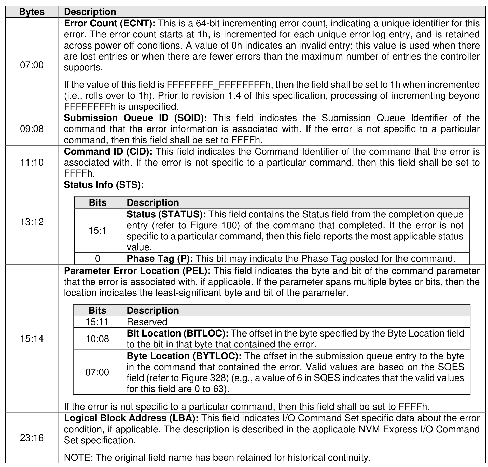
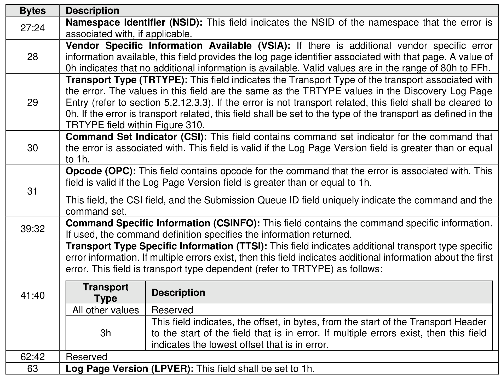

###### 5.2.12.1.2 Error Information (Log Page Identifier 01h)

> **Section ID**: 5.2.12.1.2 | **Page**: 236-237

This log page is used to describe extended error information for a command that completed with error or
report an error that is not specific to a particular command. Extended error information is provided when
the More (M) bit is set to ‘1’ in the Status field for the completion queue entry associated with the command
that completed with error or as part of an asynchronous event with an Error status type. This log page is
global to the controller.
This error log may return the last n errors. If the host specifies a data transfer of the size of n error logs,
then the error logs for the most recent n errors are returned. The ordering of the entries is based on the
time when the error occurred, with the most recent error being returned as the first log entry.
Each entry in the log page returned is defined in Figure 209. The log page is a set of 64-byte entries; the
maximum number of entries supported is indicated in the ELPE field in the Identify Controller data structure
(refer to Figure 328). If the log page is full when a new entry is generated, the controller should insert the
new entry into the log and discard the oldest entry.
The controller should clear this log page by removing all entries on power cycle and Controller Level Reset.

---
### 📊 Tables (2)

#### Table 1: Untitled Table

| | | |
| :--- | :--- | :--- |
| | **Status Info (STS):** | |
| | **Bits** | **Description** |
| | 15:1 | **Status (STATUS):** This field contains the Status field from the completion queue entry (refer to Figure 100) of the command that completed. If the error is not specific to a particular command, then this field reports the most applicable status value. |
| | 0 | **Phase Tag (P):** This bit may indicate the Phase Tag posted for the command. |
| **Parameter Error Location (PEL):** This field indicates the byte and bit of the command parameter that the error is associated with, if applicable. If the parameter spans multiple bytes or bits, then the location indicates the least-significant byte and bit of the parameter. | | |
| | **Bits** | **Description** |
| | 15:11 | Reserved |
| | 10:08 | **Bit Location (BITLOC):** The offset in the byte specified by the Byte Location field to the bit in that byte that contained the error. |
| | 07:00 | **Byte Location (BYTLOC):** The offset in the submission queue entry to the byte in the command that contained the error. Valid values are based on the SQES field (refer to Figure 328) (e.g., a value of 6 in SQES indicates that the valid values for this field are 0 to 63). |
| | | |
| **Logical Block Address (LBA):** This field indicates I/O Command Set specific data about the error condition, if applicable. The description is described in the applicable NVM Express I/O Command Set specification. | | |
| | | |
| | | |
| | | |
| | | |
| | | |
| | | |
| | | |

#### Table 2: Untitled Table

(Continuation of Untitled Table - see first part)

