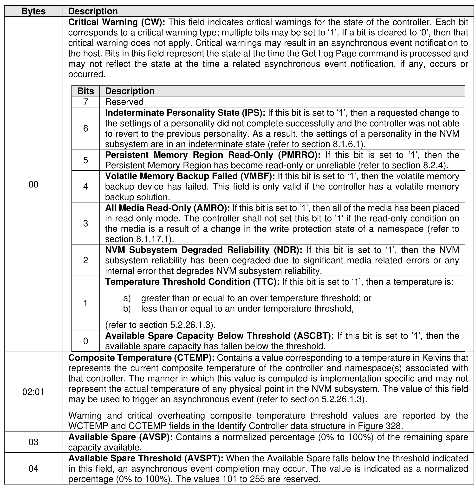
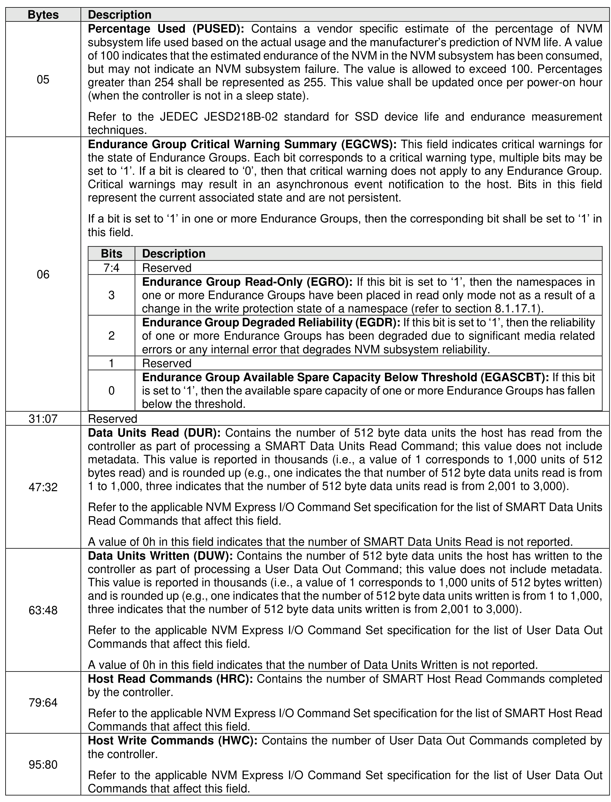
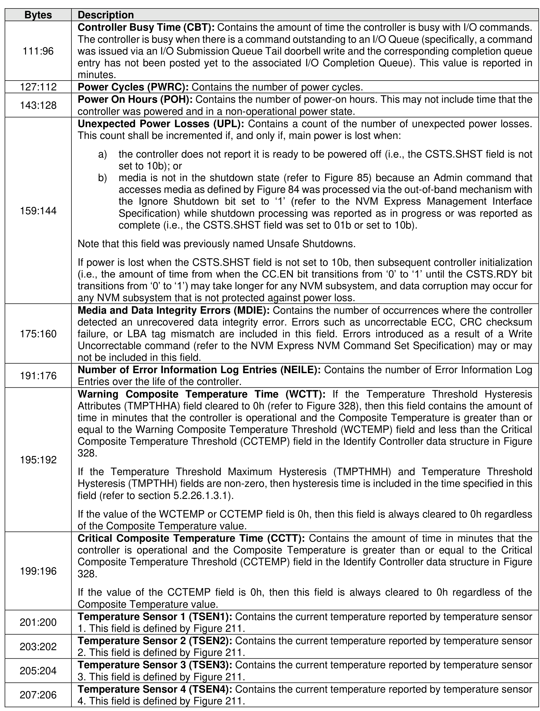
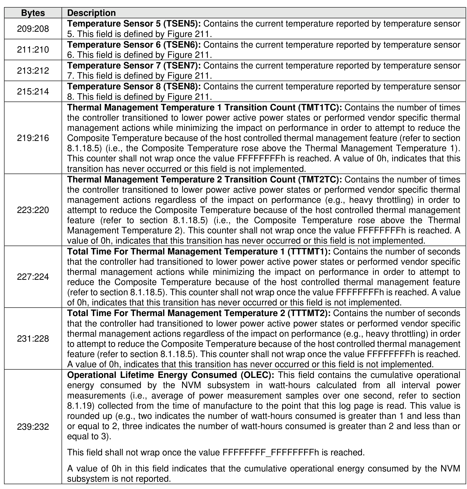
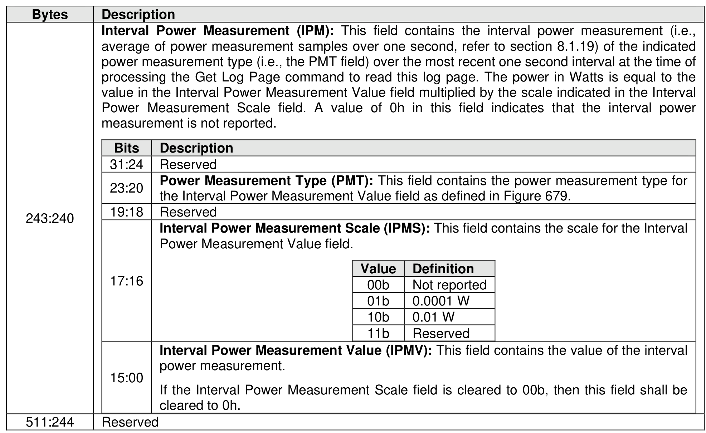
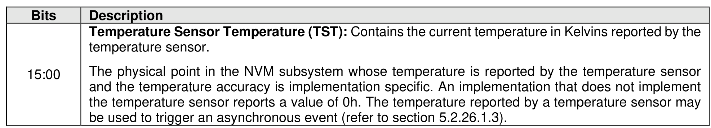

###### 5.2.12.1.3 SMART / Health Information (Log Page Identifier 02h)

> **Section ID**: 5.2.12.1.3 | **Page**: 237-242

This log page is used to provide SMART and general health information. The information provided is over
the life of the controller and is retained across power cycles unless otherwise specified. To request the
controller log page, the namespace identifier specified is FFFFFFFFh or 0h. For compatibility with
implementations compliant with NVM Express Base Specification, Revision 1.4 and earlier, hosts should
use a namespace identifier of FFFFFFFFh to request the controller log page. The controller may also
support requesting the log page on a per namespace basis, as indicated by the SMART Support bit of the
LPA field in the Identify Controller data structure in Figure 328.
If the log page is not supported on a per namespace basis and:
•
if a namespace identifier other than 0h or FFFFFFFFh is specified by the host, then the controller
shall abort the command with a status code of Invalid Field in Command; and
•
if a namespace identifier of 0h or FFFFFFFFh is specified by the host, then the controller returns
the controller log page.
There is no namespace specific information defined in the SMART / Health Information log page in this
revision of the specification, thus the controller log page and namespaces specific log page contain identical
information.
Critical warnings regarding the health of the NVM subsystem may be indicated via an asynchronous event
notification to the host. The warnings that result in an asynchronous event notification to the host are
configured using the Set Features command; refer to section 5.2.26.1.5.
Performance may be calculated using parameters returned as part of the SMART / Health Information log.
Specifically, the number of Read or Write commands, the amount of data read or written, and the amount
of controller busy time enables both I/Os per second and bandwidth to be calculated.
The log page returned is defined in Figure 210.

---
### 📊 Tables (6)

#### Table 1: Untitled Table

| Bits | Description |
| :--- | :--- |
| 7 | Reserved |
| 6 | **Indeterminate Personality State (IPS):** If this bit is set to '1', then a requested change to the settings of a personality did not complete successfully and the controller was not able to revert to the previous personality. As a result, the settings of a personality in the NVM subsystem are in an indeterminate state (refer to section 8.1.6.1). |
| 5 | **Persistent Memory Region Read-Only (PMRRO):** If this bit is set to '1', then the Persistent Memory Region has become read-only or unreliable (refer to section 8.2.4). |
| 4 | **Volatile Memory Backup Failed (VMBF):** If this bit is set to '1', then the volatile memory backup device has failed. This field is only valid if the controller has a volatile memory backup solution. |
| 3 | **All Media Read-Only (AMRO):** If this bit is set to '1', then all of the media has been placed in read only mode. The controller shall not set this bit to '1' if the read-only condition on the media is a result of a change in the write protection state of a namespace (refer to section 8.1.17.1). |
| 2 | **NVM Subsystem Degraded Reliability (NDR):** If this bit is set to '1', then the NVM subsystem reliability has been degraded due to significant media related errors or any internal error that degrades NVM subsystem reliability. |
| 1 | **Temperature Threshold Condition (TTC):** If this bit is set to '1', then a temperature is: a) greater than or equal to an over temperature threshold; or b) less than or equal to an under temperature threshold, (refer to section 5.2.26.1.3). |
| 0 | **Available Spare Capacity Below Threshold (ASCBT):** If this bit is set to '1', then the available spare capacity has fallen below the threshold. |
| | **Composite Temperature (CTEMP):** Contains a value corresponding to a temperature in Kelvins that represents the current composite temperature of the controller and namespace(s) associated with that controller. The manner in which this value is computed is implementation specific and may not represent the actual temperature of any physical point in the NVM subsystem. The value of this field may be used to trigger an asynchronous event (refer to section 5.2.26.1.3).  Warning and critical overheating composite temperature threshold values are reported by the WCTEMP and CCTEMP fields in the Identify Controller data structure in Figure 328. |
| | **Available Spare (AVSP):** Contains a normalized percentage (0% to 100%) of the remaining spare capacity available. |
| | **Available Spare Threshold (AVSPT):** When the Available Spare falls below the threshold indicated in this field, an asynchronous event completion may occur. The value is indicated as a normalized percentage (0% to 100%). The values 101 to 255 are reserved. |
| Bits | Description |
| :--- | :--- |
| 7:4 | Reserved |
| 3 | **Endurance Group Read-Only (EGRO):** If this bit is set to '1', then the namespaces in one or more Endurance Groups have been placed in read only mode not as a result of a change in the write protection state of a namespace (refer to section 8.1.17.1). |
| 2 | **Endurance Group Degraded Reliability (EGDR):** If this bit is set to '1', then the reliability of one or more Endurance Groups has been degraded due to significant media related errors or any internal error that degrades NVM subsystem reliability. |
| 1 | Reserved |
| 0 | **Endurance Group Available Spare Capacity Below Threshold (EGASCBT):** If this bit is set to '1', then the available spare capacity of one or more Endurance Groups has fallen below the threshold. |
| | |
| | **Data Units Read (DUR):** Contains the number of 512 byte data units the host has read from the controller as part of processing a SMART Data Units Read Command; this value does not include metadata. This value is reported in thousands (i.e., a value of 1 corresponds to 1,000 units of 512 bytes read) and is rounded up (e.g., one indicates the that number of 512 byte data units read is from 1 to 1,000, three indicates that the number of 512 byte data units read is from 2,001 to 3,000). |
| | Refer to the applicable NVM Express I/O Command Set specification for the list of SMART Data Units Read Commands that affect this field. |
| | A value of 0h in this field indicates that the number of SMART Data Units Read is not reported. |
| | **Data Units Written (DUW):** Contains the number of 512 byte data units the host has written to the controller as part of processing a User Data Out Command; this value does not include metadata. This value is reported in thousands (i.e., a value of 1 corresponds to 1,000 units of 512 bytes written) and is rounded up (e.g., one indicates that the number of 512 byte data units written is from 1 to 1,000, three indicates that the number of 512 byte data units written is from 2,001 to 3,000). |
| | Refer to the applicable NVM Express I/O Command Set specification for the list of User Data Out Commands that affect this field. |
| | A value of 0h in this field indicates that the number of Data Units Written is not reported. |
| | **Host Read Commands (HRC):** Contains the number of SMART Host Read Commands completed by the controller. |
| | Refer to the applicable NVM Express I/O Command Set specification for the list of SMART Host Read Commands that affect this field. |
| | **Host Write Commands (HWC):** Contains the number of User Data Out Commands completed by the controller. |
| | Refer to the applicable NVM Express I/O Command Set specification for the list of User Data Out Commands that affect this field. |
| | |
| :--- | :--- |
| | Controller Busy Time (CBT): Contains the amount of time the controller is busy with I/O commands. The controller is busy when there is a command outstanding to an I/O Queue (specifically, a command was issued via an I/O Submission Queue Tail doorbell write and the corresponding completion queue entry has not been posted yet to the associated I/O Completion Queue). This value is reported in minutes. |
| | Power Cycles (PWRC): Contains the number of power cycles. |
| | Power On Hours (POH): Contains the number of power-on hours. This may not include time that the controller was powered and in a non-operational power state. |
| | Unexpected Power Losses (UPL): Contains a count of the number of unexpected power losses. This count shall be incremented if, and only if, main power is lost when:   a) the controller does not report it is ready to be powered off (i.e., the CSTS.SHST field is not set to 10b); or   b) media is not in the shutdown state (refer to Figure 85) because an Admin command that accesses media as defined by Figure 84 was processed via the out-of-band mechanism with the Ignore Shutdown bit set to '1' (refer to the NVM Express Management Interface Specification) while shutdown processing was reported as in progress or was reported as complete (i.e., the CSTS.SHST field was set to 01b or set to 10b).   Note that this field was previously named Unsafe Shutdowns.   If power is lost when the CSTS.SHST field is not set to 10b, then subsequent controller initialization (i.e., the amount of time from when the CC.EN bit transitions from '0' to '1' until the CSTS.RDY bit transitions from '0' to '1') may take longer for any NVM subsystem, and data corruption may occur for any NVM subsystem that is not protected against power loss. |
| | Media and Data Integrity Errors (MDIE): Contains the number of occurrences where the controller detected an unrecoverable data integrity error. Errors such as uncorrectable ECC, CRC checksum failure, or LBA tag mismatch are included in this field. Errors introduced as a result of a Write Uncorrectable command (refer to the NVM Express NVM Command Set Specification) may or may not be included in this field. |
| | Number of Error Information Log Entries (NEILE): Contains the number of Error Information Log Entries over the life of the controller. |
| | Warning Composite Temperature Time (WCTT): If the Temperature Threshold Hysteresis Attributes (TMPTHHA) field cleared to 0h (refer to Figure 328), then this field contains the amount of time in minutes that the controller is operational and the Composite Temperature is greater than or equal to the Warning Composite Temperature Threshold (WCTEMP) field and less than the Critical Composite Temperature Threshold (CCTEMP) field in the Identify Controller data structure in Figure 328.   If the Temperature Threshold Maximum Hysteresis (TMPTHMH) and Temperature Threshold Hysteresis (TMPTHH) fields are non-zero, then hysteresis time is included in the time specified in this field (refer to section 5.2.26.1.3.1).   If the value of the WCTEMP or CCTEMP field is 0h, then this field is always cleared to 0h regardless of the Composite Temperature value. |
| | Critical Composite Temperature Time (CCTT): Contains the amount of time in minutes that the controller is operational and the Composite Temperature is greater than or equal to the Critical Composite Temperature Threshold (CCTEMP) field in the Identify Controller data structure in Figure 328.   If the value of the CCTEMP field is 0h, then this field is always cleared to 0h regardless of the Composite Temperature value. |
| | Temperature Sensor 1 (TSEN1): Contains the current temperature reported by temperature sensor 1. This field is defined by Figure 211. |
| | Temperature Sensor 2 (TSEN2): Contains the current temperature reported by temperature sensor 2. This field is defined by Figure 211. |
| | Temperature Sensor 3 (TSEN3): Contains the current temperature reported by temperature sensor 3. This field is defined by Figure 211. |
| | Temperature Sensor 4 (TSEN4): Contains the current temperature reported by temperature sensor 4. This field is defined by Figure 211. |
| | |
|---|---|
| | Temperature Sensor 5 (TSEN5): Contains the current temperature reported by temperature sensor 5. This field is defined by Figure 211. |
| | Temperature Sensor 6 (TSEN6): Contains the current temperature reported by temperature sensor 6. This field is defined by Figure 211. |
| | Temperature Sensor 7 (TSEN7): Contains the current temperature reported by temperature sensor 7. This field is defined by Figure 211. |
| | Temperature Sensor 8 (TSEN8): Contains the current temperature reported by temperature sensor 8. This field is defined by Figure 211. |
| | Thermal Management Temperature 1 Transition Count (TMT1TC): Contains the number of times the controller transitioned to lower power active power states or performed vendor specific thermal management actions while minimizing the impact on performance in order to attempt to reduce the Composite Temperature because of the host controlled thermal management feature (refer to section 8.1.18.5) (i.e., the Composite Temperature rose above the Thermal Management Temperature 1). This counter shall not wrap once the value FFFFFFFFh is reached. A value of 0h, indicates that this transition has never occurred or this field is not implemented. |
| | Thermal Management Temperature 2 Transition Count (TMT2TC): Contains the number of times the controller transitioned to lower power active power states or performed vendor specific thermal management actions regardless of the impact on performance (e.g., heavy throttling) in order to attempt to reduce the Composite Temperature because of the host controlled thermal management feature (refer to section 8.1.18.5) (i.e., the Composite Temperature rose above the Thermal Management Temperature 2). This counter shall not wrap once the value FFFFFFFFh is reached. A value of 0h, indicates that this transition has never occurred or this field is not implemented. |
| | Total Time For Thermal Management Temperature 1 (TTTMT1): Contains the number of seconds that the controller had transitioned to lower power active power states or performed vendor specific thermal management actions while minimizing the impact on performance in order to attempt to reduce the Composite Temperature because of the host controlled thermal management feature (refer to section 8.1.18.5). This counter shall not wrap once the value FFFFFFFFh is reached. A value of 0h, indicates that this transition has never occurred or this field is not implemented. |
| | Total Time For Thermal Management Temperature 2 (TTTMT2): Contains the number of seconds that the controller had transitioned to lower power active power states or performed vendor specific thermal management actions regardless of the impact on performance (e.g., heavy throttling) in order to attempt to reduce the Composite Temperature because of the host controlled thermal management feature (refer to section 8.1.18.5). This counter shall not wrap once the value FFFFFFFFh is reached. A value of 0h, indicates that this transition has never occurred or this field is not implemented. |
| | Operational Lifetime Energy Consumed (OLEC): This field contains the cumulative operational energy consumed by the NVM subsystem in watt-hours calculated from all interval power measurements (i.e., average of power measurement samples over one second, refer to section 8.1.19) collected from the time of manufacture to the point that this log page is read. This value is rounded up (e.g., two indicates the number of watt-hours consumed is greater than 1 and less than or equal to 2, three indicates the number of watt-hours consumed is greater than 2 and less than or equal to 3).   This field shall not wrap once the value FFFFFFFF_FFFFFFFFh is reached.   A value of 0h in this field indicates that the cumulative operational energy consumed by the NVM subsystem is not reported. |
| Bits | Description |
|---|---|
| 31:24 | Reserved |
| 23:20 | **Power Measurement Type (PMT):** This field contains the power measurement type for the Interval Power Measurement Value field as defined in Figure 679. |
| 19:18 | Reserved |
| 17:16 | **Interval Power Measurement Scale (IPMS):** This field contains the scale for the Interval Power Measurement Value field.   <table> <tr> <th>Value</th> <th>Definition</th> </tr> <tr> <td>00b</td> <td>Not reported</td> </tr> <tr> <td>01b</td> <td>0.0001 W</td> </tr> <tr> <td>10b</td> <td>0.01 W</td> </tr> <tr> <td>11b</td> <td>Reserved</td> </tr> </table> |
| 15:00 | **Interval Power Measurement Value (IPMV):** This field contains the value of the interval power measurement.   If the Interval Power Measurement Scale field is cleared to 00b, then this field shall be cleared to 0h. |
| | Reserved |

#### Table 2: Untitled Table

(Continuation of Untitled Table - see first part)

#### Table 3: Untitled Table

(Continuation of Untitled Table - see first part)

#### Table 4: Untitled Table

(Continuation of Untitled Table - see first part)

#### Table 5: Untitled Table

(Continuation of Untitled Table - see first part)

#### Table 6: Untitled Table

(Continuation of Untitled Table - see first part)

