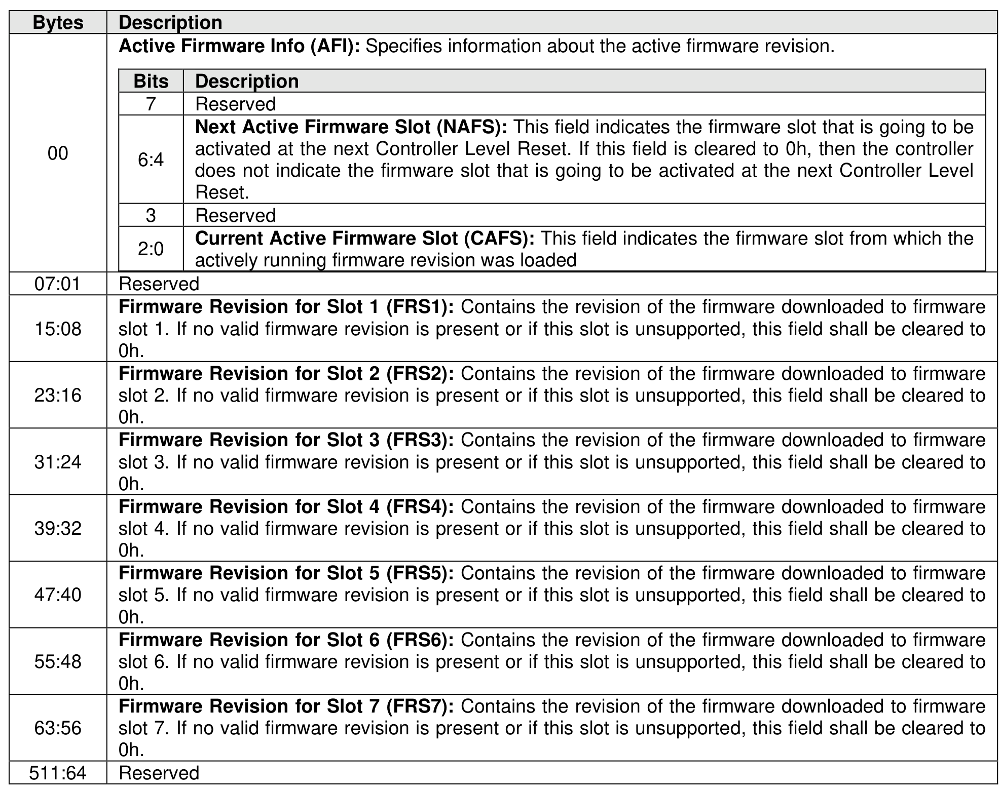

###### 5.2.12.1.4 Firmware Slot Information (Log Page Identifier 03h)

> **Section ID**: 5.2.12.1.4 | **Page**: 243-243

This log page is used to describe the firmware revision stored in each firmware slot supported. The firmware
revision is indicated as an ASCII string. The log page also indicates the active slot number. The log page
returned is defined in Figure 212.

---
### 📊 Tables (1)

#### Table 1: Untitled Table

| Bits | Description |
|---|---|
| 7 | Reserved |
| 6:4 | **Next Active Firmware Slot (NAFS):** This field indicates the firmware slot that is going to be activated at the next Controller Level Reset. If this field is cleared to 0h, then the controller does not indicate the firmware slot that is going to be activated at the next Controller Level Reset. |
| 3 | Reserved |
| 2:0 | **Current Active Firmware Slot (CAFS):** This field indicates the firmware slot from which the actively running firmware revision was loaded |
| | Reserved |
| | **Firmware Revision for Slot 1 (FRS1):** Contains the revision of the firmware downloaded to firmware slot 1. If no valid firmware revision is present or if this slot is unsupported, this field shall be cleared to 0h. |
| | **Firmware Revision for Slot 2 (FRS2):** Contains the revision of the firmware downloaded to firmware slot 2. If no valid firmware revision is present or if this slot is unsupported, this field shall be cleared to 0h. |
| | **Firmware Revision for Slot 3 (FRS3):** Contains the revision of the firmware downloaded to firmware slot 3. If no valid firmware revision is present or if this slot is unsupported, this field shall be cleared to 0h. |
| | **Firmware Revision for Slot 4 (FRS4):** Contains the revision of the firmware downloaded to firmware slot 4. If no valid firmware revision is present or if this slot is unsupported, this field shall be cleared to 0h. |
| | **Firmware Revision for Slot 5 (FRS5):** Contains the revision of the firmware downloaded to firmware slot 5. If no valid firmware revision is present or if this slot is unsupported, this field shall be cleared to 0h. |
| | **Firmware Revision for Slot 6 (FRS6):** Contains the revision of the firmware downloaded to firmware slot 6. If no valid firmware revision is present or if this slot is unsupported, this field shall be cleared to 0h. |
| | **Firmware Revision for Slot 7 (FRS7):** Contains the revision of the firmware downloaded to firmware slot 7. If no valid firmware revision is present or if this slot is unsupported, this field shall be cleared to 0h. |
| | Reserved |
| | |
| | **5 Changed Attached Namespace List (Log Page Identifier 04h)** |
| | page is used to describe changes to attached namespaces for this controller, since the last time log page was read, that: |
| | have changed information in their Identify Namespace data structures (refer to section 1.5.50); |
| | were previously unattached to the controller and have since been attached to the controller; |
| | were previously attached to the controller and have since been detached from the controller; and |
| | were deleted. |
| | page contains a Namespace List with up to 1,024 entries. If more than 1,024 namespaces have |
| | attributes since the last time the log page was read, the first entry in the log page shall be set to |
| | FFh and the remainder of the list shall be zero filled |

