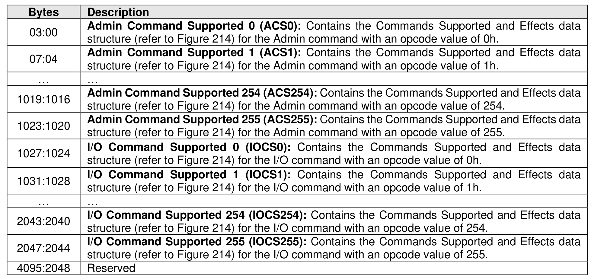
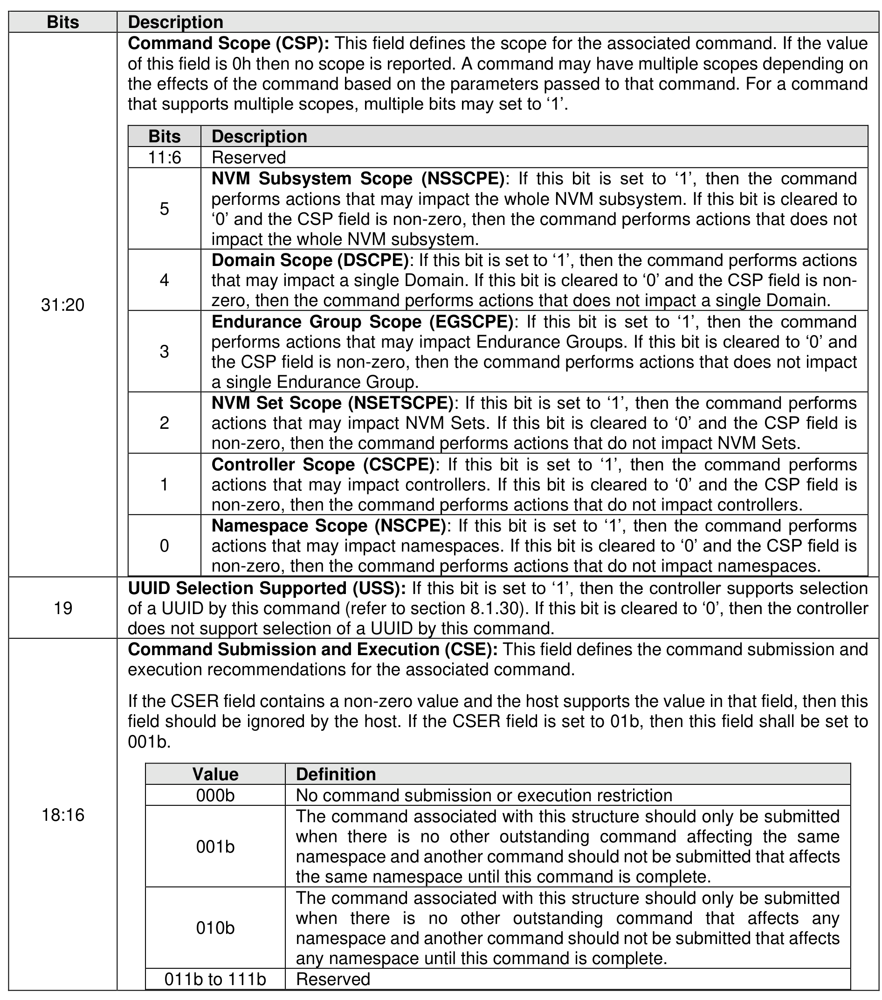
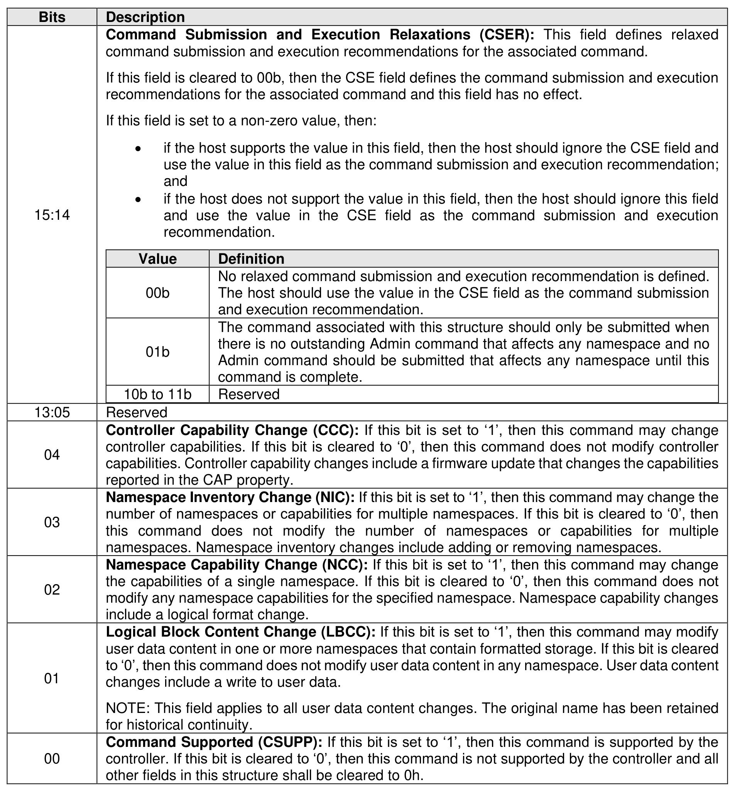

###### 5.2.12.1.6 Commands Supported and Effects (Log Page Identifier 05h)

> **Section ID**: 5.2.12.1.6 | **Page**: 244-246

This log page is used to describe the commands that the controller supports and the effects of those
commands on the state of the NVM subsystem. The log page is 4,096 bytes in size. There is one
Commands Supported and Effects data structure per Admin command opcode value. For controllers that
implement I/O Queues, there is one Commands Supported and Effects data structure per I/O command
opcode value for a specified I/O Command Set based on:
a) the I/O Command Set selected in CC.CSS, if CC.CSS is not set to 110b; and
b) the Command Set Identifier field in CDW 14, if CC.CSS is set to 110b.
The Commands Supported and Effects data structure describes the overall possible effect of a command
including any optional features of the command.
The host may take command effects into account when determining how to submit commands and actions
to take after the command is complete. It is recommended that if a command may change a particular
capability that the host re-enumerate and/or re-initialize the associated capability after the command is
complete. For example, if a namespace capability change may occur, then the host is recommended to
pause the use of the associated namespace, submit the command that may cause a namespace capability
change and wait for its completion, and then re-issue the Identify command.
If the namespace is attached to multiple controllers, the host(s) associated with those controllers should
coordinate their commands to meet the Command Submission and Execution requirements (refer to Figure
214). The details of this coordination are outside the scope of this specification.

---
### 📊 Tables (3)

#### Table 1: Untitled Table

| Bits | Description |
| :--- | :--- |
| 11:6 | Reserved |
| 5 | NVM Subsystem Scope (NSSCPE): If this bit is set to '1', then the command performs actions that may impact the whole NVM subsystem. If this bit is cleared to '0' and the CSP field is non-zero, then the command performs actions that does not impact the whole NVM subsystem. |
| 4 | Domain Scope (DSCPE): If this bit is set to '1', then the command performs actions that may impact a single Domain. If this bit is cleared to '0' and the CSP field is non-zero, then the command performs actions that does not impact a single Domain. |
| 3 | Endurance Group Scope (EGSCPE): If this bit is set to '1', then the command performs actions that may impact Endurance Groups. If this bit is cleared to '0' and the CSP field is non-zero, then the command performs actions that does not impact a single Endurance Group. |
| 2 | NVM Set Scope (NSETSCPE): If this bit is set to '1', then the command performs actions that may impact NVM Sets. If this bit is cleared to '0' and the CSP field is non-zero, then the command performs actions that do not impact NVM Sets. |
| 1 | Controller Scope (CSCPE): If this bit is set to '1', then the command performs actions that may impact controllers. If this bit is cleared to '0' and the CSP field is non-zero, then the command performs actions that do not impact controllers. |
| 0 | Namespace Scope (NSCPE): If this bit is set to '1', then the command performs actions that may impact namespaces. If this bit is cleared to '0' and the CSP field is non-zero, then the command performs actions that do not impact namespaces. |
| | UUID Selection Supported (USS): If this bit is set to '1', then the controller supports selection of a UUID by this command (refer to section 8.1.30). If this bit is cleared to '0', then the controller does not support selection of a UUID by this command. |
| | Command Submission and Execution (CSE): This field defines the command submission and execution recommendations for the associated command. |
| | If the CSER field contains a non-zero value and the host supports the value in that field, then this field should be ignored by the host. If the CSER field is set to 01b, then this field shall be set to 001b. |
| Value | Definition |
| :--- | :--- |
| 000b | No command submission or execution restriction |
| 001b | The command associated with this structure should only be submitted when there is no other outstanding command affecting the same namespace and another command should not be submitted that affects the same namespace until this command is complete. |
| 010b | The command associated with this structure should only be submitted when there is no other outstanding command that affects any namespace and another command should not be submitted that affects any namespace until this command is complete. |
| 011b to 111b | Reserved |
| Value | Definition |
| :--- | :--- |
| 00b | No relaxed command submission and execution recommendation is defined. The host should use the value in the CSE field as the command submission and execution recommendation. |
| 01b | The command associated with this structure should only be submitted when there is no outstanding Admin command that affects any namespace and no Admin command should be submitted that affects any namespace until this command is complete. |
| 10b to 11b | Reserved |
| | |
| **Controller Capability Change (CCC):** If this bit is set to '1', then this command may change controller capabilities. If this bit is cleared to '0', then this command does not modify controller capabilities. Controller capability changes include a firmware update that changes the capabilities reported in the CAP property. | |
| **Namespace Inventory Change (NIC):** If this bit is set to '1', then this command may change the number of namespaces or capabilities for multiple namespaces. If this bit is cleared to '0', then this command does not modify the number of namespaces or capabilities for multiple namespaces. Namespace inventory changes include adding or removing namespaces. | |
| **Namespace Capability Change (NCC):** If this bit is set to '1', then this command may change the capabilities of a single namespace. If this bit is cleared to '0', then this command does not modify any namespace capabilities for the specified namespace. Namespace capability changes include a logical format change. | |
| **Logical Block Content Change (LBCC):** If this bit is set to '1', then this command may modify user data content in one or more namespaces that contain formatted storage. If this bit is cleared to '0', then this command does not modify user data content in any namespace. User data content changes include a write to user data.   NOTE: This field applies to all user data content changes. The original name has been retained for historical continuity. | |
| **Command Supported (CSUPP):** If this bit is set to '1', then this command is supported by the controller. If this bit is cleared to '0', then this command is not supported by the controller and all other fields in this structure shall be cleared to 0h. | |

#### Table 2: Untitled Table

(Continuation of Untitled Table - see first part)

#### Table 3: Untitled Table

(Continuation of Untitled Table - see first part)

