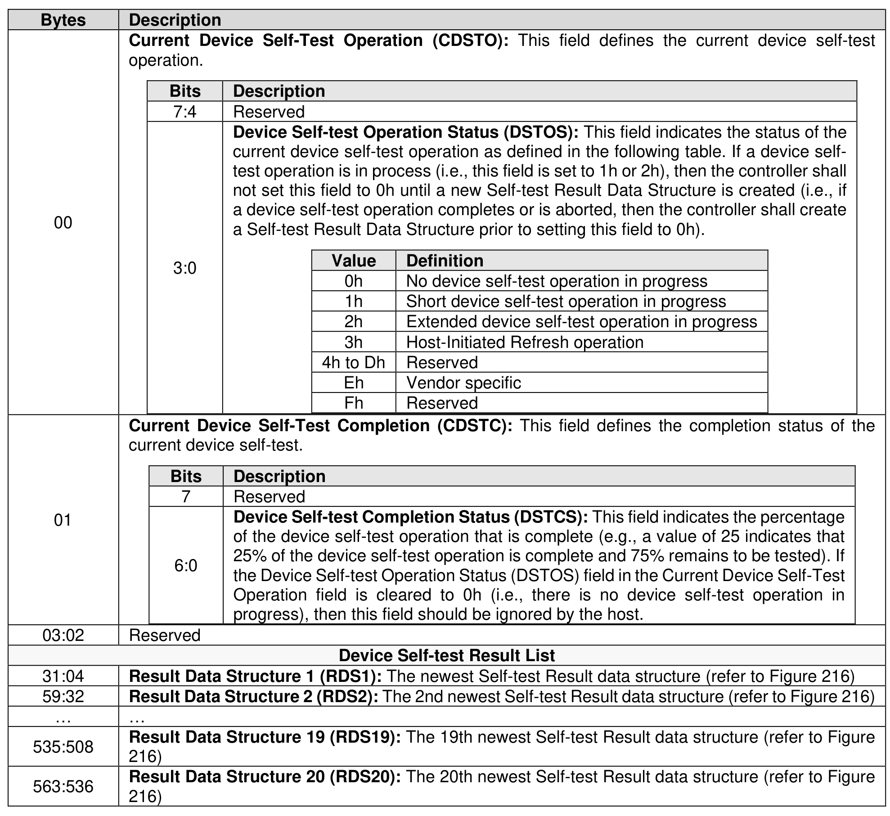

###### 5.2.12.1.7 Device Self-test (Log Page Identifier 06h)

> **Section ID**: 5.2.12.1.7 | **Page**: 246-249

This log page is used to indicate:
a) the status of any device self-test operation in progress and the percentage complete of that
operation; and
b) the results of the last 20 device self-test operations.
The Self-test Result data structure (refer to Figure 216) contained in the Result Data Structure 1 field is
always the result of the most recently completed or aborted self-test operation. The next entry in the Device
Self-test Result list in the Device Self-test log page contains the results of the second most recent self-test
operation and so on. If fewer than 20 self-test operations have completed or been aborted, then the Device
Self-test Result field shall be set to Fh (i.e., Entry is empty) and the Self-test Code field shall be cleared to
0h (i.e., Entry is empty) in the Device Self-test Status field in the unused Self-test Result Data Structure
fields and all other fields in that Self-test Result data structure should be ignored by the host.

---
### 📊 Tables (3)

#### Table 1: Untitled Table

| Bits | Description |
|---|---|
| 7:4 | Reserved |
| 3:0 | **Device Self-test Operation Status (DSTOS)**: This field indicates the status of the current device self-test operation as defined in the following table. If a device self-test operation is in process (i.e., this field is set to 1h or 2h), then the controller shall not set this field to 0h until a new Self-test Result Data Structure is created (i.e., if a device self-test operation completes or is aborted, then the controller shall create a Self-test Result Data Structure prior to setting this field to 0h).  <table><tr><th>Value</th><th>Definition</th></tr><tr><td>0h</td><td>No device self-test operation in progress</td></tr><tr><td>1h</td><td>Short device self-test operation in progress</td></tr><tr><td>2h</td><td>Extended device self-test operation in progress</td></tr><tr><td>3h</td><td>Host-Initiated Refresh operation</td></tr><tr><td>4h to Dh</td><td>Reserved</td></tr><tr><td>Eh</td><td>Vendor specific</td></tr><tr><td>Fh</td><td>Reserved</td></tr></table> |
| | **Current Device Self-Test Completion (CDSTC)**: This field defines the completion status of the current device self-test. |
| Bits | Description |
|---|---|
| 7 | Reserved |
| 6:0 | **Device Self-test Completion Status (DSTCS)**: This field indicates the percentage of the device self-test operation that is complete (e.g., a value of 25 indicates that 25% of the device self-test operation is complete and 75% remains to be tested). If the Device Self-test Operation Status (DSTOS) field in the Current Device Self-Test Operation field is cleared to 0h (i.e., there is no device self-test operation in progress), then this field should be ignored by the host. |
| 2 | Reserved |
| | **Device Self-test Result List** |
| 4 | **Result Data Structure 1 (RDS1)**: The newest Self-test Result data structure (refer to Figure 216) |
| 2 | **Result Data Structure 2 (RDS2)**: The 2nd newest Self-test Result data structure (refer to Figure 216) |
| | ... |
| 08 | **Result Data Structure 19 (RDS19)**: The 19th newest Self-test Result data structure (refer to Figure 216) |
| 36 | **Result Data Structure 20 (RDS20)**: The 20th newest Self-test Result data structure (refer to Figure 216) |
| Bits | Description |
| :--- | :--- |
| | **Device Self-test Status (DSTS):** This field indicates the device self-test code and the status of that operation. |
| 7:4 | **Self-test Code (DSTC):** This field indicates the Self-test Code value that was specified in the Device Self-test command that started the device self-test operation that this Self-test Result Data Structure describes. |
| | <table><tr><th>Value</th><th>Definition</th></tr><tr><td>0h</td><td>Entry is empty</td></tr><tr><td>1h</td><td>Short device self-test operation</td></tr><tr><td>2h</td><td>Extended device self-test operation</td></tr><tr><td>3h</td><td>Host-Initiated Refresh operation</td></tr><tr><td>4h to Dh</td><td>Reserved</td></tr><tr><td>Eh</td><td>Vendor specific</td></tr><tr><td>Fh</td><td>Reserved</td></tr></table> |
| | **Device Self-test Result (DSTR):** This field indicates the result of the device self-test operation that this Self-test Result Data Structure describes. |
| 3:0 | <table><tr><th>Value</th><th>Definition</th></tr><tr><td>0h</td><td>Operation completed without error</td></tr><tr><td>1h</td><td>Operation was aborted by a Device Self-test command</td></tr><tr><td>2h</td><td>Operation was aborted by a Controller Level Reset</td></tr><tr><td>3h</td><td>Operation was aborted due to a removal of a namespace from the namespace inventory</td></tr><tr><td>4h</td><td>Operation was aborted due to the processing of a Format NVM command</td></tr><tr><td>5h</td><td>A fatal error or unknown test error occurred while the controller was executing the device self-test operation and the operation did not complete</td></tr><tr><td>6h</td><td>Operation completed with a segment that failed and the segment that failed is not known</td></tr><tr><td>7h</td><td>Operation completed with one or more failed segments and the first segment that failed is indicated in the Segment Number field</td></tr><tr><td>8h</td><td>Operation was aborted for unknown reason</td></tr><tr><td>9h</td><td>Operation was aborted due to a sanitize operation</td></tr><tr><td>Ah to Eh</td><td>Reserved</td></tr><tr><td>Fh</td><td>Entry is empty (i.e., does not contain a test result)</td></tr></table> |
| | **Segment Number (SEGN):** This field indicates the segment number (refer to section 8.1.8) where the first self-test failure occurred. If Device Self-test Status field bits [3:0] are not set to 7h, then this field should be ignored by the host. |
| | **Valid Diagnostic Information (VDINFO):** This field indicates the diagnostic failure information that is reported. |
| Bits | Description |
| :--- | :--- |
| 7:4 | Reserved |
| 3 | **SC Valid (SCVLD):** If this bit is set to '1', then the contents of Status Code field are valid. If this bit is cleared to '0', then the contents of the Status Code field are invalid. |
| 2 | **SCT Valid (SCTVLD):** If this bit is set to '1', then the contents of the Status Code Type field are valid. If this bit is cleared to '0', then the contents of the Status Code Type field are invalid. |
| 1 | **FLBA Valid (FVLD):** If this bit is set to '1', then the contents of the Failing LBA field are valid. If this bit is cleared to '0', then the contents of the Failing LBA field are invalid. |
| 0 | **NSID Valid (NSIDVLD):** If this bit is set to '1', then the contents of the Namespace Identifier field are valid. If this bit is cleared to '0', then the contents of the Namespace Identifier field are invalid. |
| | Reserved |
| Bits | Description |
|---|---|
| 7:3 | Reserved |
| 2:0 | Additional Status Code Info (ASTCI): This field may contain additional information relating to errors or conditions that occurred during the device self-test operation represented in the same format used in the Status Code Type field of the completion queue entry (refer to Figure 101). The contents of this field are valid only when the SCT Valid bit is set to '1'. |

#### Table 2: Untitled Table

(Continuation of Untitled Table - see first part)

#### Table 3: Untitled Table

(Continuation of Untitled Table - see first part)

