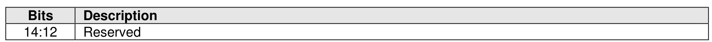
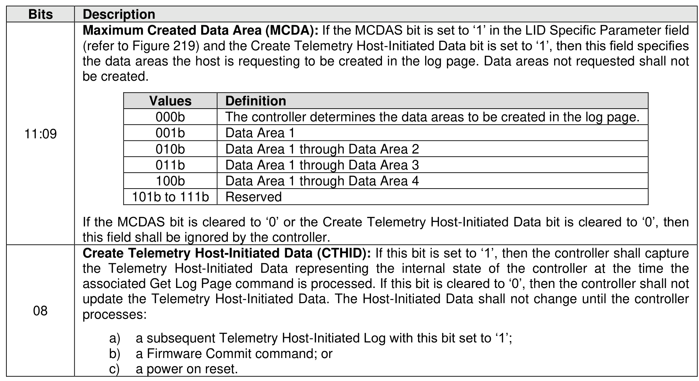
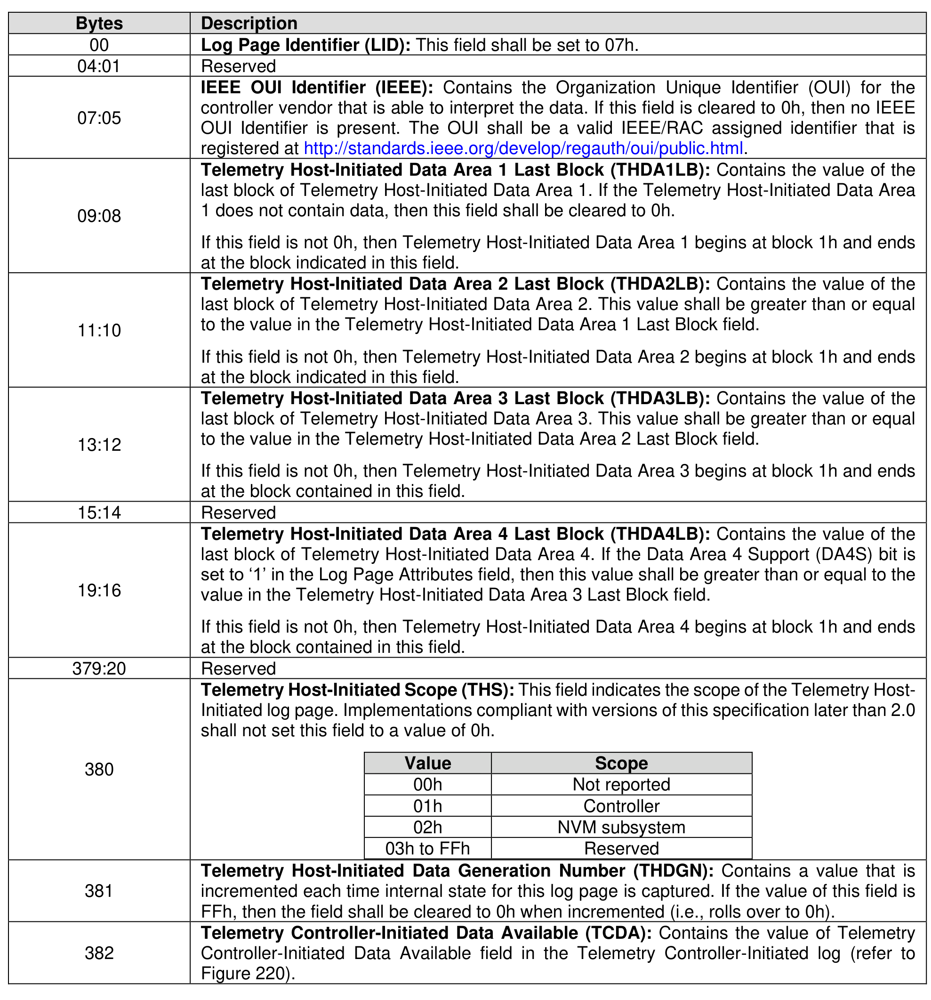
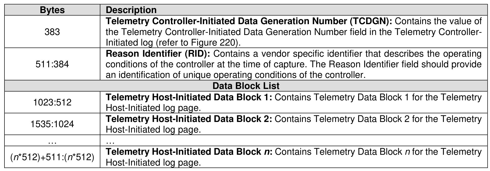

###### 5.2.12.1.8 Telemetry Host-Initiated (Log Page Identifier 07h)

> **Section ID**: 5.2.12.1.8 | **Page**: 249-252

This log page consists of a header (i.e., bytes 511:0 of the log page) describing the log and zero or more
Telemetry Data Blocks (refer to section 8.1.29). The header shall always be available even if there is no
Telemetry Host-Initiated Data available. All Telemetry Data Blocks are 512 bytes in size. The controller
shall initiate a capture of internal controller-scoped or NVM subsystem-scoped state to this log page if the
controller processes a Get Log Page command for this log with the Create Telemetry Host-Initiated Data
bit set to ‘1’ in the Log Specific Parameter field. The scope of the saved state is determined by the value in
the Telemetry Host-Initiated Scope field. If the host specifies a Log Page Offset Lower value that is not a
multiple of 512 bytes in the Get Log Page command for this log page, then the controller shall abort the
command with a status code of Invalid Field in Command.
The Log Specific Parameter field in Command Dword 10 (refer to Figure 201) for this log page is defined
in Figure 217.
The Telemetry Host-Initiated Data consists of:
a) Three areas, if the Data Area 4 Support (DA4S) bit is cleared to ‘0’ in the Log Page Attributes field:
Telemetry Host-Initiated Data Area 1, Telemetry Host-Initiated Data Area 2, and Telemetry Host-
Initiated Data Area 3; or
b) Four areas, if the DA4S bit is set to ‘1’ in the Log Page Attributes field: Telemetry Host-Initiated
Data Area 1, Telemetry Host-Initiated Data Area 2, Telemetry Host-Initiated Data Area 3 and
Telemetry Host-Initiated Data Area 4.
All areas start at Telemetry Host-Initiated Data Area Block 1. The last block of each area is indicated in
Telemetry Host-Initiated Data Area y Last Block, respectively. The telemetry data captured and the size of
that data is implementation dependent.
The size of the log page is variable and:
•
If the DA4S bit is cleared to ‘0’ in the Log Page Attributes field, the size may be calculated using
the Telemetry Host-Initiated Data Area 3 Last Block field.
•
If the DA4S bit is set to ‘1’ in the Log Page Attributes field and the Extended Telemetry Data Area
4 Supported (ETDAS) field is set to 1h in the Host Behavior Support feature (refer to section
5.2.26.1.14), then the size of the log page may be calculated using the Telemetry Host-Initiated
Data Area 4 Last Block field.
•
If the DA4S bit is set to ‘1’ in the Log Page Attributes field and the Extended Telemetry Data Area
4 Supported (ETDAS) field is cleared to 0h in the Host Behavior Support feature (refer to section
5.2.26.1.14), then the size of the log page may be calculated using the Telemetry Host-Initiated
Data Area 3 Last Block field.
The controller shall return data for all blocks requested:
•
If the DA4S bit is cleared to ‘0’ in the Log Page Attributes field, then the data beyond the last block
in Telemetry Host-Initiated Data Area 3 Last Block is undefined.
•
If the DA4S bit is set to ‘1’ in the Log Page Attributes field and the Extended Telemetry Data Area
4 Supported (ETDAS) field is set to 1h in the Host Behavior Support feature, then the data beyond
the last block in Telemetry Host-Initiated Data Area 4 Last Block is undefined.
•
If the DA4S bit is set to ‘1’ in the Log Page Attributes field and the Extended Telemetry Data Area
4 Supported (ETDAS) field is cleared to 0h in the Host Behavior Support feature, then the data
beyond the last block in Telemetry Host-Initiated Data Area 3 Last Block is undefined.
If the host requests a data transfer that is not a multiple of 512 bytes, then the controller shall return an
error of Invalid Field in Command.
If the MCDAS bit (refer to Figure 219) is set to ‘1’ and a Get Log Page command with the Create Telemetry
Host-Initiated Data bit is set to ‘1’, then the maximum data area to be created in the Telemetry Host-Initiated
log page shall be less than or equal to the MCDA field in the Log Specific Parameter field in Command
Dword 10 (refer to Figure 217).

---
### 📊 Tables (4)

#### Table 1: Untitled Table

| Values | Definition |
| :--- | :--- |
| 000b | The controller determines the data areas to be created in the log page. |
| 001b | Data Area 1 |
| 010b | Data Area 1 through Data Area 2 |
| 011b | Data Area 1 through Data Area 3 |
| 100b | Data Area 1 through Data Area 4 |
| 101b to 111b | Reserved |
| | If the MCDAS bit is cleared to '0' or the Create Telemetry Host-Initiated Data bit is cleared to '0', then this field shall be ignored by the controller. |
| | **Create Telemetry Host-Initiated Data (CTHID):** If this bit is set to '1', then the controller shall capture the Telemetry Host-Initiated Data representing the internal state of the controller at the time the associated Get Log Page command is processed. If this bit is cleared to '0', then the controller shall not update the Telemetry Host-Initiated Data. The Host-Initiated Data shall not change until the controller processes: |
| | a) a subsequent Telemetry Host-Initiated Log with this bit set to '1'; |
| | b) a Firmware Commit command; or |
| | c) a power on reset. |
| | Telemetry Host-Initiated Data consists of: |
| | Three areas, if the Data Area 4 Support (DA4S) bit is cleared to '0' in the Log Page Attributes field: Telemetry Host-Initiated Data Area 1, Telemetry Host-Initiated Data Area 2, and Telemetry Host-Initiated Data Area 3; or |
| | Four areas, if the DA4S bit is set to '1' in the Log Page Attributes field: Telemetry Host-Initiated Data Area 1, Telemetry Host-Initiated Data Area 2, Telemetry Host-Initiated Data Area 3 and Telemetry Host-Initiated Data Area 4. |
| | controller vendor that is able to interpret the data. If this field is cleared to 0h, then no IEEE OUI identifier is present. The OUI shall be a valid IEEE/RAC assigned identifier that is registered at http://standards.ieee.org/develop/regauth/oui/public.html. |
| 07:05 | Telemetry Host-Initiated Data Area 1 Last Block (THDA1LB): Contains the value of the last block of Telemetry Host-Initiated Data Area 1. If the Telemetry Host-Initiated Data Area 1 does not contain data, then this field shall be cleared to 0h. |
| 09:08 | If this field is not 0h, then Telemetry Host-Initiated Data Area 1 begins at block 1h and ends at the block indicated in this field. |
| 11:10 | Telemetry Host-Initiated Data Area 2 Last Block (THDA2LB): Contains the value of the last block of Telemetry Host-Initiated Data Area 2. This value shall be greater than or equal to the value in the Telemetry Host-Initiated Data Area 1 Last Block field. |
| | If this field is not 0h, then Telemetry Host-Initiated Data Area 2 begins at block 1h and ends at the block indicated in this field. |
| 13:12 | Telemetry Host-Initiated Data Area 3 Last Block (THDA3LB): Contains the value of the last block of Telemetry Host-Initiated Data Area 3. This value shall be greater than or equal to the value in the Telemetry Host-Initiated Data Area 2 Last Block field. |
| | If this field is not 0h, then Telemetry Host-Initiated Data Area 3 begins at block 1h and ends at the block contained in this field. |
| 15:14 | Reserved |
| 19:16 | Telemetry Host-Initiated Data Area 4 Last Block (THDA4LB): Contains the value of the last block of Telemetry Host-Initiated Data Area 4. If the Data Area 4 Support (DA4S) bit is set to '1' in the Log Page Attributes field, then this value shall be greater than or equal to the value in the Telemetry Host-Initiated Data Area 3 Last Block field. |
| | If this field is not 0h, then Telemetry Host-Initiated Data Area 4 begins at block 1h and ends at the block contained in this field. |
| 79:20 | Reserved |
| | Telemetry Host-Initiated Scope (THS): This field indicates the scope of the Telemetry Host-Initiated log page. Implementations compliant with versions of this specification later than 2.0 shall not set this field to a value of 0h. |
| | <table><tr><th>Value</th><th>Scope</th></tr><tr><td>00h</td><td>Not reported</td></tr><tr><td>01h</td><td>Controller</td></tr><tr><td>02h</td><td>NVM subsystem</td></tr><tr><td>03h to FFh</td><td>Reserved</td></tr></table> |
| 380 | |
| 381 | Telemetry Host-Initiated Data Generation Number (THDGN): Contains a value that is incremented each time internal state for this log page is captured. If the value of this field is FFh, then the field shall be cleared to 0h when incremented (i.e., rolls over to 0h). |
| 382 | Telemetry Controller-Initiated Data Available (TCDA): Contains the value of Telemetry Controller-Initiated Data Available field in the Telemetry Controller-Initiated log (refer to Figure 220). |
| 383 | the Telemetry Controller-Initiated Data Generation Number field in the Telemetry Controller-Initiated log (refer to Figure 220). |
| 11:384 | Reason Identifier (RID): Contains a vendor specific identifier that describes the operating conditions of the controller at the time of capture. The Reason Identifier field should provide an identification of unique operating conditions of the controller. |
| | **Data Block List** |
| | **Telemetry Host-Initiated Data Block 1:** Contains Telemetry Data Block 1 for the Telemetry Host-Initiated log page. |
| | **Telemetry Host-Initiated Data Block 2:** Contains Telemetry Data Block 2 for the Telemetry Host-Initiated log page. |
| | ... |
| | **Telemetry Host-Initiated Data Block n:** Contains Telemetry Data Block n for the Telemetry Host-Initiated log page. |
| | **8.1 Telemetry Host-Initiated LID Specific Parameter Field** |
| | 19 specifies the format for the LID Specific Parameter field in the Supported Log Pages log page section 5.2.12.1.1) for the Telemetry Host-Initiated log page. |
| | **Figure 219: Telemetry Host-Initiated Log Page - LID Specific Parameter Field** |

#### Table 2: Untitled Table

(Continuation of Untitled Table - see first part)

#### Table 3: Untitled Table

(Continuation of Untitled Table - see first part)

#### Table 4: Untitled Table

(Continuation of Untitled Table - see first part)

