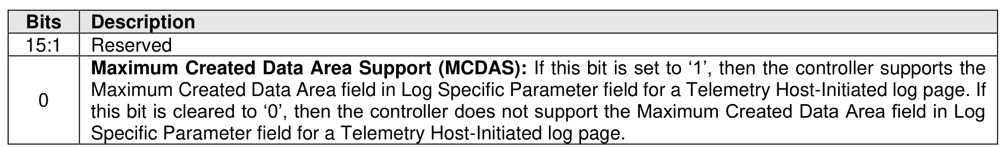

###### 5.2.12.1.8.1 Telemetry Host-Initiated LID Specific Parameter Field

> **Section ID**: 5.2.12.1.8.1 | **Page**: 252-252

Figure 219 specifies the format for the LID Specific Parameter field in the Supported Log Pages log page
(refer to section 5.2.12.1.1) for the Telemetry Host-Initiated log page.

---
### 📊 Tables (1)

#### Table 1: Untitled Table

| | |
|:---|:---|
| | page consists of a header (i.e., bytes 511:0 of the log page) describing the log and zero or more |
| | Data Blocks (refer to section 8.1.29). The header shall always be available even if there is no |
| | Controller-Initiated Data available. All Telemetry Data Blocks are 512 bytes in size. This log is a |
| | r-initiated capture of internal controller-scoped or NVM subsystem-scoped state. The scope of the |
| | ate is determined by the value in the Telemetry Controller-Initiated Scope field. The Telemetry |
| | er-Initiated Data for Data Area 1 through Data Area 3 shall persist across all resets. The Telemetry |
| | er-Initiated Data for Data Area 4 may persist across Controller Level Resets. If the host specifies a |

