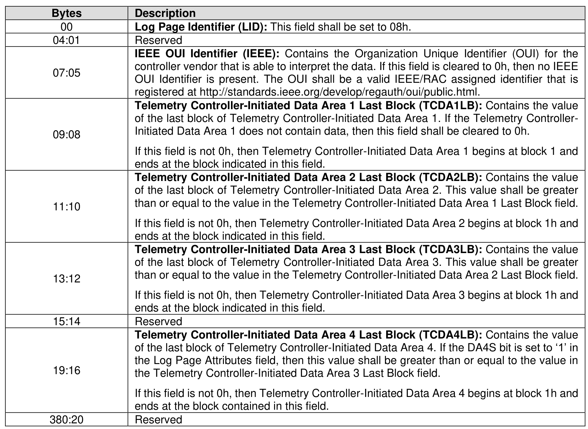
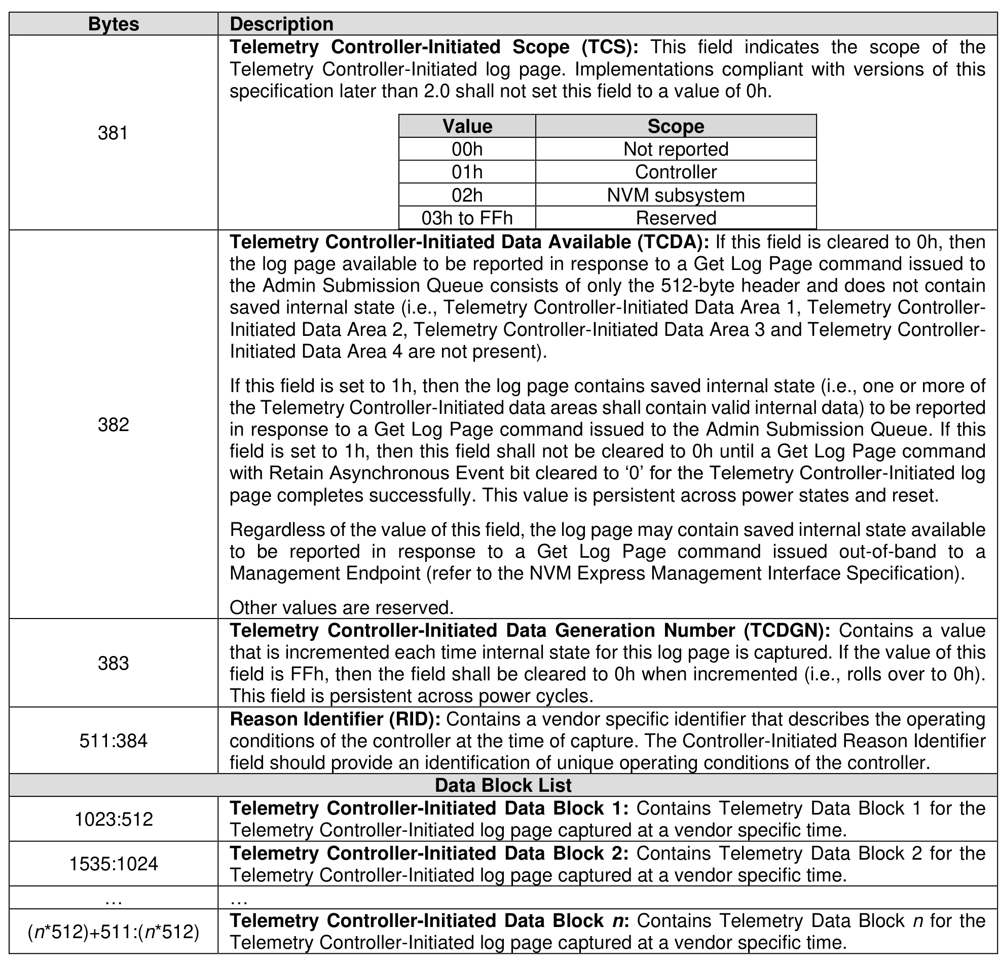

###### 5.2.12.1.9 Telemetry Controller-Initiated (Log Page Identifier 08h)

> **Section ID**: 5.2.12.1.9 | **Page**: 252-254

This log page consists of a header (i.e., bytes 511:0 of the log page) describing the log and zero or more
Telemetry Data Blocks (refer to section 8.1.29). The header shall always be available even if there is no
Telemetry Controller-Initiated Data available. All Telemetry Data Blocks are 512 bytes in size. This log is a
controller-initiated capture of internal controller-scoped or NVM subsystem-scoped state. The scope of the
saved state is determined by the value in the Telemetry Controller-Initiated Scope field. The Telemetry
Controller-Initiated Data for Data Area 1 through Data Area 3 shall persist across all resets. The Telemetry
Controller-Initiated Data for Data Area 4 may persist across Controller Level Resets. If the host specifies a
Log Page Offset Lower value that is not a multiple of 512 bytes in the Get Log Page command for this log,
then the controller shall return an error of Invalid Field in Command.
The Telemetry Controller-Initiated Data consists of:
a) three areas, if the Data Area 4 Support (DA4S) bit is cleared to ‘0’ in the Log Page Attributes field:
Telemetry Controller-Initiated Data Area 1, Telemetry Controller-Initiated Data Area 2, and
Telemetry Controller-Initiated Data Area 3; or
b) four areas, if the DA4S bit is set to ‘1’ in the Log Page Attributes field: Telemetry Controller-Initiated
Data Area 1, Telemetry Controller-Initiated Data Area 2, Telemetry Controller-Initiated Data Area 3
and Telemetry Controller-Initiated Data Area 4.
All areas start at Telemetry Controller-Initiated Data Area Block 1. The last block of each area is indicated
in the Telemetry Controller-Initiated Data Area y Last Block, respectively. The telemetry data captured and
its size is implementation dependent.
The size of the log page is variable and:
•
If the DA4S bit is cleared to ‘0’ in the Log Page Attributes field, the size may be calculated using
the Telemetry Controller-Initiated Data Area 3 Last Block field.
•
If the DA4S bit is set to ‘1’ in the Log Page Attributes field and the Extended Telemetry Data Area
4 Supported (ETDAS) field is set to 1h in the Host Behavior Support feature (refer to section
5.2.26.1.14), then the size of the log page may be calculated using the Telemetry Controller-
Initiated Data Area 4 Last Block field.
•
If the DA4S bit is set to ‘1’ in the Log Page Attributes field and the Extended Telemetry Data Area
4 Supported (ETDAS) field is cleared to 0h in the Host Behavior Support feature (refer to section
5.2.26.1.14), then the size of the log page may be calculated using the Telemetry Controller-
Initiated Data Area 3 Last Block field.
The controller shall return data for all blocks requested:
•
If the DA4S bit is cleared to ‘0’ in the Log Page Attributes field, then the data beyond the last block
in Telemetry Controller-Initiated Data Area 3 Last Block is undefined.
•
If the DA4S bit is set to ‘1’ in the Log Page Attributes field, then the data beyond the last block in
Telemetry Controller-Initiated Data Area 4 Last Block is undefined.
•
If the DA4S bit is set to ‘1’ in the Log Page Attributes field and the Extended Telemetry Data Area
4 Supported (ETDAS) field is cleared to 0h in the Host Behavior Support feature, then the data
beyond the last block in Telemetry Controller-Initiated Data Area 3 Last Block is undefined.
If the host requests a data transfer that is not a multiple of 512 bytes, then the controller shall abort the
command with the status code of Invalid Field in Command.

---
### 📊 Tables (2)

#### Table 1: Untitled Table

| | Description |
|:---|:---|
| 09:08 | of the last block of Telemetry Controller-Initiated Data Area 1. If the Telemetry Controller-Initiated Data Area 1 does not contain data, then this field shall be cleared to 0h. If this field is not 0h, then Telemetry Controller-Initiated Data Area 1 begins at block 1h and ends at the block indicated in this field. |
| 11:10 | Telemetry Controller-Initiated Data Area 2 Last Block (TCDA2LB): Contains the value of the last block of Telemetry Controller-Initiated Data Area 2. This value shall be greater than or equal to the value in the Telemetry Controller-Initiated Data Area 1 Last Block field. If this field is not 0h, then Telemetry Controller-Initiated Data Area 2 begins at block 1h and ends at the block indicated in this field. |
| 13:12 | Telemetry Controller-Initiated Data Area 3 Last Block (TCDA3LB): Contains the value of the last block of Telemetry Controller-Initiated Data Area 3. This value shall be greater than or equal to the value in the Telemetry Controller-Initiated Data Area 2 Last Block field. If this field is not 0h, then Telemetry Controller-Initiated Data Area 3 begins at block 1h and ends at the block indicated in this field. |
| 15:14 | Reserved |
| 19:16 | Telemetry Controller-Initiated Data Area 4 Last Block (TCDA4LB): Contains the value of the last block of Telemetry Controller-Initiated Data Area 4. If the DA4S bit is set to '1' in the Log Page Attributes field, then this value shall be greater than or equal to the value in the Telemetry Controller-Initiated Data Area 3 Last Block field. If this field is not 0h, then Telemetry Controller-Initiated Data Area 4 begins at block 1h and ends at the block contained in this field. |
| 380:20 | Reserved |
| | |
| | |
| | |
| | |
| | |
| | |
| | |
| | |
| | |
| | |

#### Table 2: Untitled Table

(Continuation of Untitled Table - see first part)

