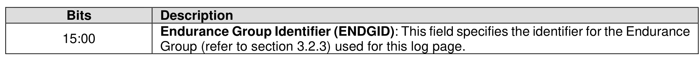
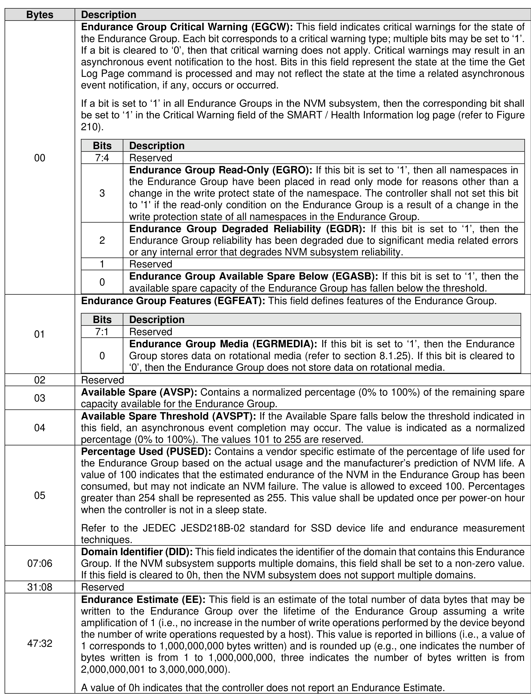
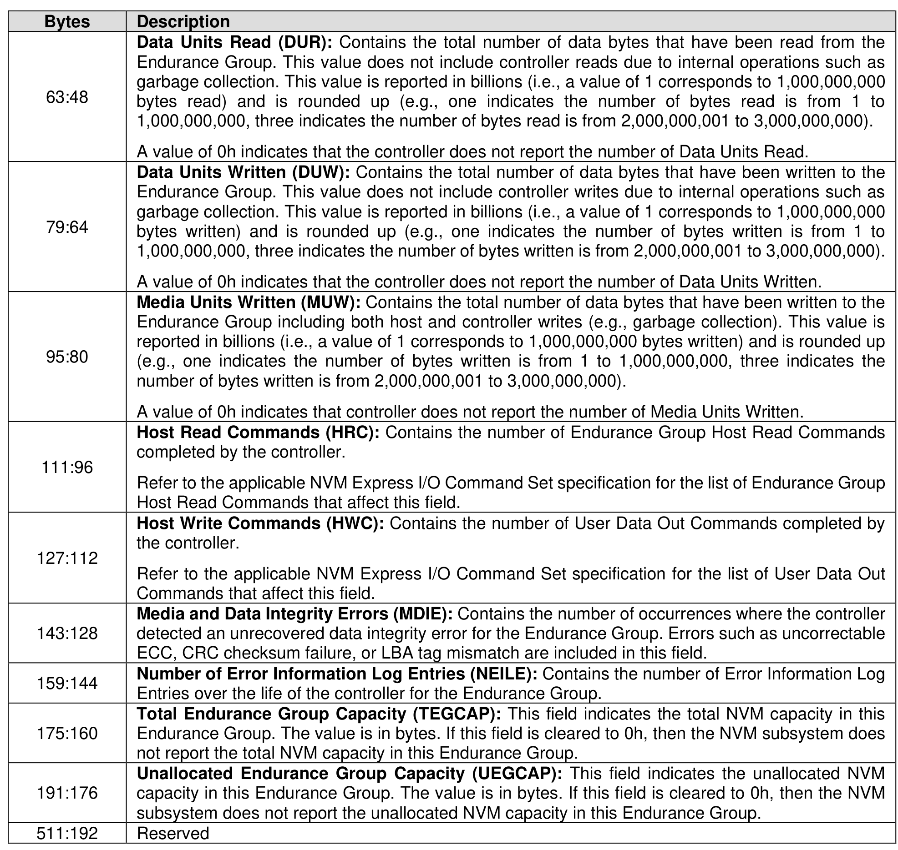

###### 5.2.12.1.10 Endurance Group Information (Log Page Identifier 09h)

> **Section ID**: 5.2.12.1.10 | **Page**: 254-256

This log page is used to provide endurance information based on the Endurance Group (refer to section
3.2.3). An Endurance Group contains capacity that may be allocated to zero or more NVM Sets. Capacity
that has not been allocated to an NVM Set is unallocated Endurance Group capacity. The information
provided is over the life of the Endurance Group. The Endurance Group Identifier is specified in the Log
Specific Identifier field in Command Dword 11 of the Get Log Page command as defined in Figure 221. The
log page is 512 bytes in size.

---
### 📊 Tables (3)

#### Table 1: Untitled Table

| Bits | Description |
| :--- | :--- |
| 7:4 | Reserved |
| 3 | **Endurance Group Read-Only (EGRO):** If this bit is set to '1', then all namespaces in the Endurance Group have been placed in read only mode for reasons other than a change in the write protect state of the namespace. The controller shall not set this bit to '1' if the read-only condition on the Endurance Group is a result of a change in the write protection state of all namespaces in the Endurance Group. |
| 2 | **Endurance Group Degraded Reliability (EGDR):** If this bit is set to '1', then the Endurance Group reliability has been degraded due to significant media related errors or any internal error that degrades NVM subsystem reliability. |
| 1 | Reserved |
| 0 | **Endurance Group Available Spare Below (EGASB):** If this bit is set to '1', then the available spare capacity of the Endurance Group has fallen below the threshold. |
| | **Endurance Group Features (EGFEAT):** This field defines features of the Endurance Group. |
| 7:1 | Reserved |
| 0 | **Endurance Group Media (EGRMEDIA):** If this bit is set to '1', then the Endurance Group stores data on rotational media (refer to section 8.1.25). If this bit is cleared to '0', then the Endurance Group does not store data on rotational media. |
| | Reserved |
| | **Available Spare (AVSP):** Contains a normalized percentage (0% to 100%) of the remaining spare capacity available for the Endurance Group. |
| | **Available Spare Threshold (AVSPT):** If the Available Spare falls below the threshold indicated in this field, an asynchronous event completion may occur. The value is indicated as a normalized percentage (0% to 100%). The values 101 to 255 are reserved. |
| | **Percentage Used (PUSED):** Contains a vendor specific estimate of the percentage of life used for the Endurance Group based on the actual usage and the manufacturer's prediction of NVM life. A value of 100 indicates that the estimated endurance of the NVM in the Endurance Group has been consumed, but may not indicate an NVM failure. The value is allowed to exceed 100. Percentages greater than 254 shall not be represented by 255. This value shall be updated once per power-on hour when the controller is not in a sleep state.   Refer to the JEDEC JESD218B-02 standard for SSD device life and endurance measurement techniques. |
| | **Domain Identifier (DID):** This field indicates the identifier of the domain that contains this Endurance Group. If the NVM subsystem supports multiple domains, this field shall be set to a non-zero value. If this field is cleared to 0h, then the NVM subsystem does not support multiple domains. |
| 6 | Reserved |
| 8 | Reserved |
| 2 | **Endurance Estimate (EE):** This field is an estimate of the total number of data bytes that may be written to the Endurance Group over the lifetime of the Endurance Group assuming a write amplification of 1 (i.e., no increase in the number of write operations performed by the device beyond the number of write operations requested by a host). This value is reported in billions (i.e., a value of 1 corresponds to 1,000,000,000 bytes written) and is rounded up (e.g., one indicates the number of bytes written is from 1 to 1,000,000,000, three indicates the number of bytes written is from 2,000,000,001 to 3,000,000,000).   A value of 0h indicates that the controller does not report an Endurance Estimate. |
| 8 | **Data Units Read (DUR):** Contains the total number of data bytes that have been read from the Endurance Group. This value does not include controller reads due to internal operations such as garbage collection. This value is reported in billions (i.e., a value of 1 corresponds to 1,000,000,000 bytes read) and is rounded up (e.g., one indicates the number of bytes read is from 1 to 1,000,000,000, three indicates the number of bytes read is from 2,000,000,001 to 3,000,000,000).   A value of 0h indicates that the controller does not report the number of Data Units Read. |
| 4 | **Data Units Written (DUW):** Contains the total number of data bytes that have been written to the Endurance Group. This value does not include controller writes due to internal operations such as garbage collection. This value is reported in billions (i.e., a value of 1 corresponds to 1,000,000,000 bytes written) and is rounded up (e.g., one indicates the number of bytes written is from 1 to 1,000,000,000, three indicates the number of bytes written is from 2,000,000,001 to 3,000,000,000).   A value of 0h indicates that the controller does not report the number of Data Units Written. |
| 0 | **Media Units Written (MUW):** Contains the total number of data bytes that have been written to the Endurance Group including both host and controller writes (e.g., garbage collection). This value is reported in billions (i.e., a value of 1 corresponds to 1,000,000,000 bytes written) and is rounded up (e.g., one indicates the number of bytes written is from 1 to 1,000,000,000, three indicates the number of bytes written is from 2,000,000,001 to 3,000,000,000).   A value of 0h indicates that controller does not report the number of Media Units Written. |
| 36 | **Host Read Commands (HRC):** Contains the number of Endurance Group Host Read Commands completed by the controller.   Refer to the applicable NVM Express I/O Command Set specification for the list of Endurance Group Host Read Commands that affect this field. |
| 12 | **Host Write Commands (HWC):** Contains the number of User Data Out Commands completed by the controller.   Refer to the applicable NVM Express I/O Command Set specification for the list of User Data Out Commands that affect this field. |
| 28 | **Media and Data Integrity Errors (MDIE):** Contains the number of occurrences where the controller detected an uncovered data integrity error for the Endurance Group. Errors such as uncorrectable ECC, CRC checksum failure, or LBA tag mismatch are included in this field. |
| 44 | **Number of Error Information Log Entries (NEILE):** Contains the number of Error Information Log Entries over the life of the controller for the Endurance Group. |
| 60 | **Total Endurance Group Capacity (TEGCAP):** This field indicates the total NVM capacity in this Endurance Group. The value is in bytes. If this field is cleared to 0h, then the NVM subsystem does not report the total NVM capacity in this Endurance Group. |
| 76 | **Unallocated Endurance Group Capacity (UEGCAP):** This field indicates the unallocated NVM capacity in this Endurance Group. The value is in bytes. If this field is cleared to 0h, then the NVM subsystem does not report the unallocated NVM capacity in this Endurance Group. |
| 92 | Reserved |
| | **11 Predictable Latency Per NVM Set (Log Page Identifier 0Ah)** |
| | This page may be used to determine the current window for the specified NVM Set when Predictable Mode is enabled and any events that have occurred for the specified NVM Set. There is one log each NVM Set when Predictable Latency Mode is supported. The NVM Set for which the log page returned is specified in the Log Specific Identifier field in Command Dword 11 of the Get Log Page and as defined in Figure 223. The log page is 512 bytes in size. |
| | **Figure 223: NVM Set Identifier – Log Specific Identifier** |
| | |

#### Table 2: Untitled Table

(Continuation of Untitled Table - see first part)

#### Table 3: Untitled Table

(Continuation of Untitled Table - see first part)

