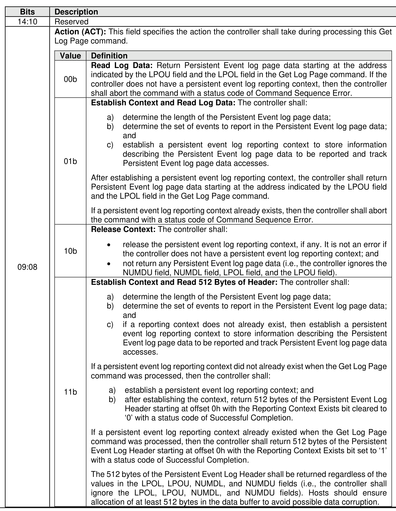
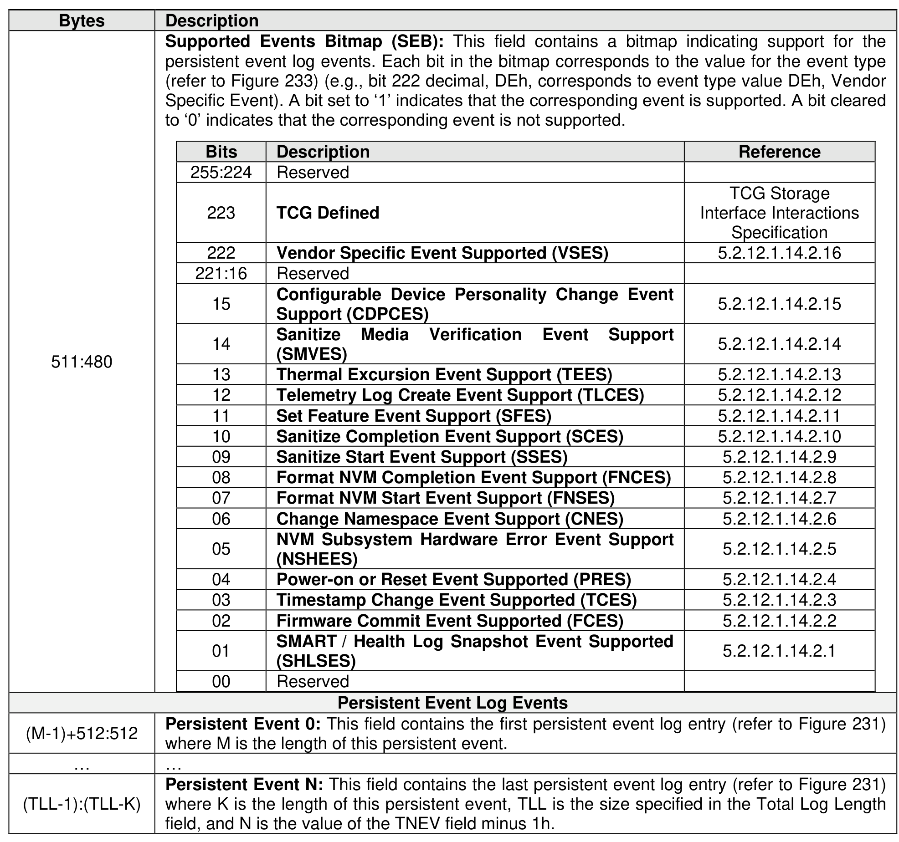
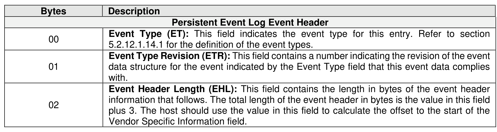
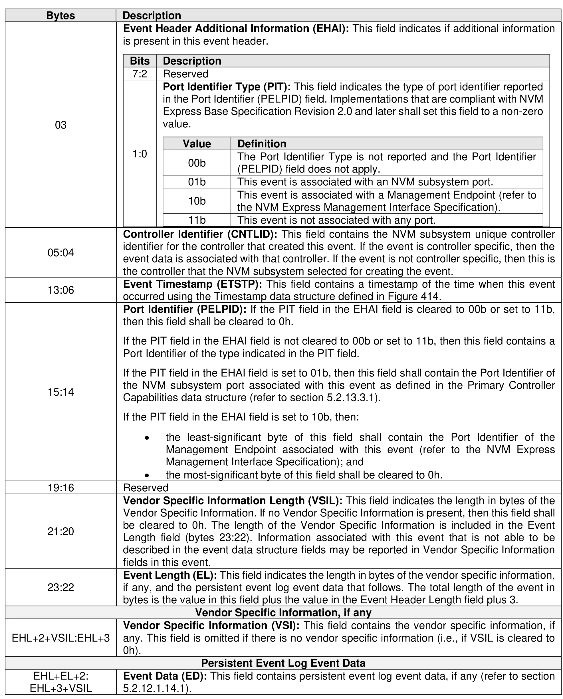

###### 5.2.12.1.14 Persistent Event (Log Page Identifier 0Dh)

> **Section ID**: 5.2.12.1.14 | **Page**: 260-267

The Persistent Event log page contains information about significant events not specific to a particular
command. The information in this log page shall be retained across power cycles and resets. NVM
subsystems should be designed for minimal loss of event information upon power failure. This log page
consists of a header describing the log and zero or more Persistent Events (refer to section 5.2.12.1.14.1).
This log page is global to the NVM subsystem.
The Log Specific Parameter field in Command Dword 10 (refer to Figure 201) for this log page is defined
in Figure 229.
A sanitize operation may alter this log page (e.g., remove or modify events to prevent derivation of user
data from log page information, refer to section 8.1.26). The events removed from this log page by a sanitize
operation are unspecified.
Persistent Event Log events specified in this section should be reported in an order such that more recent
events are reported earlier (i.e., at a lower offset) in the log data than older events. The method by which
the NVM subsystem determines the order in which events occurred is vendor specific.
The number of events supported is vendor specific. The supported maximum size for the Persistent Event
Log is indicated in the PELS field of the Identify Controller data structure (refer to Figure 328). The number
of events supported and the supported maximum size should be large enough that the number of events
or the size of the Persistent Event Log data does not reach the maximum supported size over the usable
life of the NVM subsystem.
The controller shall log all supported events at each event occurrence unless the controller determines that
the same event is occurring at a frequency that exceeds a vendor specific threshold for the frequency of
event creation. If the same event is occurring at a frequency that exceeds a vendor specific threshold then
the vendor may suppress further entries for the same event. A controller may indicate if events have been
suppressed in vendor specific event data.
It is vendor specific which events are deleted (e.g., important events may be retained and events that are
newer than an important event that was retained may be deleted) to make room for future events if:
a) the size of the Persistent Event Log data reaches the maximum supported size;
b) the number of events reaches the largest reportable number of events; or
c) an event category reaches the largest reportable number of events for that category (e.g.,
information regarding 1,000 occurrences of changes to the timestamp is stored in internal data
structures and extracted for reporting as Timestamp Change events in the Persistent Event Log
and more than 1,000 Timestamp Change events have occurred).
Events that affect multiple controllers (e.g., an NVM Subsystem Reset) should be logged once by a
controller selected by the vendor and not logged by any other controllers.
The Action field in the Log Specific Parameter field (refer to Figure 229) specifies whether:
a) A persistent event log reporting context is created at the start of processing this Get Log Page
command and log page data, if any, is read from the log page data associated with that log reporting
context;
b) Log page data is read from the log page data associated with a preexisting log reporting context;
or
c) The persistent event log reporting context, if any, is released.
The persistent event log reporting context is vendor specific information that the controller creates for
determining what information is included in the persistent event log page data (e.g., the persistent event
log reporting context may be the persistent event log page data or may contain a set of pointers to the
events to report).
The controller should retain the persistent event log reporting context:
a) Until the controller processes:
a) a Get Log Page command requesting the Persistent Event log page with the Action field set to
02h (i.e., Release Context);
b) an NVM Subsystem Reset; or
c) a Controller Level Reset;
or
b) For a vendor specific time long enough to allow retrieval of the Persistent Event log page data.
Persistent Event Log events that occur while a persistent event log reporting context exists shall not be
reported in the existing reporting context but shall be logged.
The host is expected to issue a Get Log Page command with the Action field set to 02h to release the
persistent event log reporting context after reading the persistent event log page data.
If the Persistent Event Log is not read with a single Get Log Page command, then the host should read the
Generation Number field in the Persistent Event Log header after establishing a reporting context but before
reading the remainder of the log and then re-read the Generation Number field after it has read the entire
log. If the generation numbers do not match, then:
•
the reporting context may have been lost while reading the log;
•
the Persistent Event Log contents read may be invalid; and
•
the host should re-read the log.
The log page returned is defined in Figure 230.
The format of the Persistent Events in the Persistent Event log is shown in Figure 231.

---
### 📊 Tables (6)

#### Table 1: Untitled Table

| Value | Definition |
| :--- | :--- |
| | **Action (ACT):** This field specifies the action the controller shall take during processing this Get Log Page command. |
| 00b | **Read Log Data:** Return Persistent Event log page data starting at the address indicated by the LPOU field and the LPOL field in the Get Log Page command. If the controller does not have a persistent event log reporting context, then the controller shall abort the command with a status code of Command Sequence Error. |
| 01b | **Establish Context and Read Log Data:** The controller shall:  a) determine the length of the Persistent Event log page data;  b) determine the set of events to report in the Persistent Event log page data;  and  c) establish a persistent event log reporting context to store information describing the Persistent Event log page data to be reported and track Persistent Event log page data accesses.  After establishing a persistent event log reporting context, the controller shall return Persistent Event log page data starting at the address indicated by the LPOU field and the LPOL field in the Get Log Page command.  If a persistent event log reporting context already exists, then the controller shall abort the command with a status code of Command Sequence Error. |
| 10b | **Release Context:** The controller shall:  • release the persistent event log reporting context, if any. It is not an error if the controller does not have a persistent event log reporting context; and  • not return any Persistent Event log page data (i.e., the controller ignores the NUMDU field, NUMDL field, LPOL field, and the LPOU field). |
| 11b | **Establish Context and Read 512 Bytes of Header:** The controller shall:  a) determine the length of the Persistent Event log page data;  b) determine the set of events to report in the Persistent Event log page data;  and  c) if a reporting context does not already exist, then establish a persistent event log reporting context to store information describing the Persistent Event log page data to be reported and track Persistent Event log page data accesses.  If a persistent event log reporting context did not already exist when the Get Log Page command was processed, then the controller shall:  a) establish a persistent event log reporting context; and  b) after establishing the context, return 512 bytes of the Persistent Event Log Header starting at offset 0h with the Reporting Context Exists bit cleared to '0' with a status code of Successful Completion.  If a persistent event log reporting context already existed when the Get Log Page command was processed, then the controller shall return 512 bytes of the Persistent Event Log Header starting at offset 0h with the Reporting Context Exists bit set to '1' with a status code of Successful Completion.  The 512 bytes of the Persistent Event Log Header shall be returned regardless of the values in the LPOL, LPOU, NUMDL, and NUMDU fields (i.e., the controller shall ignore the LPOL, LPOU, NUMDL, and NUMDU fields). Hosts should ensure allocation of at least 512 bytes in the data buffer to avoid possible data corruption. |
| | | |
|---|---|---|
| | | Persistent Event Log Header |
| :00 | Log Page Identifier (LID): This field shall be set to 0Dh. | |
| :01 | Reserved | |
| :04 | Total Number of Events (TNEV): Contains the number of event entries in this log page. | |
| :08 | Total Log Length (TLL): Contains the total number of bytes of persistent event log page data available, including the header. | |
| 6 | Log Revision (LREV): Contains a number indicating the revision of the Get Log Page data structure that this log page data complies with. Shall be set to 03h. This revision applies to the Persistent Event Log and the Persistent Event Format (refer to Figure 231). This revision does not apply to the contents of the Event Data field in the Persistent Event Format as that field is covered by the Event Type Revision (refer to Figure 231). | |
| 7 | Reserved | |
| :18 | Log Header Length (LHL): This field contains the length in bytes of the log header information that follows. The total length of the log header in bytes is the value in this field plus 20. | |
| :20 | Timestamp (TSTMP): This field contains a timestamp of the time at which the persistent event log reporting context was established. The value returned shall use the Timestamp data structure defined in Figure 415. | |
| :28 | Power on Hours (POH): This field indicates the number of power-on hours at the time the Persistent Event log was retrieved. This may or may not include time that the controller was powered and in a non-operational state. | |
| :44 | Power Cycle Count (PW RCC): Contains the number of power cycles for this controller. | |
| :52 | PCI Vendor ID (VID): This is the same value as reported in the Identify Controller data structure PCI Vendor ID field (i.e., bytes 01:00). | |
| :54 | PCI Subsystem Vendor ID (SSVID): This is the same value as reported in the Identify Controller data structure PCI Subsystem Vendor ID field (i.e., bytes 03:02). | |
| :56 | Serial Number (SN): This field contains the same value as reported in the Serial Number field of the Identify Controller data structure, bytes 23:04. | |
| :76 | Model Number (MN): This field contains the same value as reported in the Model Number field of the Identify Controller data structure, bytes 63:24. | |
| :116 | NVM Subsystem NVMe Qualified Name (SUBNQN): This field contains the same value as reported in the NVM Subsystem NVMe Qualified Name field of the Identify Controller data structure, bytes 1023:768. If the NVM Subsystem NVMe Qualified Name field of the Identify Controller data structure is not supported, then all bytes of this field shall be cleared to 0h. | |
| :372 | Generation Number (GNUM): Contains a value that is incremented by one each time:   • a persistent event log reporting context is established; and   • the log page contents change to contain different data than when this log page last established a reporting context.   If the value of this field is FFFFh, then the field shall be cleared to 0h when incremented (i.e., rolls over to 0h). | |
| Bits | Description |
|:---|:---|
| 31:19 | Reserved |
| 18 | **Reporting Context Exists (RCE):** This bit indicates the persistent event log reporting context. If this bit is set to '1', then a persistent event log reporting context already existed when the Get Log Page command that requested this log page was processed. If this bit is cleared to '0', then a persistent event log reporting context did not already exist when the Get Log Page command that requested this log page was processed. |
| 17:16 | **Reporting Context Port Identifier Type (RCPIT):** If the RCE bit is set to '1', then this field indicates the type of port identifier reported in the Reporting Context Port Identifier (RCPID) field. If the RCE bit is cleared to '0', then this field shall be cleared to 00b.   <table> <tr> <th>Value</th> <th>Definition</th> </tr> <tr> <td>00b</td> <td>A persistent event log reporting context does not already exist.</td> </tr> <tr> <td>01b</td> <td>The reporting context was established by an NVM subsystem port.</td> </tr> <tr> <td>10b</td> <td>The reporting context was established by a Management Endpoint (refer to the NVM Express Management Interface Specification).</td> </tr> <tr> <td>11b</td> <td>Reserved</td> </tr> </table> |
| 15:00 | **Reporting Context Port Identifier (RCPID):** If the RCE bit is cleared to '0', then this field shall be cleared to 0h.   If the RCE bit is set to '1', then this field contains a Port Identifier of the type indicated in the RCPIT field.   If the RCPIT field is set to 01b, then this field shall contain the Port Identifier of the NVM subsystem port that established the reporting context as defined in the Primary Controller Capabilities data structure (refer to section 5.2.13.3.1).   If the RCPIT field is set to 10b, then: <ul><li>the least-significant byte of this field shall contain the Port Identifier of the Management Endpoint (refer to the NVM Express Management Interface Specification); and</li><li>the most-significant byte of this field shall be cleared to 0h.</li></ul> |
| :378 | Reserved |
| Bits | Description | Reference |
| :--- | :--- | :--- |
| 255:224 | Reserved | |
| 223 | TCG Defined | TCG Storage Interface Interactions Specification |
| 222 | Vendor Specific Event Supported (VSES) | 5.2.12.1.14.2.16 |
| 221:16 | Reserved | |
| 15 | Configurable Device Personality Change Event Support (CDPCES) | 5.2.12.1.14.2.15 |
| 14 | Sanitize Media Verification Event Support (SMVES) | 5.2.12.1.14.2.14 |
| 13 | Thermal Excursion Event Support (TEES) | 5.2.12.1.14.2.13 |
| 12 | Telemetry Log Create Event Support (TLCES) | 5.2.12.1.14.2.12 |
| 11 | Set Feature Event Support (SFES) | 5.2.12.1.14.2.11 |
| 10 | Sanitize Completion Event Support (SCES) | 5.2.12.1.14.2.10 |
| 09 | Sanitize Start Event Support (SSES) | 5.2.12.1.14.2.9 |
| 08 | Format NVM Completion Event Support (FNCES) | 5.2.12.1.14.2.8 |
| 07 | Format NVM Start Event Support (FNSSES) | 5.2.12.1.14.2.7 |
| 06 | Change Namespace Event Support (CNES) | 5.2.12.1.14.2.6 |
| 05 | NVM Subsystem Hardware Error Event Support (NSHEES) | 5.2.12.1.14.2.5 |
| 04 | Power-on or Reset Event Supported (PRES) | 5.2.12.1.14.2.4 |
| 03 | Timestamp Change Event Supported (TCES) | 5.2.12.1.14.2.3 |
| 02 | Firmware Commit Event Supported (FCES) | 5.2.12.1.14.2.2 |
| 01 | SMART / Health Log Snapshot Event Supported (SHLSES) | 5.2.12.1.14.2.1 |
| 00 | Reserved | |
| | **Persistent Event Log Events** | |
| | **Persistent Event 0:** This field contains the first persistent event log entry (refer to Figure 231) where M is the length of this persistent event. | |
| | **Persistent Event N:** This field contains the last persistent event log entry (refer to Figure 231) where K is the length of this persistent event, TLL is the size specified in the Total Log Length field, and N is the value of the TNEV field minus 1h. | |
| | Figure 231: Persistent Event Format | |
| Bytes | Description | |
| | **Persistent Event Log Event Header** | |
| 00 | **Event Type (ET):** This field indicates the event type for this entry. Refer to section 5.2.12.1.14.1 for the definition of the event types. | |
| 01 | **Event Type Revision (ETR):** This field contains a number indicating the revision of the event data structure for the event indicated by the Event Type field that this event data complies with. | |
| 02 | **Event Header Length (EHL):** This field contains the length in bytes of the event header information that follows. The total length of the event header in bytes is the value in this field | |
| Bits | Description |
| :--- | :--- |
| 7:2 | Reserved |
| 1:0 | **Port Identifier Type (PIT):** This field indicates the type of port identifier reported in the Port Identifier (PELPID) field. Implementations that are compliant with NVM Express Base Specification Revision 2.0 and later shall set this field to a non-zero value. |
| | | **Value** | **Definition** |
| | | 00b | The Port Identifier Type is not reported and the Port Identifier (PELPID) field does not apply. |
| | | 01b | This event is associated with an NVM subsystem port. |
| | | 10b | This event is associated with a Management Endpoint (refer to the NVM Express Management Interface Specification). |
| | | 11b | This event is not associated with any port. |
| | **Controller Identifier (CNTLID):** This field contains the NVM subsystem unique controller identifier for the controller that created this event. If the event is controller specific, then the event data is associated with that controller. If the event is not controller specific, then this is the controller that the NVM subsystem selected for creating the event. |
| | **Event Timestamp (ETSTP):** This field contains a timestamp of the time when this event occurred using the Timestamp data structure defined in Figure 414. |
| | **Port Identifier (PELPID):** If the PIT field in the EHA1 field is cleared to 00b or set to 11b, then this field shall be cleared to 0h. |
| | If the PIT field in the EHA1 field is not cleared to 00b or set to 11b, then this field contains a Port Identifier of the type indicated in the PIT field. |
| | If the PIT field in the EHA1 field is set to 01b, then this field shall contain the Port Identifier of the NVM subsystem port associated with this event as defined in the Primary Controller Capabilities data structure (refer to section 5.2.13.3.1). |
| | If the PIT field in the EHA1 field is set to 10b, then: |
| | • the least-significant byte of this field shall contain the Port Identifier of the Management Endpoint associated with this event (refer to the NVM Express Management Interface Specification); and |
| | • the most-significant byte of this field shall be cleared to 0h. |
| | Reserved |
| | **Vendor Specific Information Length (VSIL):** This field indicates the length in bytes of the Vendor Specific Information. If no Vendor Specific Information is present, then this field shall be cleared to 0h. The length of the Vendor Specific Information is included in the Event Length field (bytes 23:22). Information associated with this event that is not able to be described in the event data structure fields may be reported in Vendor Specific Information fields in this event. |
| | **Event Length (EL):** This field indicates the length in bytes of the vendor specific information, if any, and the persistent event log event data that follows. The total length of the event in bytes is the value in this field plus the value in the Event Header Length field plus 3. |
| | **Vendor Specific Information, if any** |
| | **Vendor Specific Information (VSI):** This field contains the vendor specific information, if any. This field is omitted if there is no vendor specific information (i.e., if VSIL is cleared to 0h). |
| | **Persistent Event Log Event Data** |
| | **Event Data (ED):** This field contains persistent event log event data, if any (refer to section 5.2.12.1.14.1). |

#### Table 2: Untitled Table

(Continuation of Untitled Table - see first part)

#### Table 3: Untitled Table

(Continuation of Untitled Table - see first part)

#### Table 4: Untitled Table

(Continuation of Untitled Table - see first part)

#### Table 5: Untitled Table

(Continuation of Untitled Table - see first part)

#### Table 6: Untitled Table

(Continuation of Untitled Table - see first part)

