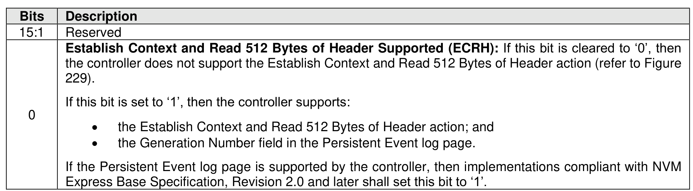

###### 5.2.12.1.14.1 Persistent Event Log Page LID Specific Parameter Field

> **Section ID**: 5.2.12.1.14.1 | **Page**: 268-268

Figure 232 specifies the format for the LID Specific Parameter field in the Supported Log Pages log page
(refer to section 5.2.12.1.1) for the Persistent Event log page.

---
### 📊 Tables (1)

#### Table 1: Untitled Table

| | |
| :--- | :--- |
| If this bit is set to '1', then the controller supports: | |
| • the Establish Context and Read 512 Bytes of Header action; and | |
| • the Generation Number field in the Persistent Event log page. | |
| If the Persistent Event log page is supported by the controller, then implementations compliant with NVM Express Base Specification, Revision 2.0 and later shall set this bit to '1'. | |

